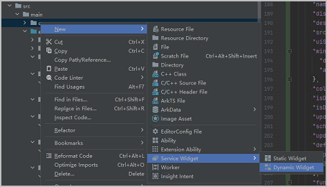
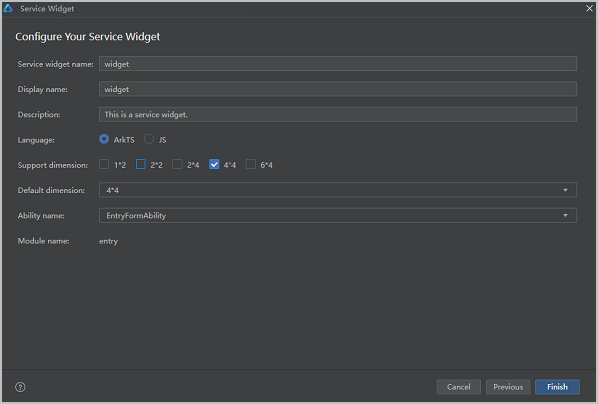
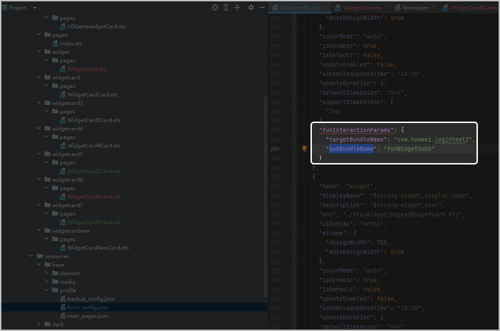

在DevEco Studio中为您已有的HarmonyOS 5.0及以上游戏创建加桌卡片。

## 工作准备

前往[下载中心](https://developer.huawei.com/consumer/cn/download/deveco-studio)下载并安装6.0.0 Release及以上版本的DevEco Studio。

## 开发步骤

1. 在DevEco Studio中打开HarmonyOS 5.0及以上游戏，右键选择“New &gt; Service Widget &gt; Dynamic Widget”，创建卡片页面。

   
2. 在弹出的窗口中填写卡片页面信息，其中“Support dimension”必须选择“4\*4”，完成后点击“Finish”，生成卡片页面的配置文件form\_config.json。

   
3. 在form\_config.json文件中配置如下参数：

   | 参数 | **类型** | **必填**(M)/选填(O) | **说明** |
   | --- | --- | --- | --- |
   | targetBundleName | string | M | 创新互动卡片的包名。与AppGallery Connect创建快游戏时填写的应用名称保持一致。 |
   | subBundleName | string | O | 互动卡片的独立分包名。 |

   
