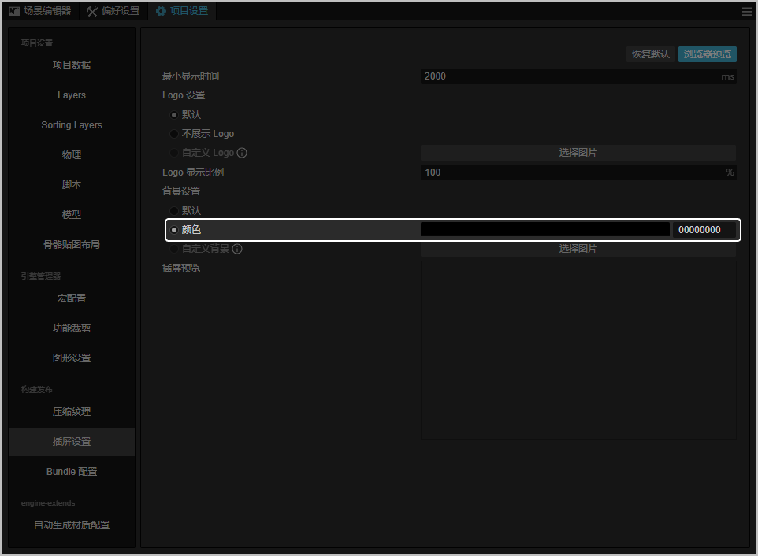
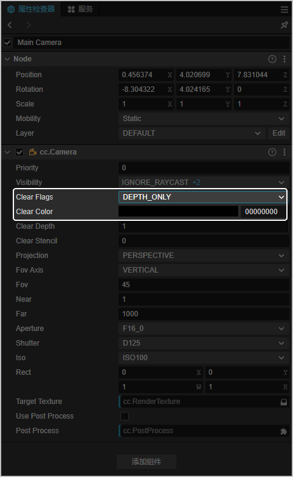
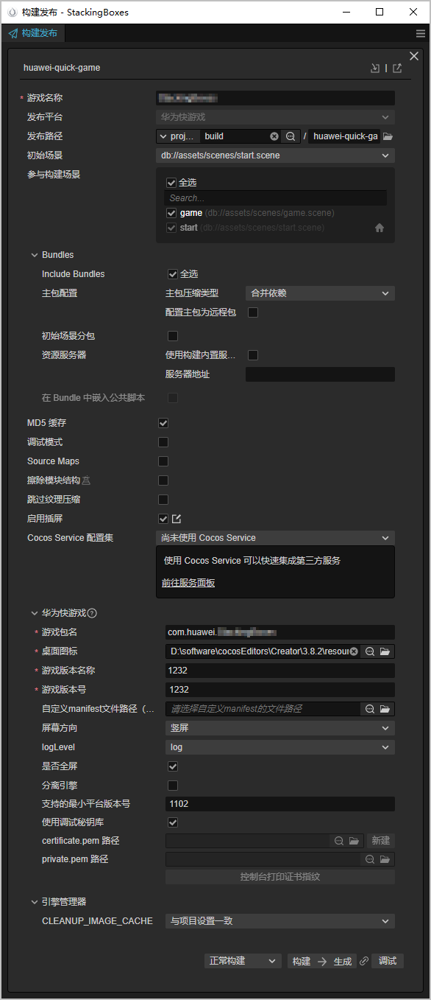

您需要将已有的快游戏改造成带有[独立分包](https://developer.huawei.com/consumer/cn/doc/games-guides/games-quickgame-independent-subpackage-0000002351933645)的创新互动卡片。

## 开发准备

准备开发工具，例如Cocos Creator、LayaAir。

## 开发步骤

### 第一步：设计创新互动卡片

* 建议尽量选择轻松解压。简洁玩法的快游戏，卡片分包内容建议截取游戏内的第一关或者最具吸引力、上手难度较小的关卡。您可以调用[Deeplink](https://developer.huawei.com/consumer/cn/doc/games-references/games-api-quickgame-runtime-deeplink-0000002366156948)接口，从创新互动卡片上加载的独立分包跳转至游戏主包。
* 创新互动卡片为卡片样式，用户长按加桌后占桌面4\*4宫格数，且游戏场景渲染的中心点保持在卡片中心点。
* 游戏运行时支持内容溢出卡片，溢出宽度限制为卡片的1.13倍，溢出高度限制为卡片的1.45倍，不限制溢出时长和溢出次数，且可溢出范围内的背景设置需为透明色。假设创新互动卡片10px\*10px，游戏素材最大范围溢出后的尺寸为11.3px\*14.5px，超过该尺寸的游戏素材内容将被截断。
* 游戏显示的圆角半径、尺寸大小必须时时与创新互动卡片保持一致。通过[qg.getFormInfo](https://developer.huawei.com/consumer/cn/doc/games-references/games-api-quickgame-runtime-card-size-0000002365997060#section19206132651319)接口获取到创新互动卡片的最新信息（尺寸大小、圆角半径）后，必须立刻修改游戏显示的圆角半径、尺寸大小。
* 创新互动卡片支持联网，支持使用华为账号登录，但不支持接入支付、广告功能。

### 第二步：调用接口

1. 调用[qg.getFormInfo](https://developer.huawei.com/consumer/cn/doc/games-references/games-api-quickgame-runtime-card-size-0000002365997060#section19206132651319)接口，获取到卡片的尺寸大小、圆角半径后，在桌面绘制主内容区。

   ```
   qg.getFormInfo({
       success: function (data) {
           console.log('getFormInfo success' + JSON.stringify(data))
       },
       complete: function () {
           console.log('getFormInfo complete')
       }
   });
   ```
2. 调用[qg.getSystemInfo](https://developer.huawei.com/consumer/cn/doc/games-references/games-api-quickgame-runtime-sysinfo-0000002399676789#section16231152791216)接口，获取卡片渲染的实际分辨率（卡片渲染范围宽=screenWidth\*pixelRatio，卡片渲染范围高=screenHeight\*pixelRatio）。

   ```
   qg.getSystemInfo({
        success(res) {
            console.log("on getSystemInfo: success =" + JSON.stringify(res));
        },
        fail() {
            console.log("on getSystemInfo: fail");
        },
        complete() {
             console.log("on getSystemInfo: complete");
        }
   });
   ```
3. 调用[qg.onFormInfoUpdate](https://developer.huawei.com/consumer/cn/doc/games-references/games-api-quickgame-runtime-card-size-0000002365997060#section189891434141913)接口，监听屏幕的分辨率/卡片尺寸大小/卡片圆角半径是否发生变化。若发生变化，卡片必须立刻修改自身卡片的对应信息，以重新适配创新互动卡片。

   ```
   qg.onFormInfoUpdate((data) => {
       console.log('onFormInfoUpdate success' + JSON.stringify(data))
   });
   ```
4. 调用[qg.onWindowResize](https://developer.huawei.com/consumer/cn/doc/games-references/games-api-quickgame-runtime-window-0000002365996980#section14948251203111)接口，监听用户是否展开、折叠、旋转设备。若该接口有回调，确认当前用户使用折叠屏手机，此时，还需调用[qg.getSystemInfo](https://developer.huawei.com/consumer/cn/doc/games-references/games-api-quickgame-runtime-sysinfo-0000002399676789#section16231152791216)接口，获取当下在折叠屏中卡片渲染范围的分辨率（卡片渲染范围宽=screenWidth\*pixelRatio，卡片渲染范围高=screenHeight\*pixelRatio），此时，卡片必须立刻修改自身卡片的对应信息，以重新适配创新互动卡片。

   ```
   qg.onWindowResize((data) => {
        qg.getSystemInfo({
          success(res) {
            console.log("on getSystemInfo: success =" + JSON.stringify(res));
          },
          fail() {
            console.log("on getSystemInfo: fail");
          },
          complete() {
            console.log("on getSystemInfo: complete");
          }
      });
   });
   ```

### 第三步：设置背景全透明

1. 在Cocos Creator 2.4.15中选择“文件 &gt; 项目设置”，在“项目设置”面板上将“背景设置”修改为透明色“00000000”。

   
2. 因可溢出范围的背景需设置为透明色，将3D摄像机“属性检查器”中的“Clear Flags”选择“DEPTH\_ONLY”，将“Clear Color”修改为透明色“00000000”。

   

### 第四步：构建发布华为快游戏

1. Cocos Creator菜单选择“项目 &gt; 构建发布”，在“构建发布”窗口填写信息并点击“构建”和“生成”，即后可在本地生成项目文件夹。

   
2. 在manifest.json文件中为为创新互动卡片设置独立分包，其中独立分包的命名规则**funWidgetSub+编号（从0开始）+"."+后缀（wm：web版本，rt：runtime版本）**，例如funWidgetSub0.wm、funWidgetSub0.rt。

   

   创新互动卡片的独立分包要求大小**不超过4MB**，加载时长在**1.5秒内**返回首帧（包含代码加载时间）。

   ```
   // manifest.json配置文件
   {
       "subPackages": [
       {
         "name": "moduleA",
         "resource": "moduleA"
       },
       {
         "independent": true, // 标识当前分包为独立分包。
         "name": "funWidgetSub0.wm", // 标识当前分包为web版本分包。命名规则是funWidgetSub+编号（从0开始）+"."+后缀（wm：web版本，rt：runtime版本），例如funWidgetSub0.wm、funWidgetSub0.rt。
         "resource": "moduleB",
         "meta": {
             "type": "funWidget" // 固定值，标识当前分包为互动卡片分包。
         }
       }
     ]
   }
   ```

manifest文件其它参数说明请参见[manifest配置文件](https://developer.huawei.com/consumer/cn/doc/games-guides/games-quickgame-manifest-0000002351944509)。
