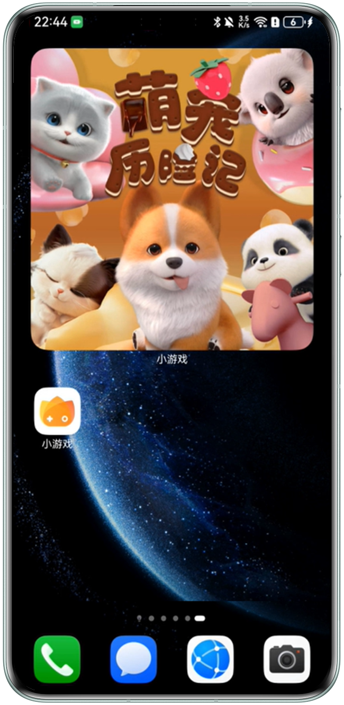

创新互动卡片聚焦即点即用，解决用户碎片化的娱乐需求，支持玩家在桌面卡片上完成游戏内容的互动，为用户带来更多的创新交互玩法。

当前能力受限开放，请开发者联系yukaiwei@huawei.com（余先生）或yangjunxuan@huawei.com（阳先生）进行申请。

|  |  |  |  |
| --- | --- | --- | --- |
|  |  |  |  |

## 用户体验

在手机桌面长按HarmonyOS 5.0及以上游戏的图标将互动卡片加至手机桌面，并在桌面卡片上完成游戏内容的互动。

|  |  |  |  |
| --- | --- | --- | --- |
|  |  |  |  |

## 设备支持说明

创新互动卡片支持的设备需满足如下条件：

|  |  |  |
| --- | --- | --- |
| 设备类型 | 直板手机（仅支持旗舰手机且不支持nova系列） |  |
| 折叠屏手机 |  |
| 平板 |  |
| 设备操作系统 | HarmonyOS 6.0.0 Release及以上版本 | |
