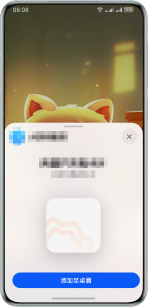

为您的快游戏创新互动卡片添加桌面卡片入口。

## 前提条件

快游戏中已包含创新互动卡片游戏的独立分包。

## 准备图片素材

| 准备项 | 说明 |
| --- | --- |
| 封面图 | 在玩家选择添加到桌面时在窗口内展示的图片。   * 尺寸：要求宽高比为4:4。 * 格式：PNG、JPG。 * 大小：不超过512KB。 |

## 用户体验

玩家可以在游戏过程中选择添加卡片至桌面。



## 开发步骤

1. 调用[qg.canIUse('MiniGame.InteractiveCard')](https://developer.huawei.com/consumer/cn/doc/games-references/games-api-quickgame-runtime-sysinfo-0000002399676789#section165771434195617)，判断当前设备是否支持将创新互动卡片添加至桌面。

   ```
   const isSupportInteractiveCard = qg.canIUse('MiniGame.InteractiveCard');
   console.log('isSupportInteractiveCard: ' + isSupportInteractiveCard) // 是否支持互动卡片加桌能力
   ```
2. 调用[qg.addInteractiveCard(Object object)](https://developer.huawei.com/consumer/cn/doc/games-references/games-api-quickgame-runtime-card-size-0000002365997060#section43861750112916)，将创新互动卡片添加至桌面。

   ```
   if (qg.canIUse("MiniGame.InteractiveCard") {
       qg.addInteractiveCard({
           cardName: '卡片标题',
           cardDesc: '卡片描述',
           coverPath: 'image/cardCover.png',
           cardDimension: '4x4',
           cardSubName: 'funWidgetSub2.rt',
           keepStateDuration: '10000',
           success: function success(res) {
             console.log(`addInteractiveCard success: ${JSON.stringify(res)}`);
           },
           fail: function fail(errMsg, errCode) {
               console.log(`addInteractiveCard fail, msg: ${errMsg}, code: ${errCode}"`);
           },
           complete: function complete() {
               console.log('addInteractiveCard complete');
           }
     });
   }
   ```
