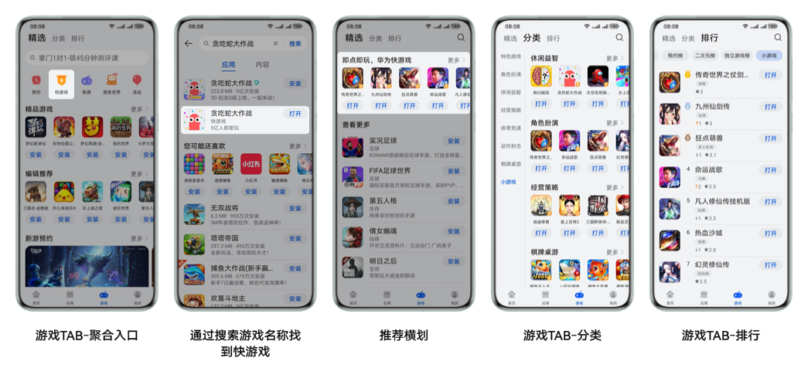
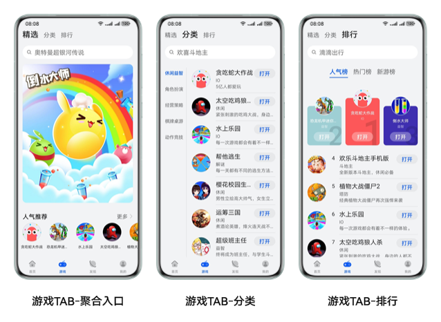
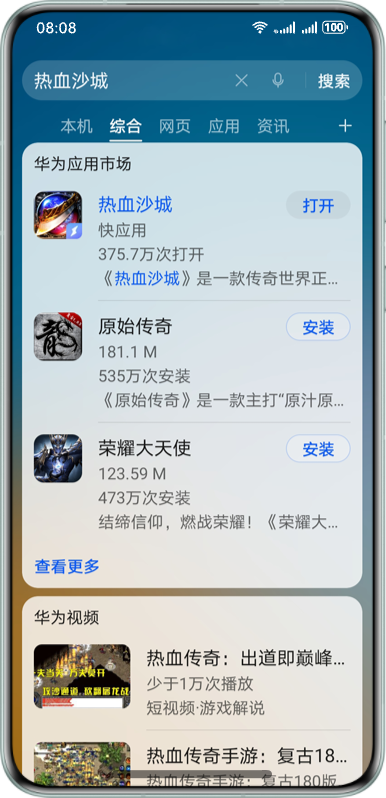
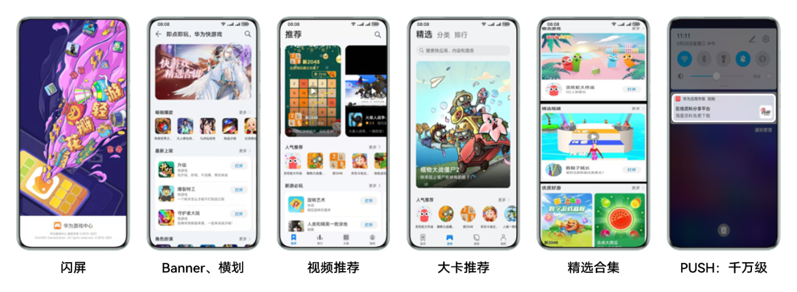

儿童、教育类应用请参考[创建快应用](https://developer.huawei.com/consumer/cn/doc/quickApp-Guides/quickapp-create-quickapp-0000001079835824)。

## 快游戏是什么？

### 快游戏定义

快游戏是一种基于行业标准开发的新型免安装应用，其标准由主流手机厂商组成的快应用联盟联合制定。开发者开发一次即可将应用分发到所有支持行业标准的手机运行。

### 快游戏的特点

* 成本低

  使用相对简单的JS开发语言。
* 体验好

  采用鸿蒙渲染技术，具备自动更新、占用内存少的特点。
* 留存高

  无需安装，即点即玩，并可添加到手机桌面。

## 分发场景

### 应用市场

### 快应用中心

### 花瓣轻游

作为华为官方快游戏平台，汇聚众多精彩快游戏，让华为手机用户更方便地找到喜欢的快游戏。

### 全局搜索（桌面下滑）

用户搜索关键词时，关联的快游戏将出现在搜索结果中，点击“打开”就可进入快游戏。

## 流量资源

