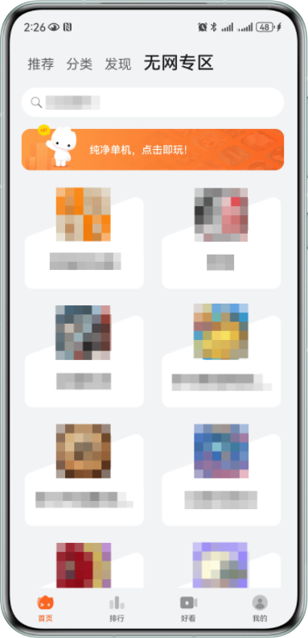

为满足用户在飞机/高铁等无网络环境下有游戏可玩的诉求，华为快游戏在花瓣轻游客户端内新增“无网专区”，将无网络环境下可玩的游戏以无网专区合集的方式呈现给游戏用户。如果想要在无网的情况下游玩无网快游戏，需要玩家先选择对应的快游戏缓存，缓存完成后才可在无网的情况下进行游玩。

## 注意事项

* 无网快游戏包体大小建议**不超过10MB**。
* 在**有网络**的情况下，无网快游戏应该和普通快游戏体验一致。
* 无网快游戏和普通快游戏一样，**需要**调用[游戏登录接口](https://developer.huawei.com/consumer/cn/doc/games-guides/games-quickgame-runtime-account-kit-0000002351893461)。
* 在**无网络**的情况下，无网快游戏只能使用包体内部的资源，无法远程请求。
* 在**无网络**的情况下，无网快游戏仅面向已实名认证的成年人提供服务，未成年以及儿童无法进入游戏。

## 接入指引

无网快游戏接入要求与普通快游戏相同，请参考[快游戏接入流程](https://developer.huawei.com/consumer/cn/doc/games-guides/games-quickgame-dev-runtimegame-guide-0000002317894824)完成无网快游戏的接入工作。

如果您希望将您的游戏添加至无网专区，让玩家可以在无网环境下游玩您的游戏，请邮件联系yukaiwei@huawei.com（余先生）进行申请。
