## 使用低于2.8.0版本的LayaAir开发快游戏


此处以**LayaAir 2.2.0**版本打包**2D示例项目**为例，对LayaAir 1.7.18~2.7.0 Beta版本均适用。

1. 在LayaAir IDE菜单栏选择“项目 &gt; 发布”，在“发布项目”界面采用默认设置，点击“发布”。

   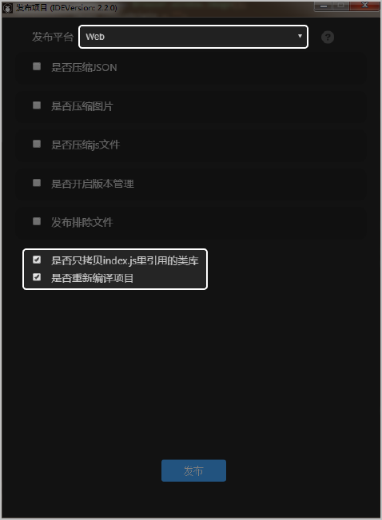

   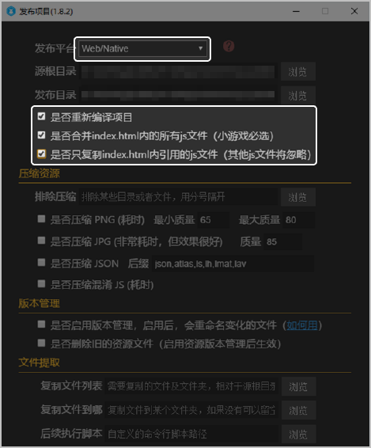
2. 快游戏打包成功后，文件目录如下图所示，不同版本发布内容略有差异。

   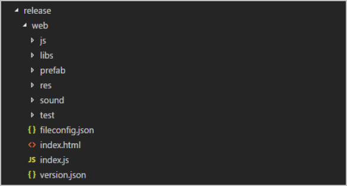
3. 新建自定义的内容。

   

   Windows创建的文件保存时，请使用utf-8格式保存。

   1. 新建game.js和manifest.json文件，这两个文件是必须的。
   2. 新建Common文件夹，存放游戏的logo图片，此目录对应manifest.json文件中的icon配置。

      

      最终发布的包结构如下：

      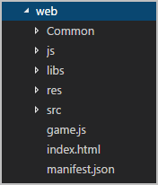
4. 由于快游戏平台实现的XMLHttpRequest不支持读取本地文件，因此需要添加适配来读取本地文件。以下是对不同 Laya 版本的适配。
   * 在 Laya 1.x 版本修改 src 目录下的 code.js，修改 load 方法，用于截获读取本地文件的请求进行处理（需要进行两处适配）。

     ```
     __proto.load=function(url,type,cache,group,ignoreCache){
         (cache===void 0)&& (cache=true);
         (ignoreCache===void 0)&& (ignoreCache=false);
         this._url=url;
         if (url.indexOf("data:image")===0)this._type=type="image";
         else {
             this._type=type || (type=this.getTypeFromUrl(url));
             url=URL.formatURL(url);
         }
         this._cache=cache;
         this._data=null;
         if (!ignoreCache && Loader.loadedMap[url]){
             this._data=Loader.loadedMap[url];
             this.event(/*laya.events.Event.PROGRESS*/"progress",1);
             this.event(/*laya.events.Event.COMPLETE*/"complete",this._data);
             return;
         }
         if (group)Loader.setGroup(url,group);
         if (Loader.parserMap[type] !=null){
             this._customParse=true;
             if (((Loader.parserMap[type])instanceof laya.utils.Handler ))Loader.parserMap[type].runWith(this);
             else Loader.parserMap[type].call(null,this);
             return;
         }
         if (type==="image" || type==="htmlimage" || type==="nativeimage")return this._loadImage(url);
         if (type==="sound")return this._loadSound(url);
         if (type==="ttf")return this._loadTTF(url);
         // 第一处适配代码 ：在这里，插入添加适配读取本地资源
         if (typeof qg !== "undefined" && !url.startsWith("http")) {
            let that = this;
             setTimeout(() => {
                 if (url.startsWith('file://'))
                     url = url.substr('file://'.length);
                 var response;
                 if (type == 'pkm' || type === "arraybuffer") {
                     response = qg.getFileSystemManager().readFileSync(url);
                 } else {
                     response = qg.getFileSystemManager().readFileSync(url, "utf8");
                     if ((type == 'atlas' || type == 'json') && typeof response !== "undefined") {
                         response = JSON.parse(response);
                     }
                 }
                 else if(type == "xml") {
                         response = qg.getFileSystemManager().readFileSync(url, "utf8");
                         response = Utils.parseXMLFromString(response);}
                 }
                 that.onLoaded(response);
             }, 0);
             return;//这里记得 return
         }
         //第一处适配代码结束，下面是原本 laya 代码
         var contentType;
         switch (type) {
             case "atlas":
             case "plf":
                 contentType = "json";
                 break;
             case "font":
                 contentType = "xml";
                 break;
             case "pkm":
                 contentType = "arraybuffer";
                 break
             default:
                 contentType = type;
             }
             if (Loader.preLoadedMap[url]) {
                 this.onLoaded(Loader.preLoadedMap[url]);
             } else {
                 //第二处适配代码
                 if(typeof qg !== "undefined"){
                     this._http = new HttpRequest();
                 }else if (!this._http) {
                     this._http = new HttpRequest();
                 }
                 this._http.on(/*laya.events.Event.PROGRESS*/"progress", this, this.onProgress);
                 this._http.on(/*laya.events.Event.ERROR*/"error", this, this.onError);
                 this._http.on(/*laya.events.Event.COMPLETE*/"complete", this, this.onLoaded);
                 //第二处适配代码结束
                 //下面是原先代码
                 // if (!this._http) {
                 //     this._http = new HttpRequest();
                 //     this._http.on(/*laya.events.Event.PROGRESS*/"progress", this, this.onProgress);
                 //     this._http.on(/*laya.events.Event.ERROR*/"error", this, this.onError);
                 //     this._http.on(/*laya.events.Event.COMPLETE*/"complete", this, this.onLoaded);
                 // }
                 //原先代码结束
                 this._http.send(url, null, "get", contentType);
             }
     }
     ```
   * 在 LayaAir IDE 2.0.0+ 和 LayaAir IDE 2.1.0+ 修改 laya.core.js 的 load 方法，用于截获读取本地文件的请求进行处理（需要进行两处适配）。

     ```
     __proto.load=function(url,type,cache,group,ignoreCache,useWorkerLoader){
         (cache===void 0)&& (cache=true);
         (ignoreCache===void 0)&& (ignoreCache=false);
         (useWorkerLoader===void 0)&& (useWorkerLoader=false);
         if (!url){
             this.onLoaded(null);
             return;
         }
         Loader.setGroup(url,"666");
         this._url=url;
         if (url.indexOf("data:image")===0)type="image";
         else url=URL.formatURL(url);
         this._type=type || (type=Loader.getTypeFromUrl(this._url));
         this._cache=cache;
         this._useWorkerLoader=useWorkerLoader;
         this._data=null;
         if (useWorkerLoader)WorkerLoader.enableWorkerLoader();
         if (!ignoreCache && Loader.loadedMap[url]){
             this._data=Loader.loadedMap[url];
             this.event(/*laya.events.Event.PROGRESS*/"progress",1);
             this.event(/*laya.events.Event.COMPLETE*/"complete",this._data);
             return;
         }
         if (group)Loader.setGroup(url,group);
         if (Loader.parserMap[type] !=null){
             this._customParse=true;
             if (((Loader.parserMap[type])instanceof laya.utils.Handler ))Loader.parserMap[type].runWith(this);
             else Loader.parserMap[type].call(null,this);
             return;
         }
         if (type==="image" || type==="htmlimage" || type==="nativeimage")return this._loadImage(url);
         if (type==="sound")return this._loadSound(url);
         if (type==="ttf")return this._loadTTF(url);
         // 第一处适配代码，这里插入添加适配读取本地资源
         if (typeof qg !== "undefined" && !url.startsWith("http")) {
             let that = this
             setTimeout(() => {
                 if (url.startsWith('file://'))
                     url = url.substr('file://'.length);
                 var response;
                 if (type == 'pkm' || type === "arraybuffer") {
                     response = qg.getFileSystemManager().readFileSync(url);
                 } else {
                     response = qg.getFileSystemManager().readFileSync(url, "utf8");
                     if ((type == 'atlas' || type == 'json' || type == 'prefab') && typeof response !== "undefined") {
                         response = JSON.parse(response);
                     }
                 }
                 that.onLoaded(response);
             }, 0);
             return;
         }
         // 第一处适配代码结束，下面是原本的 laya 代码
             var contentType;
             switch (type) {
                 case "atlas":
                 case "prefab":
                 case "plf":
                     contentType = "json";
                     break;
                 case "font":
                     contentType = "xml";
                     break;
                 case "plfb":
                     contentType = "arraybuffer";
                     break;
                 default:
                     contentType = type;
             }
             if (Loader.preLoadedMap[url]) {
                 this.onLoaded(Loader.preLoadedMap[url]);
             } else {
                //第二处适配代码
                 if(typeof qg !== "undefined"){
                     this._http = new HttpRequest();
                 }else if (!this._http) {
                     this._http = new HttpRequest();
                 }
                 this._http.on(/*laya.events.Event.PROGRESS*/"progress", this, this.onProgress);
                 this._http.on(/*laya.events.Event.ERROR*/"error", this, this.onError);
                 this._http.on(/*laya.events.Event.COMPLETE*/"complete", this, this.onLoaded);
                 //第二处适配代码结束
                 //下面是原先代码
                 // if (!this._http) {
                 //     this._http = new HttpRequest();
                 //     this._http.on(/*laya.events.Event.PROGRESS*/"progress", this, this.onProgress);
                 //     this._http.on(/*laya.events.Event.ERROR*/"error", this, this.onError);
                 //     this._http.on(/*laya.events.Event.COMPLETE*/"complete", this, this.onLoaded);
                 // }
                 //下面是原先代码结束
                 this._http.send(url, null, "get", contentType);
             }
     }
     ```
   * 在 LayaAir IDE 2.2.0+ , LayaAir IDE 2.3.0+ , LayaAir IDE 2.4.0 , LayaAir IDE 2.5.0 beta，LayaAir IDE 2.6.0 beta，LayaAir IDE 2.7.0 beta 修改 laya.core.js 的 \_loadHttpRequestWhat 方法，用于截获读取本地文件的请求进行处理（需要进行两处适配）。

     ```
     _loadHttpRequestWhat(url, contentType) {
         // 第一处适配代码在这里，插入添加适配读取本地资源
     if (typeof loadRuntime !== 'undefined' && !url.startsWith("http")) {
         let that = this;
          setTimeout(() => {
              if (url.startsWith('file://')){
                  url = url.substr('file://'.length);
              }
              url = URL.getAdptedFilePath(url);//对资源后缀转化，Laya 自带方法
              var response;
              var type = contentType;
              if (type == 'pkm' || type === "arraybuffer") {
                  response = qg.getFileSystemManager().readFileSync(url);
              } else {
                  response = qg.getFileSystemManager().readFileSync(url, "utf8");
                  if ((type == 'atlas' || type == 'json') && typeof response !== "undefined") {
                      response = JSON.parse(response);
                  }
              }
              that.onLoaded(response);
          }, 0);
          return;//这里记得 return
      }
      //第一处添加适配代码结束，下面是原本 laya 代码
         if (Loader.preLoadedMap[url])
             this.onLoaded(Loader.preLoadedMap[url]);
         else
             this._loadHttpRequest(url, contentType, this, this.onLoaded, this, this.onProgress, this, this.onError);
     }
     ```

     以下是第二处适配代码，寻找 \_loadHttpRequest 进行适配。

     ```
     _loadHttpRequest(url, contentType, onLoadCaller, onLoad, onProcessCaller, onProcess, onErrorCaller, onError) {
         //第二处适配代码
         if (Browser.onVVMiniGame || typeof qg !== "undefined") {
             this._http = new HttpRequest();
         }
         else {
             if (!this._http)
                 this._http = new HttpRequest();
         }
         //第二处适配代码结束
         //原先代码
         // if (Browser.onVVMiniGame) {
         //     this._http = new HttpRequest();
         // }
         // else {
         //     if (!this._http)
         //         this._http = new HttpRequest();
         // }
         //原先代码结束
         onProcess && this._http.on(Event.PROGRESS, onProcessCaller, onProcess);
         onLoad && this._http.on(Event.COMPLETE, onLoadCaller, onLoad);
         this._http.on(Event.ERROR, onErrorCaller, onError);
         this._http.send(url, null, "get", contentType);
     }
     ```
5. 将[laya\_js\_adapter\_sample](https://alliance-communityfile-drcn.dbankcdn.com/FileServer/getFile/cmtyPub/011/111/111/0000000000011111111.20260323192505.54257003759639626878912801925920%3A20260603111408%3A2800%3AB865A0B41470C9CD58CDECC403186921F72640AA0ECF42E9868DD2E64DF782B6.zip?needInitFileName=true)中 huawei-adapter.js拷贝至src目录。
6. 打开game.js，输入下面内容。
   * laya 1.x 的适配

     ```
     //注意：require的路径必须根据 huawei-adapter.js 和 code.js 存放路径填写
     //添加适配文件
     require("src/huawei-adapter.js");
     //导入游戏运行代码 code.js
     require("src/code.js");
     ```
   * laya.2.0 ~ laya2.7.0 beta 的适配

     ```
     //注意： require的路径必须根据 huawei-adapter.js 和 index.js 存放路径填写
     //添加适配文件
     window.loadLib=window.require;
     require("huawei-adapter.js");
     //导入游戏运行代码 index.js
     require("index.js");
     ```
7. 配置manifest.json文件，详细说明请参见[manifest.json](https://developer.huawei.com/consumer/cn/doc/quickApp-Guides/quickgame-mainfest-0000001798921053)。

   ```
   {
       "package": "com.mylaya.huawei",
       "name": "mylaya",
       "appType": "fastgame",
       "icon": "/Common/logo.png",
       "versionName": "1.0.0",
       "versionCode": 1,
       "minPlatformVersion": 1035,
       "config": {
           "logLevel": "debug"
       },
       "router": {},
       "display": {
           "orientation": "portrait",
           "fullScreen":true
       }
   }
   ```
8. 开发游戏的基本功能外，还可以接入华为提供的快游戏基础能力和开放能力，详细内容参见：
   * [文件系统](https://developer.huawei.com/consumer/cn/doc/quickApp-Guides/quickgame-file-system-0000001113298440)
   * [分包加载](https://developer.huawei.com/consumer/cn/doc/quickApp-Guides/quickgame-subpackage-0000001159658271)
   * [音频播放](https://developer.huawei.com/consumer/cn/doc/quickApp-Guides/quickgame-audio-play-0000001159778257)
   * [游戏登录](https://developer.huawei.com/consumer/cn/doc/quickApp-Guides/quickgame-runtime-account-kit-0000001113458340)
   * [支付](https://developer.huawei.com/consumer/cn/doc/quickApp-Guides/quickgame-runtime-iap-consumable-0000001413248438)
   * [广告](https://developer.huawei.com/consumer/cn/doc/quickApp-Guides/quickgame-runtime-ad-kit-0000001159778259)
   * [分享](https://developer.huawei.com/consumer/cn/doc/quickApp-Guides/quickgame-runtime-share-0000001113458342)

**【补充说明】**

* 文件加载本地资源请使用文件接口的 readFile 读取，如果有远程资源请按照原 laya 加载资源流程处理。
* 屏幕适配
  + laya.1.x 的适配：在 code.js 文件中 Laya.init 后面添加屏幕适配代码。

    ```
    //程序入口
    Laya.init(600, 400, WebGL);// 600 400 需要修改成游戏的设计尺寸
    Laya.stage.scaleMode = "exactfit";//exactfit 修改为游戏中的值
    //屏幕适配
    if(typeof getAdapterInfo !== "undefined"){
       var stage = Laya.stage;
       var info = getAdapterInfo({width:600, height:400, scaleMode:"exactfit"});// 600 400 需要修改成游戏的设计尺寸
       stage.designWidth = info.w;
       stage.designHeight = info.h;
       stage.width = info.rw;
       stage.height = info.rh;
       stage.scale(info.scaleX, info.scaleY);
     }
    //屏幕适配结束
    ```
  + laya.2.0 ~ laya2.7.0 beta 的适配：在 bundle.js 文件中程序入口后面添加屏幕适配代码。

    ```
    //程序入口
    //根据IDE设置初始化引擎
    if (window["Laya3D"]) Laya3D.init(GameConfig.width, GameConfig.height);
    else Laya.init(GameConfig.width, GameConfig.height, Laya["WebGL"]);
    Laya["Physics"] && Laya["Physics"].enable();
    Laya["DebugPanel"] && Laya["DebugPanel"].enable();
    Laya.stage.scaleMode = GameConfig.scaleMode;
    Laya.stage.screenMode = GameConfig.screenMode;
    Laya.stage.alignV = GameConfig.alignV;
    Laya.stage.alignH = GameConfig.alignH;
    //屏幕适配
    if (typeof getAdapterInfo !== "undefined") {
    var stage = Laya.stage;
    var info = getAdapterInfo({ width: GameConfig.width, height: GameConfig.height, scaleMode: GameConfig.scaleMode });
      //注意：其中 GameConfig.width 和 GameConfig.height 为该demo中设置游戏的宽和高，请根据实际项目填写
    stage.designWidth = info.w;
    stage.designHeight = info.h;
    stage.width = info.rw;
    stage.height = info.rh;
    stage.scale(info.scaleX, info.scaleY);
    }
    //屏幕适配结束
    ```
* 如果需要加载 mp3 资源，由于 HTMLAudioElement.load() 功能还未实现，需要做如下修改（不同游戏修改会有所差异，请根据快游戏文档做适配）。
  1. load 资源的时候，删除相关的 mp3 文件配置。
  2. 需要播放 mp3 文件时，使用快游戏的加载资源方式。

     ```
     //示例代码
     if(qg){
         var audioContext = qg.createInnerAudioContext();
         audioContext.src="resource/assets/bg.mp3";
         audioContext.play();
     }else{
         SoundManager.instance.startBgMusic("bg_mp3");
     }
     ```

## 使用其它版本的Egret引擎开发快游戏

当EgretLauncher版本大于等于1.2.1且引擎版本大于等于5.3.9 ，支持一键发布华为快游戏，否则按如下步骤开发（以下操作以EgretLauncher 5.2.20版本为例）。

1. 打开 EgretLauncher，新建JS空项目。

   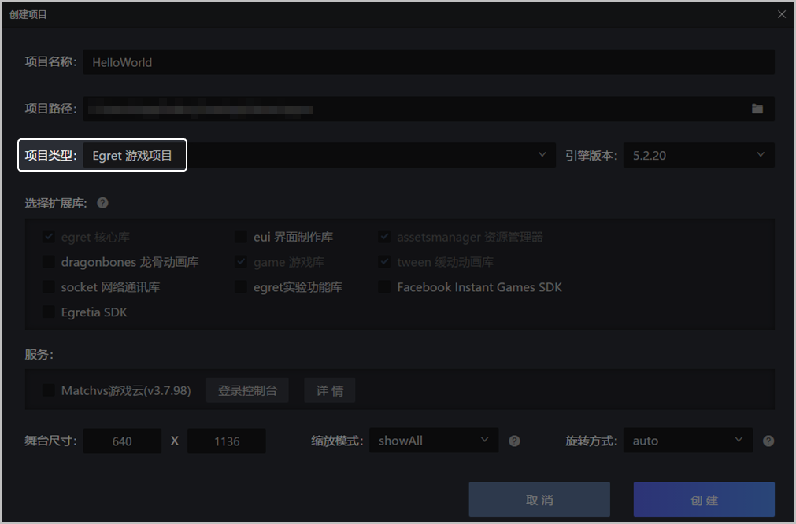
2. 点击“发布”图标，在弹出的界面中选择HTML5，版本号填写“build”，方便打包使用。点击“确定”。

   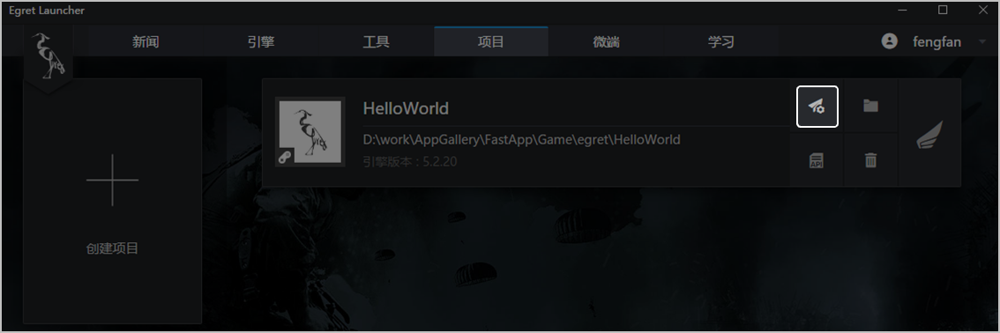
3. 发布成功后，在工程bin-release &gt; web目录下生成build目录，build目录结构如下。

   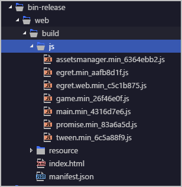
4. 将项目中libs &gt; modules &gt; egret目录下的 egret.js、egret.web.js 文件复制到发布目录build下的js文件夹中，并且重命名egret.js名称为egret.min.js、重命名egret.web.js名称为egret.web.min.js。

   

   egret.min\_\*.js和egret.web.min\_\*.js可以删除（例如下图中的egret.min\_aafb8d1f.js和egret.web.min\_c5c1b875.js），后续使用egret.min.js、egret.web.min.js两个文件。

   重命名前文件结构：

   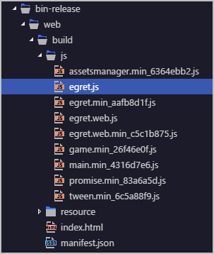

   重命名后文件结构：

   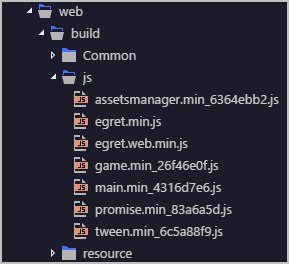
5. 增加本地资源加载逻辑。
   1. 在egret.web.min.js搜索WebHttpRequest.prototype.open，添加如下适配代码，判断资源文件是否为本地资源，如果是则不执行ajax获取资源。本地资源接口参见[文件系统](https://developer.huawei.com/consumer/cn/doc/quickApp-Guides/quickgame-file-system-0000001113298440)。

      ```
      WebHttpRequest.prototype.open = function (url, method) {
          if (method === void 0) { method = "GET"; }
                      this._url = url;
                      this._method = method;
                      if (this._xhr) {
                          this._xhr.abort();
                          this._xhr = null;
                      }
                      var xhr = this.getXHR(); //new XMLHttpRequest();
                      //适配代码
                      let isLocal = url.indexOf("http") === -1;  //判断资源地址（url）是否为本地资源
                      if (qg && isLocal) {
                          let that = this;
                          setTimeout(() => {
                              var response;
                              if (that.responseType === 'arraybuffer') {
                                  response = qg.getFileSystemManager().readFileSync(that._url);
                                  that.localResponse = response;
                              }
                              else if (that.responseType === 'blob') {
                                  response = qg.getFileSystemManager().readFileSync(that._url);
                                  that.localResponse = new Blob([response]);
                              }
                              else {
                                  response = qg.getFileSystemManager().readFileSync(that._url, "utf8");
                                  that.localResponse = response;
                              }
                              that.dispatchEventWith(egret.Event.COMPLETE);
                          }, 0);
                          return;
                      }
                     //适配代码结束
                      if (window["XMLHttpRequest"]) {
                          xhr.addEventListener("load", this.onload.bind(this));
                          xhr.addEventListener("error", this.onerror.bind(this));
                      }
                      else {
                          xhr.onreadystatechange = this.onReadyStateChange.bind(this);
                      }
                      xhr.onprogress = this.updateProgress.bind(this);
                      xhr.ontimeout = this.onTimeout.bind(this);
                      xhr.open(this._method, this._url, true);
                      this._xhr = xhr;
                  };
      ```
   2. 在egret.web.min.js搜索Object.defineProperty(WebHttpRequest.prototype, "response"，添加如下适配代码，添加本地读取方式。

      ```
      Object.defineProperty(WebHttpRequest.prototype, "response", {
          /**
           * @private
           * 本次请求返回的数据，数据类型根据responseType设置的值确定。
           */
          get: function () {
              //适配开始
              if (qg && !this._url.startsWith("http")) {
                  return this.localResponse;
              }
              //适配结束
              if (!this._xhr) {
                  return null;
              }
              if (this._xhr.response != undefined) {
                  return this._xhr.response;
              }
              if (this._responseType == "text") {
                  return this._xhr.responseText;
              }
              if (this._responseType == "arraybuffer" && /msie 9.0/i.test(navigator.userAgent)) {
                  var w = window;
                  return w.convertResponseBodyToText(this._xhr["responseBody"]);
              }
              if (this._responseType == "document") {
                  return this._xhr.responseXML;
              }
              /*if (this._xhr.responseXML) {
                  return this._xhr.responseXML;
              }
              if (this._xhr.responseText != undefined) {
                  return this._xhr.responseText;
              }*/
              return null;
          },
          enumerable: true,
          configurable: true
      });
      ```
6. 修改音频配置。

   在egret.web.min.js文件中搜索HtmlSound.prototype.load添加如下音频适配代码。

   

   添加适配代码时，由于版本不同，可能需要根据当前方法代码修改相关变量名称。

   ```
   HtmlSound.prototype.load = function (url) {
       var self = this;
       this.url = url;
       if (true && !url) {
           egret.$error(3002);
       }
       //添加适配代码，原先代码是var audio = new Audio(url);
       var audio = undefined;
       if (typeof qg === 'undefined') {
           audio = new Audio(url);
       } else {
           audio = qg.createInnerAudioContext();
           audio.src = url;
           audio.addEventListener = function (type, listener, options) {
               switch (type) {
                   case "canplaythrough":
                       this.onCanplay(listener);
                       break;
                   case "error":
                       this.onError(listener);
                       break;
               }
           };
           audio.removeEventListener = function (type, listener, useCapture) {
               switch (type) {
                   case "canplaythrough":
                       this.offCanplay(listener);
                       break;
                   case "error":
                       this.offError(listener);
                       break;
               }
           };
           audio.load = function () { };
           audio.cloneNode = function () {
               let audio = qg.createInnerAudioContext();
               audio.src = this.src;
               audio.autoplay = this.autoplay;
               audio.addEventListener = this.addEventListener;
               audio.removeEventListener = this.removeEventListener;
               audio.cloneNode = this.cloneNode;
               audio.play();
               audio.pause();
               return audio;
           };
       }
       //添加适配代码结束
       audio.addEventListener("canplaythrough", onAudioLoaded);
       audio.addEventListener("error", onAudioError);
       var ua = navigator.userAgent.toLowerCase();
       if (ua.indexOf("firefox") >= 0) {
           audio.autoplay = !0;
           audio.muted = true;
       }
       //edge and ie11
       var ie = ua.indexOf("edge") >= 0 || ua.indexOf("trident") >= 0;
       if (ie) {
           document.body.appendChild(audio);
       }
       audio.load();
       this.originAudio = audio;
       if (HtmlSound.clearAudios[this.url]) {
           delete HtmlSound.clearAudios[this.url];
       }
       function onAudioLoaded() {
           HtmlSound.$recycle(this.url, audio);
           removeListeners();
           if (ua.indexOf("firefox") >= 0) {
               audio.pause();
               audio.muted = false;
           }
           if (ie) {
               document.body.appendChild(audio);
           }
           self.loaded = true;
           self.dispatchEventWith(egret.Event.COMPLETE);
       }
       function onAudioError() {
           removeListeners();
           self.dispatchEventWith(egret.IOErrorEvent.IO_ERROR);
       }
       function removeListeners() {
           audio.removeEventListener("canplaythrough", onAudioLoaded);
           audio.removeEventListener("error", onAudioError);
           if (ie) {
               document.body.removeChild(audio);
           }
       }
   };
   ```
7. 在build目录下新建目录和文件。

   

   Windows创建的文件保存时，请使用utf-8格式保存。

   1. 备份原先HTML5的manifest.json（后续适配需要参考，请必须做好备份）。
   2. 新建game.js和manifest.json文件，该两个文件必须存在。
   3. 新建Common文件夹，存放快游戏的logo图片，此目录对应manifest.json文件中icon的配置。

      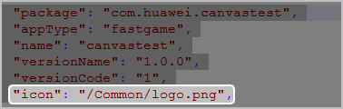

      最终发布的包结构如下：

      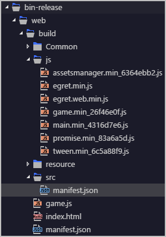
8. 打开game.js，添加如下的适配代码。

   ```
   //添加适配代码
   // 以下内容请复制------------------------
   window.self = window
   window.navigator.isCocoonJS = true
   window.scrollTo = function () {
   };
   if(CanvasRenderingContext2D.prototype.drawImage === undefined){
       CanvasRenderingContext2D.prototype.drawImage = function () {
       };
   }
   if(CanvasRenderingContext2D.prototype.bezierCurveTo === undefined){
       CanvasRenderingContext2D.prototype.bezierCurveTo = function () {
       };
   }
   if(CanvasRenderingContext2D.prototype.createPattern === undefined){
       CanvasRenderingContext2D.prototype.createPattern = function () {
           return {
               toString() {
                   return ''
               }
           }
       };
   }
   let oldCreateElement = document.createElement
   let hasCreated = false
   document.createElement = function (name) {
       if (name === 'canvas') {
           let node
           if (!hasCreated) {
               hasCreated = true
               node = document.getElementById('canvas')
           } else {
               node = oldCreateElement(name)
               let oldGetContext = node.getContext.bind(node)
               node.style = document.getElementById('canvas').style
               node.getContext = function (name, opts) {
                   // 特殊处理：任何canvas都返回主canvas的webgl
                   if (name === 'webgl' || name === 'experimental-webgl') {
                       return document.getElementById('canvas').getContext(name, opts)
                   } else {
                       return oldGetContext(name, opts)
                   }
               }
           }
           if (typeof node.toDataURL === 'undefined') {
               node.toDataURL = function (tagName) {
                   return ''
               }
           }
           return node
       }
       return oldCreateElement(name)
   }
   let ce = document.createElementNS
   document.createElementNS = function (ns, name) {
       if (name === 'canvas') {
           return this.createElement(name)
       }
       return ce.apply(this, arguments)
   }
   document.addEventListener = document.getElementById('canvas').addEventListener
   Object.defineProperty(Element.prototype, 'firstElementChild', {
       get() {
           let child = this.childNodes[0]
           return child ? child : (this.innerHTML ? new HTMLElement() : undefined)
       }
   })
   String.prototype.toFixed = function() {
   let value = parseFloat(this.toString());
   return value.toFixed.apply(value, arguments);
   };
   //添加适配代码结束
   ```
9. 对发布工程build里index.html内容进行适配修改。
   1. 将html游戏入口文件class为egret-player的div的属性添加到game.js中。

      class为egret-player的div如下所示：

      ```
      <div style="margin: auto;width: 100%;height: 100%;"
               data-entry-class="Main"
               data-orientation="auto"
               data-scale-mode="showAll"
               data-frame-rate="30"
               data-content-width="640"
               data-content-height="1136"
               data-show-paint-rect="false"
               data-multi-fingered="2"
               data-show-fps="false" data-show-log="false"
               data-show-fps-style="x:0,y:0,size:12,textColor:0xffffff,bgAlpha:0.9">
      </div>
      ```

      将div的属性以如下形式添加到game.js中：

      ```
      (function (target) {
          target['data-entry-class'] = 'Main'
          target['data-orientation'] = 'auto'
          target['data-scale-mode'] = 'showAll'
          target['data-frame-rate'] = '30'
          target['data-content-width'] = '640'
          target['data-content-height'] = '1136'
          target['data-show-paint-rect'] = 'false'
          target['data-multi-fingered'] = '2'
          target['data-show-fps'] = 'false'
          target['data-show-log'] = 'false'
          target['data-show-fps-style'] = 'x:0,y:0,size:12,textColor:0xffffff,bgAlpha:0.9'
      })(HTMLElement.prototype)
      ```
   2. 将html文件中编写的js代码拷贝到game.js文件。

      html文件中编写的js代码如下所示：

      ```
      //require("./xx/xx.js"); // game.js文件中对应引用, <script src="xx/xx.js"><script> 修改为 require("./xx/xx.js");的方式，当前示例里无这种引用
      // html文件中编写的js代码复制到这里适配修改
          var loadScript = function (list, callback) {
              var loaded = 0;
              var loadNext = function () {
                  loadSingleScript(list[loaded], function () {
                      loaded++;
                      if (loaded >= list.length) {
                          callback();
                      }
                      else {
                          loadNext();
                      }
                  })
              };
              loadNext();
          };
          let loadSingleScript = function (src, callback) {
                   require('./' + src)
                   callback()
          }
              //引用build->js目录下js文件
          let manifest = {
              "initial": [
                  "js/egret.min.js",
                  "js/egret.web.min.js",
                  "js/game.min_26f46e0f.js",
                  "js/tween.min_6c5a88f9.js",
                  "js/assetsmanager.min_6364ebb2.js",
                  "js/promise.min_83a6a5d.js"
              ],
              "game": [
                  "js/main.min_4316d7e6.js"
              ]
          };
          //适配修改结束
          let list = manifest.initial.concat(manifest.game);
          loadScript(list, function () {
              /**
               * {
               * "renderMode":, //Engine rendering mode, "canvas" or "webgl"
               * "audioType": 0 //Use the audio type, 0: default, 2: web audio, 3: audio
               * "antialias": //Whether the anti-aliasing is enabled in WebGL mode, true: on, false: off, defaults to false
               * "calculateCanvasScaleFactor": //a function return canvas scale factor
               * }
               **/
              egret.runEgret({ renderMode: "webgl", audioType: 0, calculateCanvasScaleFactor:function(context) {
                  var backingStore = context.backingStorePixelRatio ||
                      context.webkitBackingStorePixelRatio ||
                      context.mozBackingStorePixelRatio ||
                      context.msBackingStorePixelRatio ||
                      context.oBackingStorePixelRatio ||
                      context.backingStorePixelRatio || 1;
                  return (window.devicePixelRatio || 1) / backingStore;
              }});
          });
      ```
   3. 如果在index.html里的\&lt;script\&gt;有用到shader代码，需要将特殊适配添加到game.js，示例代码如下：

      ```
      <script type="x-shader/x-vertex" id="vertexshader">
          uniform float amplitude;
          attribute vec3 displacement;
          attribute vec3 customColor;
          varying vec3 vColor;
          void main() {
              vec3 newPosition = position + amplitude * displacement;
              vColor = customColor;
              gl_Position = projectionMatrix * modelViewMatrix * vec4( newPosition, 1.0 );
          }
      </script>
      ```

      需要将脚本适配修改添加到game.js。

      ```
      vertexShader = "uniform float amplitude;\n" +
              "\n" +
              "                attribute vec3 displacement;\n" +
              "                attribute vec3 customColor;\n" +
              "\n" +
              "                varying vec3 vColor;\n" +
              "\n" +
              "                void main() {\n" +
              "\n" +
              "                        vec3 newPosition = position + amplitude * displacement;\n" +
              "\n" +
              "                        vColor = customColor;\n" +
              "\n" +
                                      gl_Position = projectionMatrix * modelViewMatrix * vec4( newPosition, 1.0 );\n" +
              "\n" +
      "
                              }";
      ```
10. 在egret.min.js找到Event.create定义的地方。在代码里增加判断eventPool.pop();出来的event是否属于EventClass（即event instanceof EventClass结果为true），如果不属于这个EventClass必须重新创建，修改示例如下：

    ```
    Event.create = function (EventClass, type, bubbles, cancelable) {
        var eventPool;
        var hasEventPool = EventClass.hasOwnProperty("eventPool");
        if (hasEventPool) {
            eventPool = EventClass.eventPool;
        }
        if (!eventPool) {
            eventPool = EventClass.eventPool = [];
        }
        if (eventPool.length) {
            var event_2 = eventPool.pop();
            //适配修改开始
            while(event_2) {
            if(event_2 instanceof EventClass) {
                event_2.$type = type;
                event_2.$bubbles = !!bubbles;
                event_2.$cancelable = !!cancelable;
                event_2.$isDefaultPrevented = false;
                event_2.$isPropagationStopped = false;
                event_2.$isPropagationImmediateStopped = false;
                event_2.$eventPhase = 2 /* AT_TARGET */;
                return event_2;
                }
              event_2 = eventPool.pop();
            }     //适配修改结束
        }
        return new EventClass(type, bubbles, cancelable);
    };
    ```
11. 修改游戏代码，如果游戏代码里有用到鼠标事件需要修改为触摸事件（需要修改点可能出现game.js中，也可能出现在引用js文件中）。

    将游戏代码中如下鼠标事件修改为触摸事件：
    * mousedown 修改为 touchstart
    * mousemove 修改为 touchmove
    * mouseup 修改为 touchend
    * onmousedown=function() &#123;...&#125; 修改为 ontouchstart=function() &#123;...&#125;
    * onmousemove=function() &#123;...&#125; 修改为 ontouchmove=function() &#123;...&#125;
    * onmouseup=function() &#123;...&#125; 修改为 ontouchend=function() &#123;...&#125;

    在初始化createjs.StageGL之后加上createjs.Touch.enable(stage);触摸事件才生效

    修改回调函数中event调用的值，参照如下：

    * mouse\_event获取点击x坐标：mouse\_event.clientX
    * touch\_event获取点击x坐标：touch\_event.changedTouches[0].clientX

    具体请参考[MouseEvent](https://developer.mozilla.org/zh-CN/docs/Web/API/MouseEvent)、 [TouchEvent](https://developer.mozilla.org/zh-CN/docs/Web/API/Touch_events)以及[Touch](https://developer.mozilla.org/zh-CN/docs/Web/API/Touch)。华为快游戏不支持window.onload = function() &#123;...&#125;;以及window.addEventListener("load", function() &#123;...&#125;);如果需要使用，需要修改成如下形式：

    ```
    setTimeout(function() {...});
    ```
12. 配置 manifest.json 文件，详细说明请参见[manifest.json](https://developer.huawei.com/consumer/cn/doc/quickApp-Guides/quickgame-mainfest-0000001798921053)。
13. 开发游戏的基本功能外，还可以接入华为提供的快游戏基础能力和开放能力，详细内容参见：
    * [文件系统管理](https://developer.huawei.com/consumer/cn/doc/quickApp-Guides/quickgame-file-system-0000001113298440)
    * [分包加载](https://developer.huawei.com/consumer/cn/doc/quickApp-Guides/quickgame-subpackage-0000001159658271)
    * [音频播放](https://developer.huawei.com/consumer/cn/doc/quickApp-Guides/quickgame-audio-play-0000001159778257)
    * [游戏登录](https://developer.huawei.com/consumer/cn/doc/quickApp-Guides/quickgame-runtime-account-kit-0000001113458340)
    * [支付](https://developer.huawei.com/consumer/cn/doc/quickApp-Guides/quickgame-runtime-iap-consumable-0000001413248438)
    * [广告](https://developer.huawei.com/consumer/cn/doc/quickApp-Guides/quickgame-runtime-ad-kit-0000001159778259)
    * [分享](https://developer.huawei.com/consumer/cn/doc/quickApp-Guides/quickgame-runtime-share-0000001113458342)

**【补充说明】**

* 目前文件读取只支持本地资源，如有远程资源需要先下载再读取。
* 如果需要加载mp3资源，由于 HTMLAudioElement.load() 功能还未实现，需要做如下修改（不同游戏修改会有所差异，请根据快游戏文档做适配）。
  1. 删除default.res.json里面有关的mp3文件的配置。
  2. 在需要加载mp3文件的地方，使用快游戏的加载资源方式。

  ```
  //示例代码
  if(qg){
      var audioContext = qg.createInnerAudioContext();
      audioContext.src="resource/assets/bg.mp3";
      audioContext.play();
  }else{
      SoundManager.instance.startBgMusic("bg_mp3");
  }
  ```
