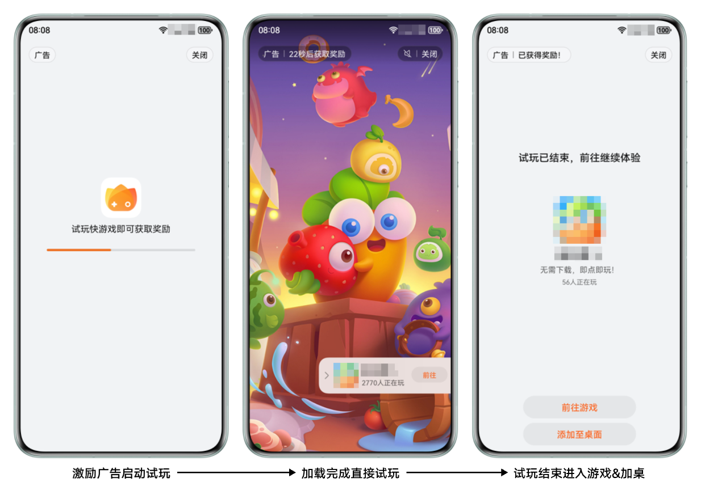
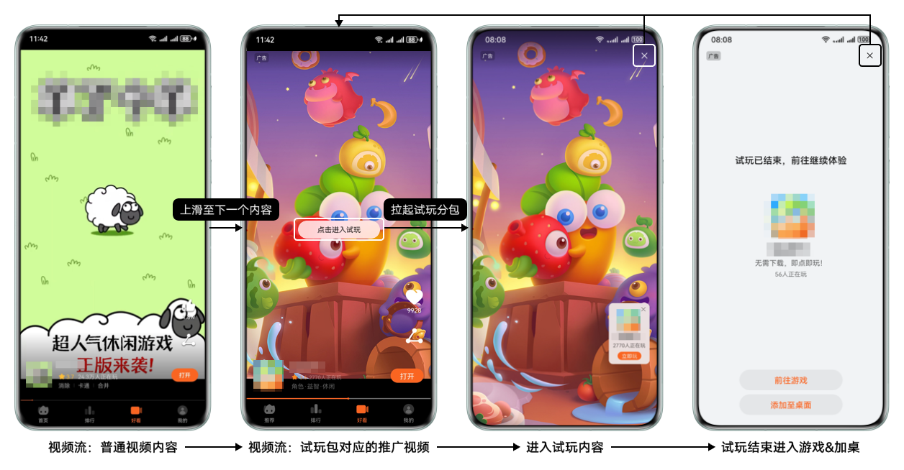

快游戏试玩是一种独立于快游戏之外的形式，您可以截取游戏内的第一关或者最具吸引力、上手难度小的玩法，制作成游戏的试玩包，让用户提前体验游戏的玩法。

## 试玩分包要求

* 试玩分包依托于独立分包的能力，因此试玩分包大小要求**不超过4MB**。
* 试玩分包内**请勿使用fetch方法**。如果因为引擎框架引入了fetch方法，请[使用XMLHttpRequest进行替换](/docs/dev/game-dev/games-quickgame-independent-subpackage-0000002351933645#ZH-CN_TOPIC_0000002348453520__zh-cn_topic_0000002076341729_li169488551386)。
* 试玩分包的加载时长，要求在包含代码加载时间的情况下，1.5秒内返回首帧。
* 建议截取游戏内第一关或开发者认为游戏内最具吸引力、上手难度小、性能要求相对较低的玩法作为试玩内容。
* 建议试玩内容与游戏主玩法尽量一直或者有较强的关联性。
* 建议选取用户完成关卡的时长在15-60秒以内的关卡（最好在30秒左右可以完成关卡）制作试玩内容。

## 准备工作

请根据试玩内容制作对应的推广视频。具体要求如下：

* 推广视频内容需与试玩分包的关卡内容相关，可以录制试玩关卡操控视频或其他与试玩关卡相关的内容。
* 视频需要为竖屏，建议宽\*高为1080px\*1920px。

## 试玩分包使用场景

当带有试玩分包的快游戏上架后，您可以将您的试玩分包投放至如下场景：

* 激励广告位

  试玩分包的激励广告位是将传统激励广告的内容变为快游戏试玩内容，用户试玩30秒后可获得奖励。

  如果您希望将试玩分包投放至激励广告位，您需要先上架您所制作的试玩分包。当您的试玩分包完成上架审核后，您可以前往[鲸鸿动能广告平台](https://ads.huawei.com)创建试玩投放任务。试玩投放任务创建成功后，您所创建的试玩内容将会被投放至激励广告场景。详情可咨询快游戏运营：QQ：2851508950。

  
* 视频流

  试玩分包的视频流是将试玩内容嵌入至视频流内，视频流内展示试玩包对应的推广视频，用户点击“点击进入试玩”后进入游戏试玩。

  如果您希望将试玩分包投放至视频流，您需要先上架您所制作的试玩分包。当您的试玩分包完成上架审核后，请联系快游戏运营：QQ：2851508950，配置视频流。

  

## 开发指导

快游戏试玩依托于快游戏[独立分包](/docs/dev/game-dev/games-quickgame-independent-subpackage-0000002351933645)的能力，可以独立于主包和其他分包运行，但依旧为快游戏的一部分。快游戏试玩分包和普通的独立分包相比，需要额外添加meta字段，声明当前独立分包为试玩分包。meta字段定义如下：

| 参数 | 类型 | 必填(M)/选填(O) | 说明 |
| --- | --- | --- | --- |
| type | string | M | 独立分包类型，目前固定为“playable”。 |
| playableOrientation | string | O | 试玩分包的横竖屏信息：   * portrait：竖屏。 * landscape：横屏。   默认值为“portrait”。  注意：  当前版本仅支持竖屏。 |

更多独立分包相关信息请参见[独立分包](/docs/dev/game-dev/games-quickgame-independent-subpackage-0000002351933645)。

### 配置manifest.json

快游戏试玩分包的目录结构以如下为例：

```
├── assets
├── image
     └── icons.png
     └── 1.png
├── jsb-adapter
├── src
├── subpackages              // 分包文件夹
      └── moduleA    // 普通分包
             └── game.js     // 普通分包入口文件，且分包入口文件只能命名为game.js
             └── main.js
      └── moduleB    // Web版本独立分包
             └── assets
             └── src
             └── index.html     // Web版本独立分包入口文件
             └── main.js
├── game.js                  // 主包入口文件
├── manifest.json            // 配置文件
```

manifest.json文件中试玩分包对应的配置项如下：

```
{
   ...
   "subpackages": [
     {
        "name": "moduleA",
        "resource": "subpackages/moduleA"
     },
     {
        "independent": true, // 声明当前分包为独立分包
        "name": "independentSub0.wm", // 当前分包为Web版本的独立分包
        "resource": "subpackages/moduleB", //试玩包目录
        "meta": {
          "type": "playable" // 固定值，声明当前独立分包为试玩分包
        }
     }
   ]
   ...
}
```


当前版本仅支持Web版本的试玩分包，分包包名请固定使用“independentSub0”或“independentSub0.wm”，不可自行更改名称、后缀或在包名内使用其他特殊符号，否则分包将无法正常运行。请在提交审核前检查分包包名是否符合要求，若不符合要求将无法通过审核，请修改后重新提交。

## 运行测试

试玩分包的运行测试需要使用**15.0.2及以上版本**的快游戏开发者工具进行测试，快游戏开发者工具的具体使用方法请参见[快游戏开发者工具调试](/docs/dev/game-dev/games-quickgame-tool-debug-0000002351933789)和[使用快游戏开发者工具进行试玩调试](/docs/dev/game-dev/games-quickgame-faq-playable-subpackage-0000002425133926#section151421127437)。

## 审核与发布

快游戏试玩分包是快游戏的一部分，因此提审发布时，主包和所有的分包需要一起上传、审核及发布。主包或分包未审核通过时，会影响整体提审情况。

* 在线上有可运行的试玩分包时，若仅主包内容有更新，请带上原有的试玩分包代码一起提交，否则会导致已在线上投放的试玩分包无法正常播放。
* 试玩分包如果跟随主包进行更新，在新版本审核通过前，已在线上投放的试玩分包的正常运行不会受到影响。新版本审核通过后，同包名的试玩包内容会自动更新为审核通过后的新内容。


若包体（主包或试玩分包）有任何更新，请在提交上架前联系并告知快游戏运营人员：QQ：2851508950。

## 相关链接

### FAQ

* [如何使用快游戏开发者工具进行试玩调试？](/docs/dev/game-dev/games-quickgame-faq-playable-subpackage-0000002425133926#section151421127437)
* [如何制作试玩分包？](/docs/dev/game-dev/games-quickgame-faq-playable-subpackage-0000002425133926#section178539135432)
* [试玩分包如何合入主包中？](/docs/dev/game-dev/games-quickgame-faq-playable-subpackage-0000002425133926#section48432712436)
