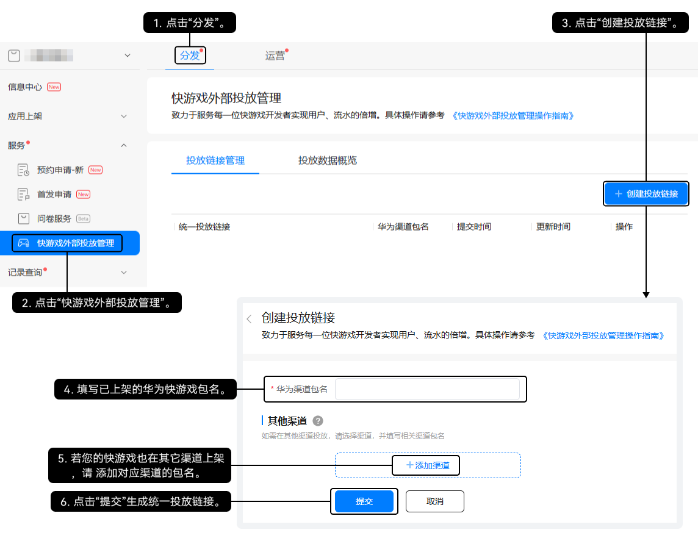
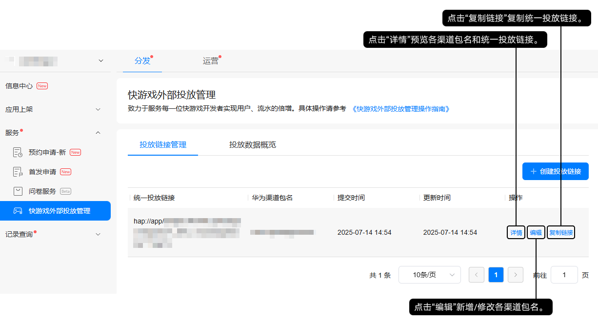
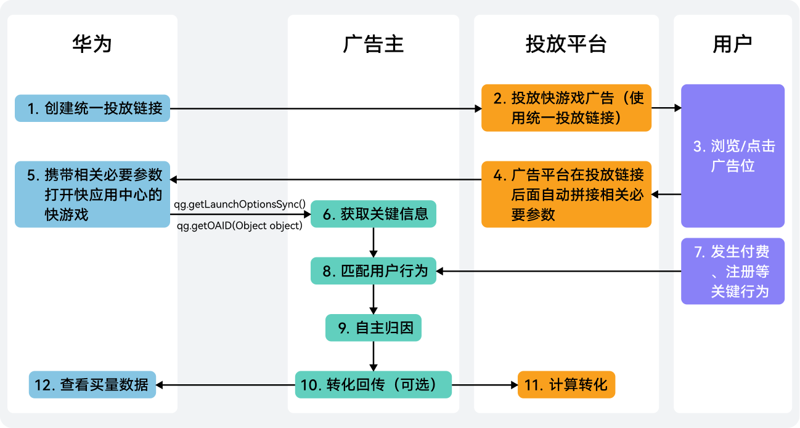
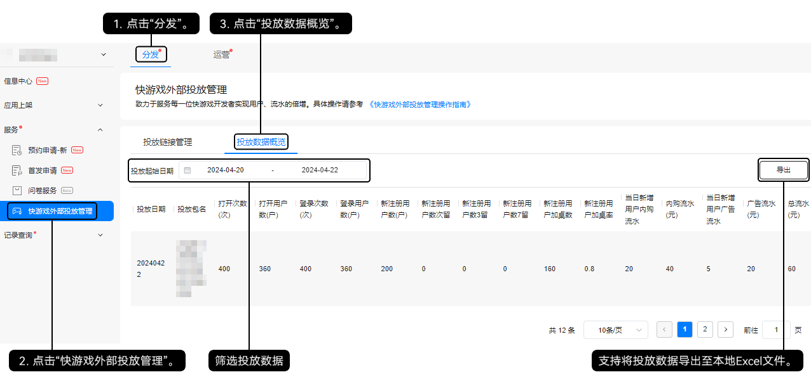

买量是一种快速获客的游戏运营手段，可以为华为快游戏带来更多的曝光量和用户量，有效提升快游戏的用户活跃度和市场竞争力，为您的游戏事业带来更多的发展机会。目前华为快游戏支持在快手、UC和微博平台上买量推广。

## 买量流程

## 接入快游戏接口

在游戏程序中预埋如下快游戏接口，并自主添加匹配事件上报的逻辑代码，然后将快游戏上架至华为渠道的应用市场。

| 接口 | 必选(M)/可选(O) | 说明 |
| --- | --- | --- |
| [qg.getOAID(Object object)](https://developer.huawei.com/consumer/cn/doc/quickApp-References/quickgame-api-getoaid-0000001439846464) | M | 在快游戏中接入**qg.getOAID(Object object)**接口，用于[广告主自主归因](#section1539154141912)。 |
| [qg.getLaunchOptionsSync()](https://developer.huawei.com/consumer/cn/doc/quickApp-References/quickgame-api-lifecycle-0000001083746128#section4844135503910) | O | [转化回传](#section88171649181914)是快游戏通过**qg.getLaunchOptionsSync()**接口获取平台自动在Deeplink后拼接的相关必要参数，广告主获取相关参数后可进行自主归因。Deeplink示例如下：  hap://app/com.\*\*\*.\*\*\*/\*\*\*?adid=123456&creativeid=654321&creativetype=3&clickid=EPHk9cX3pv4CGJax4ZENKI7w4MDev\_4C |

## 创建投放链接

1. 登录[AppGallery Connect](https://developer.huawei.com/consumer/cn/service/josp/agc/index.html)，为已上架的华为快游戏创建平台广告的统一投放链接。

   

   

   统一投放链接生成失败请联系QQ：2853051205或QQ：2851508950。
2. 链接成功生成后，在列表右侧复制统一投放链接。

   

   

   统一投放链接后面的\_SRC\_为预留拓展字段，暂不支持自定义参数。

## 投放快游戏

前往买量平台投放华为快游戏。

## 转化归因

### 全景图

在买量平台投放华为快游戏后，广告数据的转化归因流程如下：

### 广告主自主归因

广告归因是为了找出哪些广告触点对用户最终的转化行为起到了决定性的作用。投放平台会给广告主提供广告点击用户的OAID/IMEI等设备信息，广告主需将达到转化目标的用户信息与投放平台的广告点击信息进行匹配，并自主归因。

### 转化回传（可选）

广告主完成归因后，将发生转化行为的用户信息回传给投放平台，投放平台会关联转化用户与广告计划，并以此计算一次转化，同时跟踪每个广告计划的转化效果。

## 查看投放数据

快游戏的投放数据关联用户的打开、登录、注册、支付等行为，登录[AppGallery Connect](https://developer.huawei.com/consumer/cn/service/josp/agc/index.html)，查看买量数据，分析买量效果，及时调整买量策略。

| 数据指标 | 单位 | 说明 |
| --- | --- | --- |
| 打开次数 | 次 | 用户打开快游戏的次数。 |
| 打开用户数 | 户 | 打开快游戏的用户数。 |
| 登录次数 | 次 | 用户登录快游戏的次数。 |
| 登录用户数 | 户 | 登录快游戏的用户数。 |
| 新注册用户数 | 户 | 首次注册快游戏的用户数。 |
| 新注册用户数次留 | - | 新注册用户次日登录数/首日新注册用户数。 |
| 新注册用户数3留 | - | 新注册用户3日登录数/首日新注册用户数。 |
| 新注册用户数7留 | - | 新注册用户7日登录数/首日新注册用户数。 |
| 新注册用户加桌数 | - | 新注册用户数中成功添加快游戏桌面图标的用户数。 |
| 新注册用户加桌率 | - | 新注册用户数加桌人数/新注册用户数。 |
| 当日新增用户内购流水 | 元 | 当日新增用户产生的内购流水。 |
| 内购流水 | 元 | 用户累积产生的内购流水。 |
| 当日新增用户广告流水 | 元 | 当日新增用户产生的广告流水。 |
| 广告流水 | 元 | 用户累积产生的广告流水。 |
| 总流水 | 元 | 内购流水和广告流水的总和。 |
