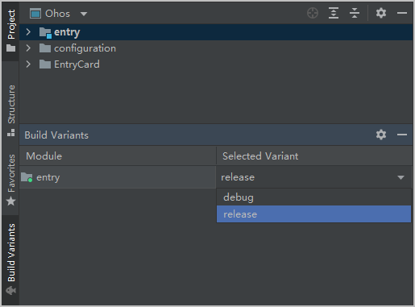
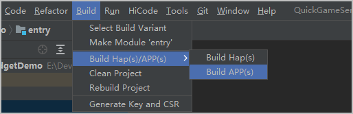
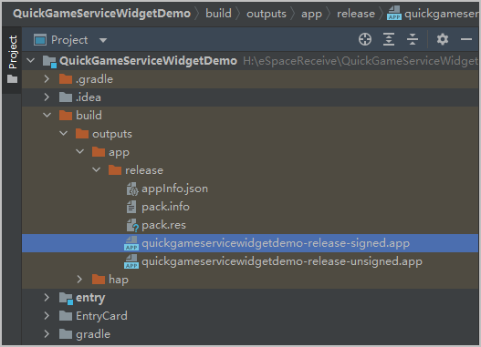
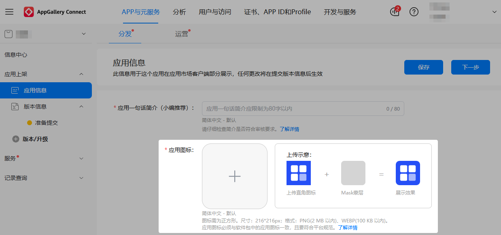

在真机设备上反复验证功能后，您可以正式在AGC控制台上架元服务，并分发至服务中心，为用户提供对应的游戏服务。

## 配置签名信息

在DevEco Studio中配置工程的数字签名信息可以保证元服务的完整性和安全性。正式上架元服务仅支持手动签名方式，您需要手动申请并填写证书、文件信息，详细配置步骤请参见[手动配置签名信息](https://developer.huawei.com/consumer/cn/doc/harmonyos-guides/ide-signing#section297715173233)。

## 选择build Variants

打正式发布包前，请在DevEco Studio界面左下角选择“build Variants”，选择“release”。

## 编译构建

1. 编译构建是将元服务的源代码、资源文件等打包成可以发布的APP上架包。菜单栏选择“Build &gt; Build APP(s)”进行构建APP软件包。

   
2. 工程目录结构切换为“project”视图后，APP包体存放至工程的“build”文件夹下。

   

   

   APP正式包仅做上架使用，无法本地安装。

## 上架元服务

前往[AppGallery Connect](https://developer.huawei.com/consumer/cn/service/josp/agc/index.html)配置并上架元服务。详细流程请参见[上架元服务](https://developer.huawei.com/consumer/cn/doc/app/agc-help-harmonyos-releaseservice-0000001946273965)。

上架时请注意，元服务的**应用图标**位置请上传按照216\*216尺寸模板设计的元服务图标。

