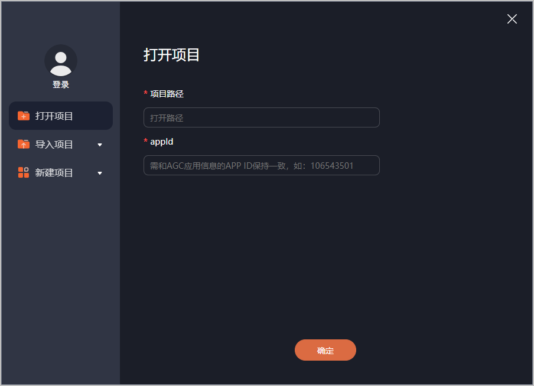

## 快游戏开发者工具

华为2023年7月正式推出快游戏开发者工具，这是一款面向快游戏开发者的工具。

* 提供了调试功能，支持开发者快速定位、解决问题。
* 提供了完整的发布功能，确保快游戏的质量和可靠性。
* 采用了先进的安全技术，保障开发者的代码和数据安全。
* 支持Windows系统和Mac系统。

### 工具下载

仅15.0.2.300及以上版本的小游戏服务支持快游戏开发者工具运行调试。如需查看当前设备内小游戏服务的版本号，请打开手机“设置”APP的“应用与服务”页面，点击右上角四点打开“更多应用”页面，查找并点击“小游戏服务”即可查看小游戏服务的版本号。若版本号低于15.0.2.300，请更新小游戏服务版本，若无法手动更新，请打开“应用市场”APP的“闲时更新”功能或更新手机系统，小游戏服务将会自动更新至新版本。

| 更新时间 | Windows | Mac |
| --- | --- | --- |
| 2026-02-09 | [HuaweiQuickGameAssistant-win-tool-15.5.2.300.zip](https://contentcenter-vali-drcn.dbankcdn.cn/pvt_2/DeveloperAlliance_package_901_9/a0/v3/OYddNq3xR2m8Gh9rqiA1Fg/HuaweiQuickGameAssistant-win-tool-15.5.2.300.zip?HW-CC-KV=V1&HW-CC-Date=20260209T035107Z&HW-CC-Expire=315360000&HW-CC-Sign=23CAE51E673860C6E242585856EF65B1E4CD0E32C7213D9A10CFFD2C68427600) | [HuaweiQuickGameAssistant-mac-tool-15.5.2.300.zip](https://contentcenter-vali-drcn.dbankcdn.cn/pvt_2/DeveloperAlliance_package_901_9/0f/v3/GHr9bFUASECs5vJz3Va54A/HuaweiQuickGameAssistant-mac-tool-15.5.2.300.zip?HW-CC-KV=V1&HW-CC-Date=20260209T035212Z&HW-CC-Expire=315360000&HW-CC-Sign=D83653CBCEA611CB0BDA99D9F986C99104509AF144D7FBF814E1DD7FCA937588) |
| SHA256校验码：e39c2a1fbe246552724a561e213195073016773e3de3519fec98bc5b3bc1d020 | SHA256校验码：f672e2cc21b2d7663b76aaa69fbf9d12a71d94532630220ba7a62da2a1b270e8 |

### 工具使用

快游戏开发者工具界面友好、操作简单，具备生成签名证书、调试快游戏、发布快游戏等能力，工具的使用教程请参见[快游戏开发者工具](/docs/dev/game-dev/games-quickgame-tool-ux-0000002318054804)。

## 快应用加载器

快应用加载器可以在手机上运行和管理快游戏。

### 工具下载

在手机上运行不同平台的快游戏需要下载不同的快应用加载器，下载快应用加载器请[前往快应用加载器下载页](https://developer.huawei.com/consumer/cn/doc/Tools-Library/quickapp-ide-download-0000001101172926#section9347192715112)。

### 工具使用

快应用加载器详细的操作指导请参见[快应用加载器使用指导](https://developer.huawei.com/consumer/cn/doc/quickApp-Guides/quickapp-loader-user-guide-0000001115925960)。
