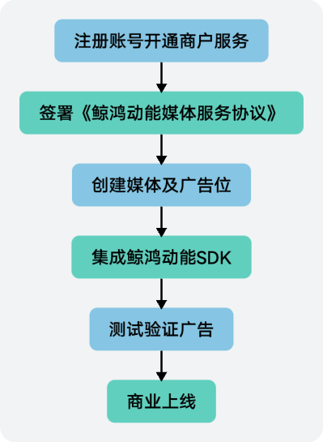
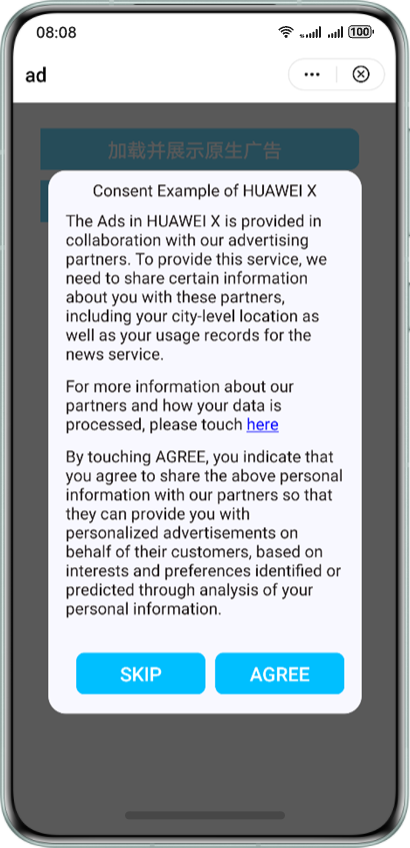
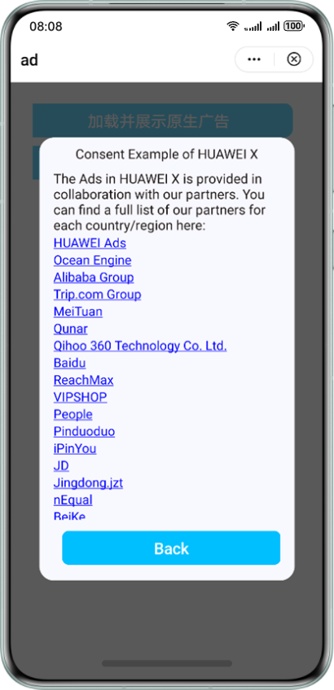

鲸鸿动能流量变现服务（以下简称“流量变现服务）是华为推出的一项广告服务，依托华为强大的终端平台和数据能力，帮助您实现广告流量变现。接入广告服务后，您可以在游戏内向用户展示精准的、精美的以及高价值的广告内容，并从中获得对应的广告收益。接入广告服务服务的流程如下：



您可以接入如下广告类型：

* 原生广告：广告内容以“原生”的形式植入到游戏场景中，广告呈现不破坏游戏场景的和谐，在不影响用户体验的前提下，为用户提供有价值的信息，支持展示图片、文字和视频。原生广告目前提供两种形式：
  + **落地页**下载/打开应用。您需要自定义广告图片，若是下载类广告，请额外自定义控件按钮。调用[nativeAd.startDownload](https://developer.huawei.com/consumer/cn/doc/games-references/games-api-quickgame-runtime-ad-0000002399676813#section1660516404918)接口将在用户点击广告后前往落地页下载/打开应用。
  + （推荐）**当前页**下载/打开应用。该方式大大提升了原生广告的下载转化，广告流水预估可能提升20%。您在渲染广告图片时**必须**加上六要素（应用名，开发者信息，版本号，隐私，权限，介绍），若是下载类广告，请额外调用[nativeAd.showDownloadButton](https://developer.huawei.com/consumer/cn/doc/games-references/games-api-quickgame-runtime-ad-0000002399676813#section1472982717439)接口渲染控件按钮，样例图如下。在广告曝光后，用户点击广告将在当前页面一键下载/打开应用。在下载类广告消失后，**必须**调用[nativeAd.hideDownloadButton](https://developer.huawei.com/consumer/cn/doc/games-references/games-api-quickgame-runtime-ad-0000002399676813#section13271113313213)隐藏控件按钮。

    

    - 建议控件按钮与广告图片保持较近的距离。
    - 可根据[nativeAd.onLoad](https://developer.huawei.com/consumer/cn/doc/games-references/games-api-quickgame-runtime-ad-0000002399676813#section1528411518185)返回的**creativeType**值判断广告类型是否带有下载按钮，如果是，则为下载类广告。

    
* 激励广告：观看完整的视频广告，用户可以获取游戏内对应的奖励。
* Banner广告：在快游戏界面的顶部、中部或底部占据一个矩形位置的广告，广告内容每隔一段时间自动刷新，用户点击内容后会自动跳转到对应的页面。
* 插屏广告：启动、暂停、退出快游戏时以全屏的形式弹出的广告。

## 前提条件

* 您已了解“流量变现服务”对接入主体、媒体、设备及服务区域都有一定的限制，限制详情请参见[流量变现服务受限说明](https://developer.huawei.com/consumer/cn/doc/distribution/monetize/shouxianshuoming-0000001085379360)。
* 您已了解“流量变现服务”业务规范，规范详情请参见[业务规则](https://developer.huawei.com/consumer/cn/doc/distribution/monetize/yewuzongze-0000001132177047)。
* 您已实名认证、开通商户服务、签署《鲸鸿动能媒体服务协议》，操作详情请参见[注册认证](https://developer.huawei.com/consumer/cn/doc/distribution/monetize/zhucerenzheng-0000001132395957)。
* 快游戏已添加媒体，操作详情请参见[媒体管理](https://developer.huawei.com/consumer/cn/doc/distribution/monetize/meitiguanli-0000001132278779)。
* 快游戏已添加广告展示位，操作详情请参见[展示位创建](https://developer.huawei.com/consumer/cn/doc/distribution/monetize/zhanshiweichuangjian-0000001132700049)。

## 征求用户意见

鲸鸿动能投放的广告包括个性化广告和非个性化广告。为了征求用户意见，鲸鸿动能提供了相关接口征求用户意见，以及在征得用户意见后如何根据用户意见获取广告。

1. 首次启动快应用时，确定是否需要针对用户弹框以征得用户同意。

* 需要：执行 [qg.setUnderAgeOfPromise(false)](https://developer.huawei.com/consumer/cn/doc/games-references/games-api-quickgame-runtime-ad-0000002399676813#section45941522152814)。
* 不需要：执行 [qg.setUnderAgeOfPromise(true)](https://developer.huawei.com/consumer/cn/doc/games-references/games-api-quickgame-runtime-ad-0000002399676813#section45941522152814)。

  一旦将此设置置为true，表明为“未达到法定年龄用户”，只能请求非个性化广告，每次[qg.requestConsentUpdate](https://developer.huawei.com/consumer/cn/doc/games-references/games-api-quickgame-runtime-ad-0000002399676813#section1399713608)请求均会回调fail方法，此时不需要再展示征求用户意见弹框。设置为false表明用户已达到法定承诺年龄。

2. 调用[qg.requestConsentUpdate](https://developer.huawei.com/consumer/cn/doc/games-references/games-api-quickgame-runtime-ad-0000002399676813#section1399713608)更新用户意见状态。
   * 进入失败回调，则请求非个性化广告。
   * 进入成功回调，返回广告技术提供商等信息，并进一步判断isNeedConsent的值。
     + isNeedConsent为false，则不需要征求意见，可以请求个性化广告。
     + isNeedConsent为true，且consentStatus=2，则需要弹框征求用户意见。
3. 征求用户意见。

   开发者需要自定义弹框等方式向用户征求意见，并展示广告技术提供商的完整列表。示例demo效果图如下（仅供参考）：

   |  |  |
   | --- | --- |
   |  |  |
   | **图一** 弹框效果 | **图二** 点图一中here后展示广告提供商 |
4. 调用[qg.setConsentStatus](https://developer.huawei.com/consumer/cn/doc/games-references/games-api-quickgame-runtime-ad-0000002399676813#section10342513193112)设置[步骤3](#ZH-CN_TOPIC_0000002348453516__zh-cn_topic_0000001159778259_li55822449132)通过弹框获取的用户意见。

   

   * 请必须让用户可以随时更改或撤消意见，并将用户更新后的意见再次调用该接口进行设置。
   * 中国大陆地区可选择是否接入[qg.setConsentStatus](https://developer.huawei.com/consumer/cn/doc/games-references/games-api-quickgame-runtime-ad-0000002399676813#section10342513193112)设置用户意见。
5. 根据广告类型调用[qg.setTagForUnderAgeOfPromise](https://developer.huawei.com/consumer/cn/doc/games-references/games-api-quickgame-runtime-ad-0000002399676813#section1393594010568)设置未达到法定年龄用户的标记。
6. 根据广告类型调用[qg.setNonPersonalizedAd](https://developer.huawei.com/consumer/cn/doc/games-references/games-api-quickgame-runtime-ad-0000002399676813#section193934035615)设置请求广告类型（个性化或者非个性化）。
7. 请求广告。（如果获取用户意见时，用户未给出选择，则只能请求非个性化广告）

   通过调用开发的接口，接入原生广告、激励视频或者Banner广告。

更详细的内容可以参见[征求用户意见Demo](#section1360461017315)。

## 原生广告

1. 通过 let nativeAd=[qg.createNativeAd](https://developer.huawei.com/consumer/cn/doc/games-references/games-api-quickgame-runtime-ad-0000002399676813#section443419211957)创建广告组件。
2. 调用[nativeAd.load()](https://developer.huawei.com/consumer/cn/doc/games-references/games-api-quickgame-runtime-ad-0000002399676813#section15261346684)拉取广告数据。

   成功执行[nativeAd.onLoad](https://developer.huawei.com/consumer/cn/doc/games-references/games-api-quickgame-runtime-ad-0000002399676813#section1528411518185)回调。

   ```
   nativeAd.onLoad((adlist) => {
   })
   ```

   失败执行[nativeAd.onError](https://developer.huawei.com/consumer/cn/doc/games-references/games-api-quickgame-runtime-ad-0000002399676813#section19331824172513)回调。

   ```
   nativeAd.onError((errorObj) => {
   })
   ```
3. 调用[nativeAd.showDownloadButton](https://developer.huawei.com/consumer/cn/doc/games-references/games-api-quickgame-runtime-ad-0000002399676813#section1472982717439)接口显示控件按钮，用户点击下载/打开应用。
4. 调用[nativeAd.reportAdShow](https://developer.huawei.com/consumer/cn/doc/games-references/games-api-quickgame-runtime-ad-0000002399676813#section64121517151117)上报广告曝光。
5. 每次用户点击广告后调用[nativeAd.reportAdClick](https://developer.huawei.com/consumer/cn/doc/games-references/games-api-quickgame-runtime-ad-0000002399676813#section18941134151715)进行上报。
6. 广告页面消失时，调用[nativeAd.hideDownloadButton](https://developer.huawei.com/consumer/cn/doc/games-references/games-api-quickgame-runtime-ad-0000002399676813#section13271113313213)接口隐藏控件按钮。

更详细的内容可以参见[原生广告Demo](#section68688435321)。

## 激励视频广告

1. 通过 let rewardedVideoAd=[qg.createRewardedVideoAd](https://developer.huawei.com/consumer/cn/doc/games-references/games-api-quickgame-runtime-ad-0000002399676813#section9772146486)创建广告组件。
2. 调用[rewardedVideoAd.load](https://developer.huawei.com/consumer/cn/doc/games-references/games-api-quickgame-runtime-ad-0000002399676813#section1972112171410)拉取广告数据，成功拉取广告数据后再显示广告的播放入口。

   成功执行[rewardedVideoAd.onLoad](https://developer.huawei.com/consumer/cn/doc/games-references/games-api-quickgame-runtime-ad-0000002399676813#section1630313442180)回调。

   ```
   rewardedVideoAd.onLoad((adlist) => {
   })
   ```

   失败执行[rewardedVideoAd.onError](https://developer.huawei.com/consumer/cn/doc/games-references/games-api-quickgame-runtime-ad-0000002399676813#section102711648165011)回调。

   ```
   rewardedVideoAd.onError((errorObj) => {
   })
   ```
3. 调用[rewardedVideoAd.show](https://developer.huawei.com/consumer/cn/doc/games-references/games-api-quickgame-runtime-ad-0000002399676813#section1952319579167)上报广告曝光。
4. 调用[rewardedVideoAd.onClose](https://developer.huawei.com/consumer/cn/doc/games-references/games-api-quickgame-runtime-ad-0000002399676813#section361754172315)监听激励视频广告的关闭。
5. 关闭广告前调用[rewardedVideoAd.load](https://developer.huawei.com/consumer/cn/doc/games-references/games-api-quickgame-runtime-ad-0000002399676813#section1972112171410)获取下一次广告的数据。
6. 当应用场景销毁时，调用[rewardedVideoAd.destroy](https://developer.huawei.com/consumer/cn/doc/games-references/games-api-quickgame-runtime-ad-0000002399676813#section5568204441520)销毁激励视频广告。

详细的内容可以参见[激励视频广告Demo](#section164708613311)。

## Banner广告

1. 通过 let bannerAd=[qg.createBannerAd](https://developer.huawei.com/consumer/cn/doc/games-references/games-api-quickgame-runtime-ad-0000002399676813#section912518224415)创建广告组件。
2. 调用[bannerAd.show](https://developer.huawei.com/consumer/cn/doc/games-references/games-api-quickgame-runtime-ad-0000002399676813#section624934211819)拉取广告。

   成功执行[bannerAd.onLoad](https://developer.huawei.com/consumer/cn/doc/games-references/games-api-quickgame-runtime-ad-0000002399676813#section7324182810252)回调。

   ```
   bannerAd.onLoad(()=>{
       console.log('bannerAd onload success')
   })
   ```

   失败执行[bannerAd.onError](https://developer.huawei.com/consumer/cn/doc/games-references/games-api-quickgame-runtime-ad-0000002399676813#section18987174410195)回调。

   ```
   bannerAd.onError((e)=>{
       console.log('bannerAd onError '+ JSON.stringify(e))
   })
   ```
3. 调用[bannerAd.hide](https://developer.huawei.com/consumer/cn/doc/games-references/games-api-quickgame-runtime-ad-0000002399676813#section36665811911)隐藏广告，调用[bannerAd.show](https://developer.huawei.com/consumer/cn/doc/games-references/games-api-quickgame-runtime-ad-0000002399676813#section624934211819)可重新展示广告。
4. 调用[bannerAd.onClose](https://developer.huawei.com/consumer/cn/doc/games-references/games-api-quickgame-runtime-ad-0000002399676813#section11570203913310)监听Banner广告的关闭。
5. 调用[bannerAd.destroy](https://developer.huawei.com/consumer/cn/doc/games-references/games-api-quickgame-runtime-ad-0000002399676813#section26911713164418)销毁Banner广告，销毁后重新创建的广告为新的广告。

详细的内容可以参见[Banner广告Demo](#section173911120336)。

## 插屏广告

1. 通过 const interstitialAd=[qg.createInterstitialAd](https://developer.huawei.com/consumer/cn/doc/quickApp-References/quickgame-api-ad-0000001130711971#section1043518578314)创建广告。
2. 调用[interstitialAd.load](https://developer.huawei.com/consumer/cn/doc/quickApp-References/quickgame-api-ad-0000001130711971#section137531557955)加载广告数据。

   成功执行[interstitialAd.onLoad](https://developer.huawei.com/consumer/cn/doc/quickApp-References/quickgame-api-ad-0000001130711971#section201107221293)回调，并调用[interstitialAd.show](https://developer.huawei.com/consumer/cn/doc/quickApp-References/quickgame-api-ad-0000001130711971#section9887931482)显示广告。

   ```
   interstitialAd.onLoad(function (data) {
       console.log('onLoad data ' + JSON.stringify(data));
       interstitialAd.show();
   });
   ```

   失败执行[interstitialAd.onError](https://developer.huawei.com/consumer/cn/doc/quickApp-References/quickgame-api-ad-0000001130711971#section16232171314174)回调。

   ```
   interstitialAd.onError((e)=>{
       console.log('interstitialAd onError '+ JSON.stringify(e))
   })
   ```
3. 调用[interstitialAd.onClick](https://developer.huawei.com/consumer/cn/doc/quickApp-References/quickgame-api-ad-0000001130711971#section141912516228)监听插屏广告的点击。
4. 调用[interstitialAd.onClose](https://developer.huawei.com/consumer/cn/doc/quickApp-References/quickgame-api-ad-0000001130711971#section1856893917208)监听插屏广告的关闭，如果关闭了，则调用[interstitialAd.destroy](https://developer.huawei.com/consumer/cn/doc/quickApp-References/quickgame-api-ad-0000001130711971#section108807478234)销毁插屏广告。

   ```
   interstitialAd.onClose(()=>{
       console.log('interstitialAd closed');
       interstitialAd.destroy();
   })
   ```

更详细的内容可以参见[插屏广告Demo](#section2045604810240)。

## 广告测试验证及上线

在广告商业上线前，您需要对集成的广告进行自测，以及提交给华为验收。

在进行自测前，您需要对测试环境进行自检：

1. 使用华为手机进行调试，并使用测试广告位，获取测试广告位参见[如何获取广告测试id](https://developer.huawei.com/consumer/cn/doc/distribution/monetize/ceshiyanzhengjishangxian-0000001085219714)。

   

   测试阶段请使用测试广告位ID。
2. 测试手机上已安装HMS Core（APK）4.0.0.300及以上版本，不满足要求请到华为应用市场安装或者升级。
3. 检查测试手机时间是否为当前时间，如果不是，请调整至当前时间。
4. 确保测试手机的“限制广告跟踪”配置项为关闭状态。（配置项设置路径：设置 &gt; 安全和隐私 &gt; 更多安全设置 &gt; 匿名设备标识 &gt; 限制广告跟踪）

请参考如下规则进行自检：

1. 请勿设置定时器循环请求广告。
2. 请勿失败后频繁重复请求广告。

   【错误做法】失败后在onError中重新请求广告。如果每次都回调onError，会进入“请求广告—&gt;失败—&gt;请求广告”的恶性循环。

   【推荐做法】正常情况下不管是成功还是失败都不要再次发起请求。如果业务希望请求失败后重试，只有激励视频可以再发起1次，其他类型广告都不要再次发起请求。
3. 每次请求的广告不能重复展示，展示完成后需要重新实时获取后，再次展示。

   【错误做法】在多个场景使用同一个全局的广告去展示广告。

   【推荐做法】每个场景的广告对象是独立的，需要使用createXX的方法去创建广告、注册回调等。
4. 预缓存的广告如激励视频广告，请注意load和show接口调用的时间间隔，超过一个小时需重新请求新的广告来展示，否则计为无效展示，将不计费结算。
5. 激励视频调用show接口前，建议先预加载，加载失败的时候，不要显示广告入口。否则从广告入口进入后，可能因为视频数据没有加载完成，导致空白。

   【推荐做法】建议在onLoad回调中延时几秒或者几分钟调用show接口。

   

   延时时长不要超过1个小时，否则广告计为无效展示，将不计费结算。
6. 没有任何内容或不以内容为主的屏幕上应避免展示广告。
7. 广告必须有关闭按钮，特别是由开发者自行定义布局的原生广告，一定要在广告界面上设计关闭能力。
8. 广告素材必须全尺寸等比例展示。展示广告时，要保证原有的宽高比，只能等比例缩放。
9. 请勿将广告背景设置为可点区域，只允许广告的图片、标题、按钮等素材区域可以点击跳转落地页。
10. 请勿通过其他违规手段进行广告请求与展示。
11. 原生广告每次点击都需要调用reportAdClick接口上报点击事件。

    【错误做法】原生广告多次点击只上报一次点击事件。

12. 原生广告每次展示都需要上报曝光事件。

    【错误做法】原生广告多次展示只上报一次曝光事件。 例如：在首次展示广告的时候调用reportAdShow接口上报，但当从其他场景返回到广告页面时，仍然显示了广告，但是没有上报曝光事件。

    【推荐做法】当页面可见时，如果还显示原生广告，需要再次上报曝光事件。一般在页面生命周期onShow中处理。
13. 点击原生广告图片区域应调用reportAdClick接口实现落地页跳转。
14. 原生广告在实现布局时，需要把广告标题（title字段）和广告来源（source字段）都显示出来。
15. 除了需要预加载的激励视频广告，其他类型广告都需要实时请求成功后再实时展示。

    【错误做法】请求了原生广告却没有展示。
16. 必须用户同意了用户隐私协议才能展示广告，不同意请勿请求和展示广告。

自测和华为验收通过后，即可准备广告的商业上架，具体操作参见“[鲸鸿动能流量变现服务测试验证及上线](https://developer.huawei.com/consumer/cn/doc/distribution/monetize/ceshiyanzhengjishangxian-0000001085219714)”。

## 示例代码

 [查看视频教程](https://developer.huawei.com/consumer/cn/training/detail/101622713477391672)

### 征求用户意见

```
checkAdConsent(){
  var _this = this;
    console.log("checkAdConsent start");
    //注意：setUnderAgeOfPromise是可选的。
    //如果开发者需要针对未达到法定承诺年龄的用户请求对应的广告，则在调用requestConsentUpdate()前必须通过调用setUnderAgeOfPromise设置是否“未达到法定承诺年龄用户”的标记。
    qg.setUnderAgeOfPromise(false);
    //true表明用户未达到法定承诺年龄，不能请求个性化广告，此时调用requestConsentUpdate始终回调失败，不需要弹框。
    //需要征得用户同意调用qg.setUnderAgeOfPromise(false)；
    //弹框代码

    //根据弹框之后选则调用requestConsentUpdate更新用户意见状态
    qg.requestConsentUpdate({
      success: function (data) {
        console.log("requestConsentUpdate success data " + JSON.stringify(data));
        //  isNeedConsent取值为false，表明可以向鲸鸿动能SDK请求个性化广告；取值为true，表明用户在欧洲经济区内或其他敏感地区，需进一步确认用户意见。
        if (data.isNeedConsent==true) {
          if (data.consentStatus == 2){
            // 需要弹框showModal();   征求用户意见，并调用qg.setConsentStatus设置用户意见。可以先查询本地结果

            let check=cc.sys.localStorage.getItem("isTrue");
            if(check){
                console.log('查询历史记录，用户之前就同意过，可以请求个性化广告');
            }else{
              setTimeout(function () {
                showModal();
              }, 100);
            }

          } else if(data.consentStatus == 1){
            //仅接收非个性化广告

            qg.setConsentStatus(1)
            qg.setNonPersonalizedAd(1)
          }
        }else{

           //可以请求个性化广告
            qg.setConsentStatus(0)
            qg.setNonPersonalizedAd(0)

            setTimeout(_this.showModal.bind(_this), 100);

        }
        console.log("4444")
      },
      fail: function (data) {
        //进入失败回调，则请求非个性化广告。
        console.log("requestConsentUpdate fail data " + JSON.stringify(data));
        qg.setConsentStatus(1)
        qg.setNonPersonalizedAd(1)
      },
      complete: function () { console.log("5555")}
    });
},
//弹框代码中需要向用户征求意见，并展示广告技术提供商的完整列表。
//根据用户选择同意还是拒绝来判断调用qg.setConsentStatus和qg.setNonPersonalizedAd时传入的参数。
//设置完用户意见后，根据不同意见，请求上述相对应的广告。
showModal(){
    qg.showModal({
        title: 'Consent Example',
        content: 'SKIP or AGREE',
        success (res) {
            if (res.confirm) {
                console.log('用户点击确定')
                cc.sys.localStorage.setItem("isTrue",true)
                qg.setConsentStatus(0)
                qg.setNonPersonalizedAd(0)
            } else if (res.cancel) {
                console.log('用户点击取消')
                cc.sys.localStorage.setItem("isTrue",false)
                qg.setConsentStatus(1)
                qg.setNonPersonalizedAd(1)
            }
        }
    })
},
```

### 原生广告

```
var nativeAd;
var adId;
createNativeAd(){
    console.log("ad demo : loadNativeAd");
    nativeAd = qg.createNativeAd({
        adUnitId: "testu7m3hc4gvm",
        success: function(code) {
            console.log("loadNativeAd loadNativeAd : success");
        },
        fail: function(data, code) {
            console.log("loadNativeAd loadNativeAd fail: " + data + "," + code);
        },
        complete: function() {
            console.log("loadNativeAd loadNativeAd : complete");
        }
    });
    nativeAd.offLoad();
    nativeAd.onLoad(function (test) {
        adId = test.adList[0].adId;
        console.log("ad demo loadNativeAd onLoad NativeAd enter length : " + test.adList.length);
        console.log(JSON.stringify(test));
        var imgUrlList = test.adList[0].imgUrlList;
        console.log("ad demo : loadNativeAd onLoad imgUrlList : " + imgUrlList);
        cc.sys.localStorage.setItem("ImageList",imgUrlList);
    });
    nativeAd.offError();
    nativeAd.onError(function (test) {
        console.log("ad demo : loadNativeAd onError enter" + test.errCode);
        console.log("ad demo : loadNativeAd onError enter" + test.errMsg);
    });
    nativeAd.load();
}
loadPics(){
    //remoteUrl 获取到的图片地址
    let remoteUrl=cc.sys.localStorage.getItem("ImageList");
    console.log("remoteUrl"+remoteUrl);
    cc.assetManager.loadRemote(remoteUrl,{ext:".image"},(err, texture)=>{
        console.log("err"+err);
        var spriteFrame=new cc.SpriteFrame(texture);
        // let newNode=new cc.Node();
        // newNode.addComponent(cc.Sprite).spriteFrame=spriteFrame;
        this.sprite_node.getComponent(cc.Sprite).spriteFrame=spriteFrame;
        this.sprite_node.active=true;
        // this.node.addChild(newNode);
        //this.node.getComponent(cc.Sprite).spriteFrame = spriteFrame
    });
}
loadNativeAdAd(){
      this.loadPics();
}
showDownloadButton(){
    nativeAd.showDownloadButton({
        // adId 广告信息标识，由nativeAd.onLoad回调返回
        adId : adId,
        style : {
            left:300,
            top:500,
            heightType:'normal',
            width:300,
            minWidth:200,
            maxWidth:500,
            textSize:50,
            horizontalPadding:50,
            cornerRadius:22,
            normalTextColor:'#FFFFFF',
            normalBackground:'#5291FF',
            pressedColor:'#0A59F7',
            normalStroke:5,
            normalStrokeCorlor:'#FF000000',
            processingTextColor:'#5291FF',
            processingBackground:'#0F000000',
            processingColor:'#000000',
            processingStroke:10,
            processingStrokeCorlor:'#0A59F7',
            installingTextColor:'#000000',
            installingBackground:'#FFFFFF',
            installingStroke:15,
            installingStrokeCorlor:'#5291FF'
        },
        success: (code) => {
            console.log("showDownloadButton: success");
        },
        fail: (data, code) => {
            console.log("showDownloadButton fail: " + data + "," + code);
        },
        complete: () => {
            console.log("showDownloadButton : complete");
        }
    });
}
hideDownloadButton(){
    nativeAd.hideDownloadButton({
        // adId 广告信息标识，由nativeAd.onLoad回调返回
        adId : adId,
        success: (code) => {
            console.log("hideDownloadButton: success");
       },
        fail: (data, code) => {
            console.log(" hideDownloadButton fail: " + data + "," + code);
        },
        complete: () => {
            console.log("hideDownloadButton : complete");
        }
    });
}
```

### 激励广告

```
//预加载操作激励视频，创建视频对象，加载视频load，监听调用onload，监听关闭onclose
var rewardedVideoAd;
reLoadVideo(){
    rewardedVideoAd = qg.createRewardedVideoAd({
      adUnitId: "testx9dtjwj8hp",
      success: (code) => {
          console.log("ad demo : loadAndShowVideoAd createRewardedVideoAd success");
      },
      fail: (data, code) => {
          console.log("ad demo : loadAndShowVideoAd createRewardedVideoAd fail: " + data + "," + code);
      },
      complete: () => {
          console.log("ad demo : loadAndShowVideoAd createRewardedVideoAd complete");
      }
    });
    rewardedVideoAd.onLoad(() => {
    console.log('ad demo :ad loaded.')
    })

    rewardedVideoAd.onError((e) => {
        console.error('load ad error:' + JSON.stringify(e));
        const errCode = e.errCode
        const errMsg = e.errMsg
    })
    rewardedVideoAd.onClose((res) => {
       // if(!this.rewardedVideoAd) return
    // this.rewardedVideoAd.offClose(null);
        console.log('ad onClose: ' + res.isEnded)
    // this.rewardedVideoAd.offLoad(null);
        if (res && res.isEnded || res === undefined) {
            console.log('播放激励视频结束，给予奖励')
        }else{
            console.log('播放没结束，不给予奖励')
        }
    })
    rewardedVideoAd.load()
},
//由于激励广告要求预加载，可在进入游戏时立即触发上述逻辑。在onLoad触发成功回调时，可以展示视频广告组件。
//玩家每次点击视频按钮时调用rewardedVideoAd.show()播放广告。在播放期间或者关闭视频前调用rewardedVideoAd.load()请求下一次广告
requestRewardAd(){
    rewardedVideoAd.show();
    rewardedVideoAd.load();

},
```

### Banner广告

```
createBannerAd() {
    //获取手机详细参数
    var sysInfo = qg.getSystemInfoSync();
    console.log("on getSystemInfoSync: success =" + JSON.stringify(sysInfo));
    //获取当前手机屏幕高度(dp)
    var bannerTop = sysInfo.safeArea.height
    bannerAd = qg.createBannerAd({
     // console.log("createBannerAd");
      adUnitId: 'testw6vs28auh3',
      adIntervals:30,
      style:{
         //top需要手机屏幕高度减去广告本身高度
        top:bannerTop-57,
        left:0,
        height:57,
        width:360,
      }
    });
    setTimeout(function () {
       bannerAd.show()
    }, 1000);
},
showBannerAd(){
    console.log(bannerAd);
    setTimeout(function () {
       bannerAd.show();
    }, 100);
},
hideBannerAd(){
    setTimeout(function () {
       bannerAd.hide();
    }, 100);
},
```

### 插屏广告

```
var interstitialAd;
loadInterstitialVideoAd() {
  if (interstitialAd) {
    interstitialAd.destroy();
  }
  interstitialAd = qg.createInterstitialAd({
    adUnitId: testb4znbuh3n2
  });
  interstitialAd.load({
    "channelExtras": {
      "customerChannel": "1"
    }
  });
  interstitialAd.onLoad(function (data) {
    console.log(
      "requestImageAdAndShow onLoad data= " + JSON.stringify(data)
    );
    interstitialAd.show();
  });
  interstitialAd.onError(err => {
    console.log(" requestImageAdAndShow on error = " + JSON.stringify(err));
  });
  interstitialAd.onClose(() => {
    console.log("requestImageAdAndShow interstitialAd closed");
    interstitialAd.destroy(() => {
      console.log("destroy");
    });
  });
  interstitialAd.onClick(() => {
    console.log("requestImageAdAndShow interstitialAd clicked");
  });
};
```

## 相关链接

### FAQ

* [如何解决原生广告图片展示失败的问题？](/docs/dev/game-dev/games-quickgame-faq-ads-0000002458692489#section571562019517)
* [如何获取自测阶段的广告日志？](/docs/dev/game-dev/games-quickgame-faq-ads-0000002458692489#section1952413341551)
* [如何获取测试广告位ID?](/docs/dev/game-dev/games-quickgame-faq-ads-0000002458692489#section15828350161313)
* [如何查看并处理广告存在多余请求？](/docs/dev/game-dev/games-quickgame-faq-ads-0000002458692489#section195241733254)
* [如何查看曝光日志并处理曝光问题？](/docs/dev/game-dev/games-quickgame-faq-ads-0000002458692489#section146299201298)
* [如何解决激励视频广告播放按钮快速多次点击出现多个广告覆盖播放的问题？](/docs/dev/game-dev/games-quickgame-faq-ads-0000002458692489#section10511102614317)
* [提交验收前的自检CheckList](/docs/dev/game-dev/games-quickgame-faq-ads-0000002458692489#section113931745495)。
* [如何获取自测sdk的日志？](https://developer.huawei.com/consumer/cn/doc/quickApp-Guides/quickapp-faq-0000001129279483#section8113155018122)
* [广告验收通过了，使用正式广告id的版本也通过审核上架了，为什么还是没有广告？](https://developer.huawei.com/consumer/cn/doc/quickApp-Guides/quickapp-faq-0000001129279483#section19402350367)
* [在哪里提交审核广告测试交付件？](https://developer.huawei.com/consumer/cn/doc/quickApp-Guides/quickapp-faq-0000001129279483#section49626383502)
* [华为媒体服务平台的结算在哪里？](https://developer.huawei.com/consumer/cn/doc/quickApp-Guides/quickapp-faq-0000001129279483#section48963171757)
* [配置广告正式id提审应用市场，驳回原因为：点击广告是空白，如何处理？](https://developer.huawei.com/consumer/cn/doc/quickApp-Guides/quickapp-faq-0000001129279483#section1316164923815)
* [快游戏接入广告时，提示\&#123;"errCode":1004,"errMsg":"No suitable advertising."\&#125;，如何处理？](/docs/dev/game-dev/games-quickgame-faq-ads-0000002458692489#section1718710169114)
* [现网的海外快游戏点击广告没有反应，如何处理？](/docs/dev/game-dev/games-quickgame-faq-ads-0000002458692489#section335781620111)
* [海外快游戏请求非个性化广告setNonPersonalizedAd是不是需要传1的参数，还是说可以不调用此接口？](/docs/dev/game-dev/games-quickgame-faq-ads-0000002458692489#section11514181641110)
* [原生广告展示时需要展示哪些信息？](/docs/dev/game-dev/games-quickgame-faq-ads-0000002458692489#section14390654154019)
* [调用广告时，二级界面使用的原生广告在关闭界面后销毁，重新打开界面会重新创建，但是加载不出来广告，如何处理？](/docs/dev/game-dev/games-quickgame-faq-ads-0000002458692489#section1652765444015)
* [激励视频未播放完成，回到游戏渲染正常。但是完整的播放完激励视频，回到游戏却提示call to OpenGL ES API with no current context，如何处理？](/docs/dev/game-dev/games-quickgame-faq-ads-0000002458692489#section46705549402)
* [调用广告时，返回1003错误，如何处理？](/docs/dev/game-dev/games-quickgame-faq-ads-0000002458692489#section148307546404)
* [调用接口setConsentStatus设置了consentStatus，但是在游戏中获取的值没有变化？](/docs/dev/game-dev/games-quickgame-faq-ads-0000002458692489#section1966195494014)
* [如果一个广告多次点击，每次点击都上报的话，是否会出现点击数大于展示量？](/docs/dev/game-dev/games-quickgame-faq-ads-0000002458692489#section16110195517401)
* [激励视频的广告是否有判断是否过期的接口？](/docs/dev/game-dev/games-quickgame-faq-ads-0000002458692489#section1024665594014)
* [如果鸿蒙App已经接入了广告，那么使用鸿蒙App的正式广告id可以加载广告吗？](/docs/dev/game-dev/games-quickgame-faq-ads-0000002458692489#section134062551400)
* [观看激励视频两次后，游戏场景偶现加载node场景节点时出现黑色方块，如何处理？](/docs/dev/game-dev/games-quickgame-faq-ads-0000002458692489#section13535655184014)
* [激励视频广告如何判断玩家观看完整个视频而不是中途退出？](/docs/dev/game-dev/games-quickgame-faq-ads-0000002458692489#section184591654141818)
* [如何分析华为鲸鸿动能 Kit日志？](/docs/dev/game-dev/games-quickgame-faq-ads-0000002458692489#section833865491014)

### 案例

* [不同手机上使快游戏的Banner广告始终在手机最下方展示](/docs/dev/game-dev/games-quickgame-case-0000002318064148#section5905185813510)。
* [原生广告存在多余请求](/docs/dev/game-dev/games-quickgame-case-0000002318064148#section11921442194413)。
* [广告存在多余上报曝光事件](/docs/dev/game-dev/games-quickgame-case-0000002318064148#section638102114011)。
