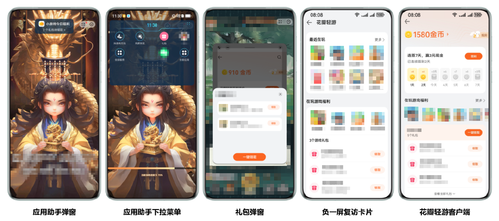
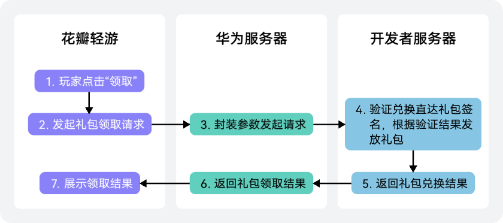

直达礼包为用户提供了方便快捷的礼包领取体验，同时降低了礼包被刷的风险。

## 使用场景

用户在客户端（展示位置包括应用助手弹窗/应用助手下拉菜单/负一屏复访卡片/花瓣轻游客户端）完成领取动作后，开发者在游戏内直接为该用户账号的角色发放礼包内容，不需要用户先领取礼包串码再复制使用。

## 直达礼包限制

* 直达礼包只支持配置成普通礼包，不支持配置为活动礼包或者开机礼包。
* 目前仅支持接入华为账号的联网游戏。
* 在运营平台配置的开发者服务地址为公网域名。

## 业务流程

1. 玩家在花瓣轻游点击“领取”，向华为服务器发起领取请求，华为服务器封装玩家的各类参数向开发者提供的[直达礼包兑换接口](https://developer.huawei.com/consumer/cn/doc/games-references/games-api-quickgame-server-redeem-direct-gift-0000002366156972)发起直达礼包兑换的请求。
2. 开发者接受请求，对接收到的[请求参数](https://developer.huawei.com/consumer/cn/doc/games-references/games-api-quickgame-server-redeem-direct-gift-0000002366156972#section158484244262)进行处理[生成签名字符串](https://developer.huawei.com/consumer/cn/doc/games-references/games-api-quickgame-server-redeem-direct-gift-0000002366156972#section15458102542611)，并[校验签名](https://developer.huawei.com/consumer/cn/doc/games-references/games-api-quickgame-server-redeem-direct-gift-0000002366156972#section1217516466268)。
3. 签名校验完成，根据校验结果返回兑换结果至华为服务器。

   

   当前不需要对是否注册角色进行限制，当用户领取礼包时直接判断领取成功即可。
4. 华为服务器返回领取结果至花瓣轻游，花瓣轻游向玩家展示领取结果，同时快游戏根据相关信息自行发放礼包。

## 开发指导

1. 在AGC控制台[配置快游戏直达礼包](https://developer.huawei.com/consumer/cn/doc/games-guides/games-quickgame-develop-direct-gifts-0000002351933757)。
2. 提供[直达礼包兑换接口](https://developer.huawei.com/consumer/cn/doc/games-references/games-api-quickgame-server-redeem-direct-gift-0000002366156972)。
3. 联系华为接口人[调试](#section18291214111813)接口服务是否正常。

## 功能调试

1. 联系华为接口人：QQ1：2851508897，QQ2：2850400633。
2. 开发者需要准备[游戏公钥和私钥](https://developer.huawei.com/consumer/cn/doc/games-guides/games-quickgame-enable-account-kit-0000002317894820#section16882021380)、[APP ID](https://developer.huawei.com/consumer/cn/doc/games-guides/games-quickgame-enable-account-kit-0000002317894820#section1148753814717)和服务URL地址（获取发放游戏内礼包）。
3. 调试接口服务是否正常。

## 相关链接

### FAQ

[兑换直达礼包签名在服务器侧验证不通过，应该如何处理？](https://developer.huawei.com/consumer/cn/doc/games-guides/games-quickgame-faq-gift-0000002458772637#section448834284215)
