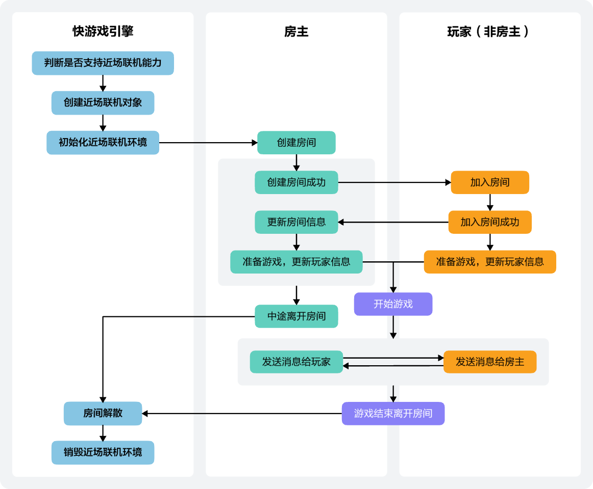
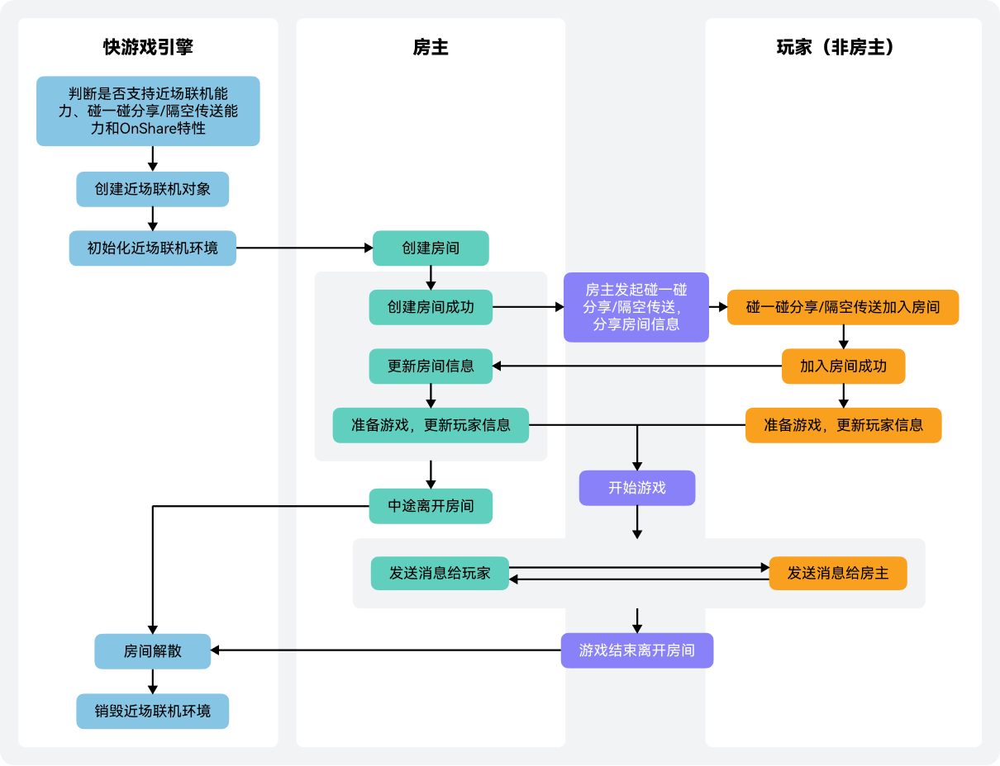
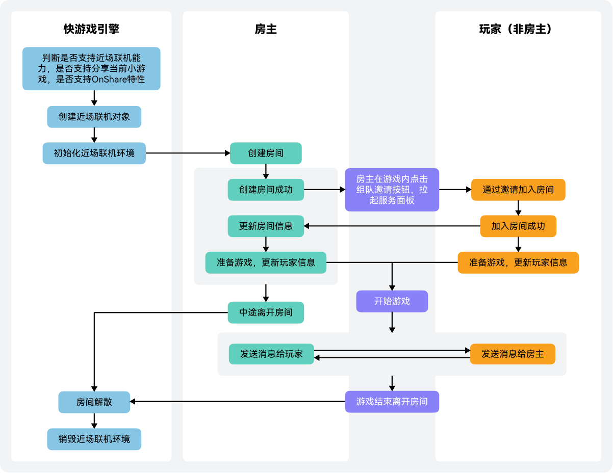

近场联机服务为无网专区小游戏提供了在无网环境（如飞机、高铁）通过蓝牙实现联机对战的功能。您的游戏只需要接入近场联机服务即可快速实现无网联机对战，提升玩家游戏体验，并降低游戏开发成本。

## 使用场景

当前近场联机服务主要适用于回合制（棋牌类）游戏。

## 开发指导

### 手动加入房间



1. 通过调用[qg.canIUse('MiniGame.NearbyPlaying')](https://developer.huawei.com/consumer/cn/doc/games-references/games-api-quickgame-runtime-sysinfo-0000002399676789#section165771434195617)判断当前客户端是否支持近场联机能力。
2. 通过let gameNearbyPlayingManager = [qg.createGameNearbyPlayingManager()](https://developer.huawei.com/consumer/cn/doc/games-references/games-api-quickgame-runtime-game-nearby-playing-0000002399676821#section20934131615911)创建近场联机对象。
3. 调用[GameNearbyPlayingManager.init](https://developer.huawei.com/consumer/cn/doc/games-references/games-api-quickgame-runtime-game-nearby-playing-0000002399676821#section19206171192917)初始化近场联机环境。

   成功执行[GameNearbyPlayingManager.onInit](https://developer.huawei.com/consumer/cn/doc/games-references/games-api-quickgame-runtime-game-nearby-playing-0000002399676821#section18152172114274)回调。

   ```
   this.gameNearbyPlayingManager.onInit((res) => {
     that.showLog("nearby: onInit, res = " + JSON.stringify(res));
   });
   ```

   失败执行[GameNearbyPlayingManager.onError](https://developer.huawei.com/consumer/cn/doc/games-references/games-api-quickgame-runtime-game-nearby-playing-0000002399676821#section114881535164515)回调。

   ```
   this.gameNearbyPlayingManager.onError((res) => {
     that.showLog("nearby test: onError, res = " + JSON.stringify(res));
   });
   ```
4. 房主调用[GameNearbyPlayingManager.createRoom](https://developer.huawei.com/consumer/cn/doc/games-references/games-api-quickgame-runtime-game-nearby-playing-0000002399676821#section842225710263)创建房间，其他玩家调用[GameNearbyPlayingManager.joinRoom](https://developer.huawei.com/consumer/cn/doc/games-references/games-api-quickgame-runtime-game-nearby-playing-0000002399676821#section1914845912614)加入已有房间。
5. 调用[GameNearbyPlayingManager.getRoom](https://developer.huawei.com/consumer/cn/doc/games-references/games-api-quickgame-runtime-game-nearby-playing-0000002399676821#section9565113102719)查询房间信息，房间信息更新时调用[GameNearbyPlayingManager.updateRoom](https://developer.huawei.com/consumer/cn/doc/games-references/games-api-quickgame-runtime-game-nearby-playing-0000002399676821#section656741532716)。
6. 玩家信息更新时调用[GameNearbyPlayingManager.updatePlayer](https://developer.huawei.com/consumer/cn/doc/games-references/games-api-quickgame-runtime-game-nearby-playing-0000002399676821#section128310165279)。
7. 通过调用[GameNearbyPlayingManager.sendToMaster](https://developer.huawei.com/consumer/cn/doc/games-references/games-api-quickgame-runtime-game-nearby-playing-0000002399676821#section13951917152713)玩家可以发送消息给房主，通过调用[GameNearbyPlayingManager.sendToPlayer](https://developer.huawei.com/consumer/cn/doc/games-references/games-api-quickgame-runtime-game-nearby-playing-0000002399676821#section652010191272)房主可以同步消息给房间内其他玩家。
8. 通过[GameNearbyPlayingManager.onDismissRoomNotify](https://developer.huawei.com/consumer/cn/doc/games-references/games-api-quickgame-runtime-game-nearby-playing-0000002399676821#section19132986916)监听到房间解散后，可以调用[GameNearbyPlayingManager.destroy](https://developer.huawei.com/consumer/cn/doc/games-references/games-api-quickgame-runtime-game-nearby-playing-0000002399676821#section5388105112614)销毁近场联机环境。

### 碰一碰/隔空传送加入房间



1. 通过调用[qg.canIUse('MiniGame.NearbyPlaying')](https://developer.huawei.com/consumer/cn/doc/games-references/games-api-quickgame-runtime-sysinfo-0000002399676789#section165771434195617)判断当前客户端是否支持近场联机能力，再调用[qg.canIUse('MiniGame.KnockSharing')](https://developer.huawei.com/consumer/cn/doc/games-references/games-api-quickgame-runtime-sysinfo-0000002399676789#section165771434195617)/[qg.canIUse('MiniGame.GesturesShare')](https://developer.huawei.com/consumer/cn/doc/games-references/games-api-quickgame-runtime-sysinfo-0000002399676789#section165771434195617)判断当前客户端是否支持碰一碰分享/隔空传送，最后调用[qg.canIUse('MiniGame.OnShare')](https://developer.huawei.com/consumer/cn/doc/games-references/games-api-quickgame-runtime-sysinfo-0000002399676789#section165771434195617)判断当前客户端是否支持OnShare特性。
2. 通过let gameNearbyPlayingManager = [qg.createGameNearbyPlayingManager()](https://developer.huawei.com/consumer/cn/doc/games-references/games-api-quickgame-runtime-game-nearby-playing-0000002399676821#section20934131615911)创建近场联机对象。
3. 调用[GameNearbyPlayingManager.init](https://developer.huawei.com/consumer/cn/doc/games-references/games-api-quickgame-runtime-game-nearby-playing-0000002399676821#section19206171192917)初始化近场联机环境。

   成功执行[GameNearbyPlayingManager.onInit](https://developer.huawei.com/consumer/cn/doc/games-references/games-api-quickgame-runtime-game-nearby-playing-0000002399676821#section18152172114274)回调。

   ```
   this.gameNearbyPlayingManager.onInit((res) => {
     that.showLog("nearby: onInit, res = " + JSON.stringify(res));
   });
   ```

   失败执行[GameNearbyPlayingManager.onError](https://developer.huawei.com/consumer/cn/doc/games-references/games-api-quickgame-runtime-game-nearby-playing-0000002399676821#section114881535164515)回调。

   ```
   this.gameNearbyPlayingManager.onError((res) => {
     that.showLog("nearby test: onError, res = " + JSON.stringify(res));
   });
   ```
4. 房主调用[GameNearbyPlayingManager.createRoom](https://developer.huawei.com/consumer/cn/doc/games-references/games-api-quickgame-runtime-game-nearby-playing-0000002399676821#section842225710263)创建房间。
5. 房主和其他玩家使用手机碰一碰分享/隔空传送，房主在[qg.onShare](https://developer.huawei.com/consumer/cn/doc/games-references/games-api-quickgame-runtime-knock-share-0000002366156896#section94961019174317)中返回房间信息。

   ```
   qg.onShare((shareType)=>{
      if ("knock" === shareType) {
   	return extraData: "{roomId: 176567}"
      } else if ("gesturesShare" === shareType) {
           return extraData: "{roomId: 176568}"
      }
   })
   ```
6. 其他玩家作为接收方，在[qg.onReceiveShare](https://developer.huawei.com/consumer/cn/doc/games-references/games-api-quickgame-runtime-knock-share-0000002366156896#section870510433594)接口设置用于监听碰一碰分享/隔空传送参数的回调函数。解析监听得到的分享参数，获取对应的房间信息，调用[GameNearbyPlayingManager.joinRoom](https://developer.huawei.com/consumer/cn/doc/games-references/games-api-quickgame-runtime-game-nearby-playing-0000002399676821#section1914845912614)加入房间。

   ```
   const listener = function (shareType, params) {
     if ("knock" === shareType) {
       var extraData = params && params.extraData;
       if (extraData) {
         // 1、解析extraData，获取roomId
         // 2、调用joinRoom加入房间
       }
     } else if ("gesturesShare" === shareType) {
       var extraData = params && params.extraData;
       if (extraData) {
         // 1、解析extraData，获取roomId
         // 2、调用joinRoom加入房间
       }
     }
   }
   qg.onReceiveShare(listener);
   ```
7. 调用[GameNearbyPlayingManager.getRoom](https://developer.huawei.com/consumer/cn/doc/games-references/games-api-quickgame-runtime-game-nearby-playing-0000002399676821#section9565113102719)查询房间信息，房间信息更新时调用[GameNearbyPlayingManager.updateRoom](https://developer.huawei.com/consumer/cn/doc/games-references/games-api-quickgame-runtime-game-nearby-playing-0000002399676821#section656741532716)。
8. 玩家信息更新时调用[GameNearbyPlayingManager.updatePlayer](https://developer.huawei.com/consumer/cn/doc/games-references/games-api-quickgame-runtime-game-nearby-playing-0000002399676821#section128310165279)。
9. 通过调用[GameNearbyPlayingManager.sendToMaster](https://developer.huawei.com/consumer/cn/doc/games-references/games-api-quickgame-runtime-game-nearby-playing-0000002399676821#section13951917152713)玩家可以发送消息给房主，通过调用[GameNearbyPlayingManager.sendToPlayer](https://developer.huawei.com/consumer/cn/doc/games-references/games-api-quickgame-runtime-game-nearby-playing-0000002399676821#section652010191272)房主可以同步消息给房间内其他玩家。
10. 通过[GameNearbyPlayingManager.onDismissRoomNotify](https://developer.huawei.com/consumer/cn/doc/games-references/games-api-quickgame-runtime-game-nearby-playing-0000002399676821#section19132986916)监听到房间解散后，可以调用[GameNearbyPlayingManager.destroy](https://developer.huawei.com/consumer/cn/doc/games-references/games-api-quickgame-runtime-game-nearby-playing-0000002399676821#section5388105112614)销毁近场联机环境。

### 组队邀请加入房间



1. 通过调用[qg.canIUse('MiniGame.NearbyPlaying')](https://developer.huawei.com/consumer/cn/doc/games-references/games-api-quickgame-runtime-sysinfo-0000002399676789#section165771434195617)判断当前客户端是否支持近场联机能力，再调用[qg.canIUse('MiniGame.SystemShare.ShareSelf')](https://developer.huawei.com/consumer/cn/doc/games-references/games-api-quickgame-runtime-sysinfo-0000002399676789#section165771434195617)判断当前客户端是否支持分享当前小游戏，最后调用[qg.canIUse('MiniGame.OnShare')](https://developer.huawei.com/consumer/cn/doc/games-references/games-api-quickgame-runtime-sysinfo-0000002399676789#section165771434195617)判断当前客户端是否支持OnShare特性。
2. 通过let gameNearbyPlayingManager = [qg.createGameNearbyPlayingManager()](https://developer.huawei.com/consumer/cn/doc/games-references/games-api-quickgame-runtime-game-nearby-playing-0000002399676821#section20934131615911)创建近场联机对象。
3. 调用[GameNearbyPlayingManager.init](https://developer.huawei.com/consumer/cn/doc/games-references/games-api-quickgame-runtime-game-nearby-playing-0000002399676821#section19206171192917)初始化近场联机环境。

   成功执行[GameNearbyPlayingManager.onInit](https://developer.huawei.com/consumer/cn/doc/games-references/games-api-quickgame-runtime-game-nearby-playing-0000002399676821#section18152172114274)回调。

   ```
   this.gameNearbyPlayingManager.onInit((res) => {
     that.showLog("nearby: onInit, res = " + JSON.stringify(res));
   });
   ```

   失败执行[GameNearbyPlayingManager.onError](https://developer.huawei.com/consumer/cn/doc/games-references/games-api-quickgame-runtime-game-nearby-playing-0000002399676821#section114881535164515)回调。

   ```
   this.gameNearbyPlayingManager.onError((res) => {
     that.showLog("nearby test: onError, res = " + JSON.stringify(res));
   });
   ```
4. 房主调用[GameNearbyPlayingManager.createRoom](https://developer.huawei.com/consumer/cn/doc/games-references/games-api-quickgame-runtime-game-nearby-playing-0000002399676821#section842225710263)创建房间。
5. 房主点击游戏内组队邀请按钮，调用type为“application/vnd.huawei.minigame”、data为“myself”的[qg.systemShare](https://developer.huawei.com/consumer/cn/doc/games-references/games-api-quickgame-runtime-share-0000002399796685#section16201454172110)拉起华为分享界面。

   ```
   qg.systemShare({
     type: 'application/vnd.huawei.minigame',
     data: 'myself',
     success: function () { console.log('share success') },
     fail: function (errMsg, errCode) { console.log('share fail --- ' + errCode + ':' + errMsg) },
     cancel: function (data) { console.log("share cancel:" + data) },
     complete: function () { console.log('share complete') }
   });
   ```
6. 房主在[qg.onShare](https://developer.huawei.com/consumer/cn/doc/games-references/games-api-quickgame-runtime-knock-share-0000002366156896#section94961019174317)中返回房间信息。

   ```
   qg.onShare((shareType)=>{
      if ("systemShare" === shareType) {
   	return extraData: "{roomId: 176567}"
      }
   })
   ```
7. 其他玩家作为接收方，在[qg.onReceiveShare](https://developer.huawei.com/consumer/cn/doc/games-references/games-api-quickgame-runtime-knock-share-0000002366156896#section870510433594)接口设置用于监听组队邀请的回调函数。解析监听得到的分享参数，获取对应的房间信息，调用[GameNearbyPlayingManager.joinRoom](https://developer.huawei.com/consumer/cn/doc/games-references/games-api-quickgame-runtime-game-nearby-playing-0000002399676821#section1914845912614)加入房间。

   ```
   const listener = function (shareType, params) {
     if ("systemShare" === shareType) {
       var extraData = params && params.extraData;
       if (extraData) {
         // 1、解析extraData，获取roomId
         // 2、调用joinRoom加入房间
       }
     }
   }
   qg.onReceiveShare(listener);
   ```
8. 调用[GameNearbyPlayingManager.getRoom](https://developer.huawei.com/consumer/cn/doc/games-references/games-api-quickgame-runtime-game-nearby-playing-0000002399676821#section9565113102719)查询房间信息，房间信息更新时调用[GameNearbyPlayingManager.updateRoom](https://developer.huawei.com/consumer/cn/doc/games-references/games-api-quickgame-runtime-game-nearby-playing-0000002399676821#section656741532716)。
9. 玩家信息更新时调用[GameNearbyPlayingManager.updatePlayer](https://developer.huawei.com/consumer/cn/doc/games-references/games-api-quickgame-runtime-game-nearby-playing-0000002399676821#section128310165279)。
10. 通过调用[GameNearbyPlayingManager.sendToMaster](https://developer.huawei.com/consumer/cn/doc/games-references/games-api-quickgame-runtime-game-nearby-playing-0000002399676821#section13951917152713)玩家可以发送消息给房主，通过调用[GameNearbyPlayingManager.sendToPlayer](https://developer.huawei.com/consumer/cn/doc/games-references/games-api-quickgame-runtime-game-nearby-playing-0000002399676821#section652010191272)房主可以同步消息给房间内其他玩家。
11. 通过[GameNearbyPlayingManager.onDismissRoomNotify](https://developer.huawei.com/consumer/cn/doc/games-references/games-api-quickgame-runtime-game-nearby-playing-0000002399676821#section19132986916)监听到房间解散后，可以调用[GameNearbyPlayingManager.destroy](https://developer.huawei.com/consumer/cn/doc/games-references/games-api-quickgame-runtime-game-nearby-playing-0000002399676821#section5388105112614)销毁近场联机环境。
