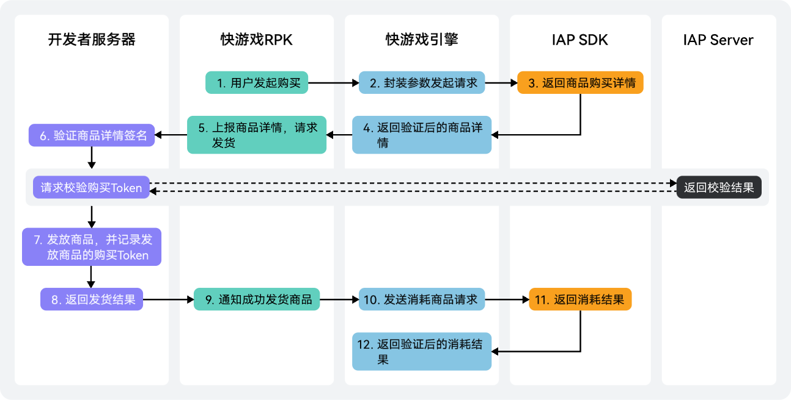

消耗型商品仅能使用一次，消耗使用后即刻失效，需再次购买，例如游戏中额外生命、游戏货币等。

## 前提条件

* 已[注册开发者账号](https://developer.huawei.com/consumer/cn/doc/games-guides/games-quickgame-registration-account-0000002351933629)。
* 已[创建项目和快游戏](https://developer.huawei.com/consumer/cn/doc/games-guides/games-quickgame-create-quickgame-0000002317894816)。
* 已[打开游戏服务API开关](https://developer.huawei.com/consumer/cn/doc/games-guides/games-quickgame-enable-game-kit-0000002351893445#ZH-CN_TOPIC_0000002382054097__zh-cn_topic_0000001113292730_li1450624175912)、[打开应用内支付服务API开关](https://developer.huawei.com/consumer/cn/doc/games-guides/games-quickgame-enable-game-kit-0000002351893445#ZH-CN_TOPIC_0000002382054097__zh-cn_topic_0000001113292730_li59494019315)。
* 已[获取APP ID](https://developer.huawei.com/consumer/cn/doc/games-guides/games-quickgame-enable-account-kit-0000002317894820#section1148753814717)、[获取支付公钥](https://developer.huawei.com/consumer/cn/doc/games-guides/games-quickgame-enable-account-kit-0000002317894820#section8652102314545)。
* 已前往AGC控制台[创建游戏内商品](https://developer.huawei.com/consumer/cn/doc/games-guides/games-quickgame-enable-gameobe-kit-0000002351933633)。

## 业务流程



1. 用户发起商品购买请求。
2. 客户端携带商品ID、商品类型等信息向IAP SDK发起购买请求。
3. 用户完成支付后，IAP SDK向客户端返回订单ID、商品ID等购买数据及其签名数据。
4. 同时向快游戏返回购买数据及其签名数据。
5. 客户端将收到的订单数据和签名向开发者服务器进行上报，请求发货。
6. 开发者服务器使用IAP公钥[对客户端返回结果验证](#section9450525193515)。若您的游戏对安全性要求比较高，可以不使用客户端数据，直接通过服务端[Order服务购买Token校验](https://developer.huawei.com/consumer/cn/doc/HMSCore-References/api-order-verify-purchase-token-0000001050746113)，向华为支付服务器发起校验请求，进一步确认订单的准确性。
7. 成功验证订单后，开发者服务器发放商品，并记录商品的发货状态，即购买Token和商品ID。

   

   必须保存已发货商品的购买Token，后续可避免重复发货。
8. 开发者服务器返回发货结果给快游戏。
9. 发货成功后，快游戏向客户端请求消耗商品，以此通知华为支付服务器更新商品的发货状态。
10. 客户端发送商品消耗请求时，请携带购买数据中的purchaseToken。
11. IAP SDK向客户端返回商品消耗结果。
12. 客户端成功消耗商品后，华为支付服务器将对应商品重新设置为可购买状态，用户即可再次购买该商品。

    

    * 请在发货成功后再执行消耗操作。
    * 若在服务端发送商品消耗请求，请携带purchaseToken和productId调用[服务端验证购买商品](https://developer.huawei.com/consumer/cn/doc/HMSCore-References/api-purchase-confirm-for-order-service-0000001051066054)。
    * 对于没有服务端的应用，以上流程同样适用，只需将服务端的处理放在客户端即可。

## 查询商品信息

构建请求参数productInfoReq，指定**priceType**为0，发起[qg.obtainProductInfo](https://developer.huawei.com/consumer/cn/doc/games-references/games-api-quickgame-runtime-payment-0000002399676809#section125017344614)请求，查询在AGC控制台已配置的消耗型商品信息，同时设置success和fail回调函数请求结果：

* 若请求成功，应用可获取success返回的商品列表productInfoList，您可以使用productInfoList[i]查看单个商品的详细信息，例如商品价格、名称、描述等。
* 若请求失败，可根据fail返回值判断原因。

```
qg.obtainProductInfo({
  productInfoReq: {
    "priceType": 0,
    "productIds": ["dy1","dmy00","lcole"],
     // 替换为真实有效的APP ID
    "applicationID": "101***1",
  },
  success: function (data) {
    console.log("obtainProductInfo =" + JSON.stringify(data.productInfoList[0]));
  },
  fail: function (data, code) {
    console.log("obtainProductInfo fail data =" + JSON.stringify(data), "code =" + code);
  }
})
```

## 支付环境验证

用户使用应用内支付前，您的应用需先调用[qg.isEnvReady](https://developer.huawei.com/consumer/cn/doc/games-references/games-api-quickgame-runtime-payment-0000002399676809#section1623962461015)，判断当前华为账号所属国家或地区是否支持华为IAP支付，并设置success和fail回调函数发起请求：

* 若请求成功，应用将获取success返回值，表示当前华为账号所属服务地支持应用内支付。
* 若请求失败，应用将根据fail返回值判断不支持应用内支付的原因。

```
qg.isEnvReady({
  isEnvReadyReq: {
    // 替换为真实有效的APP ID
    "applicationID": "101***751"
  },
  success: function (data) {
    console.log("isEnvReady data =", JSON.stringify(data));
  },
  fail: function (data, code) {
    console.log("isEnvReady fail data =" + data, "code =" + code);
  }
})
```

## 购买商品


若用户购买商品后返回“支付失败（-1）”或“已拥有该商品（60051)”时，您需要检查是否存在掉单情况，详情请参见[消耗型商品补单流程](https://developer.huawei.com/consumer/cn/doc/games-guides/games-quickgame-runtime-redelivering-consumables-0000002351893465)。

构建请求参数purchaseIntentReq，指定**priceType**为0，发起[qg.createPurchaseIntent](https://developer.huawei.com/consumer/cn/doc/games-references/games-api-quickgame-runtime-payment-0000002399676809#section416683091)请求，页面跳转至收银台购买支付在AGC控制台配置的消耗型商品，同时设置success和fail回调函数请求结果：

* 若用户成功购买，应用可获取success回调函数的订单详情和签名字符串。使用支付公钥[对返回结果验证](#section9450525193515)，若应用有自己的服务器，需要应用服务器到客户端获取购买后详情数据和签名。
* 若用户取消购买或其它异常场景，应用会根据fail回调函数的返回码判断原因。

```
qg.createPurchaseIntent({
  purchaseIntentReq: {
    // 替换为真实有效的APP ID
    "applicationID": "101***751",
    "productId": "dmy001",
    "priceType": 0,
    "developerPayload": "testPurchase",
      // 替换为真实有效的支付公钥
    "publicKey": "MIIBojANBgkqh******************aZWT7PzVAeGidLcEeKlAgMBAAE"
  },
  success: function (data) {
    that.inAppPurchaseData = data;
    console.log("createPurchaseIntent success =" + JSON.stringify(data));

  },
  fail: function (data, code) {
    console.log("createPurchaseIntent fail data =" + data, "code =" + code);

  }
})
```

## 对客户端返回结果验证

在接口调用的过程中，请求方在获取接收方的响应结果后，若返回结果中包含了查询结果的签名字符串，请求方可以对签名字符串使用支付公钥进行验证，确认返回结果没有被篡改，使用支付公钥后进行验签：

1. 获取需要验签的结果字符串。调用[qg.obtainOwnedPurchases](https://developer.huawei.com/consumer/cn/doc/games-references/games-api-quickgame-runtime-payment-0000002399676809#section3284913305)后返回的商品信息inAppPurchaseDataList需要验签，取第1条商品信息的JSON字符串参与验签。
2. 获取对应的签名字符串。调用[qg.obtainOwnedPurchases](https://developer.huawei.com/consumer/cn/doc/games-references/games-api-quickgame-runtime-payment-0000002399676809#section3284913305)后返回的签名字符串inAppSignature，取与第1条商品信息对应的签名字符串参与验签。
3. 通过SHA256WithRSA算法使用支付公钥对结果字符串和签名字符串进行验证。


* 建议把支付公钥存放在服务端并在服务端完成签名校验，保证接口调用的安全性。
* 建议填写最小平台版本号**minPlatformVersion**大于等于**1103**，否则返回的验签JSON字符串顺序可能出现问题。

```
/** *校验签名信息
* @param content 结果字符串
* @param sign 签名字符串
* @param publicKey 支付公钥
* @param是否校验通过
*/
public static boolean doCheck(String content, String sign, String publicKey) {
    if ( sign == null) {
        return false;
    }
    if (publicKey == null) {
        return false;
    }
    try {
        KeyFactory keyFactory = KeyFactory.getInstance("RSA");
        byte[] encodedKey = Base64.decode(publicKey);
        PublicKey pubKey = keyFactory.generatePublic(new X509EncodedKeySpec(encodedKey));
        java.security.Signature signature = null;
        signature = java.security.Signature.getInstance("SHA256WithRSA");
        signature.initVerify(pubKey);
        signature.update(content.getBytes(StandardCharsets.UTF_8));
        byte[] bsign = Base64.decode(sign);
        return signature.verify(bsign);
    } catch (RuntimeException e) {
        throw e;
    } catch (Exception e) {
        e.printStackTrace();
    }
    return false;
}
```

## （可选）对服务端返回结果验证

玩家触发[V2版本关键事件](https://developer.huawei.com/consumer/cn/doc/HMSCore-References/api-notifications-about-subscription-events-v2-0000001385268541#section3341022479)后，若想接收华为应用内支付服务器关键事件的通知，请在AGC控制台[配置回调地址](https://developer.huawei.com/consumer/cn/doc/games-guides/games-quickgame-enable-iap-kit-0000002318054648#section18765154225513)和[选择签名算法](https://developer.huawei.com/consumer/cn/doc/games-guides/games-quickgame-enable-iap-kit-0000002318054648#section17361339155314)。接收关键事件的接口调用流程如下：

1. 关键事件发生时，华为应用内支付服务器将自动调用[关键事件通知V2版本](https://developer.huawei.com/consumer/cn/doc/HMSCore-References/api-notifications-about-subscription-events-v2-0000001385268541#section1943932814710)接口，返回字段中包括**purchaseToken**和**productId**。
2. 信息接收后，您的服务器需立即发送**200**响应，否则该消息会重复发送。
3. 使用**purchaseToken**和**productId**，主动调用[Order服务验证购买Token](https://developer.huawei.com/consumer/cn/doc/HMSCore-References/api-order-verify-purchase-token-0000001050746113)接口查询具体的支付订单数据，华为应用内支付服务器接收后会返回支付的详细数据。
4. 将拿到的支付数据进行服务端验签，详情请参见[服务端验签](https://developer.huawei.com/consumer/cn/doc/HMSCore-Guides/verifying-signature-returned-result-0000001050033088)。

## 消耗商品

用户完成支付后，游戏需根据购买数据purchaseState判断是否成功支付订单。成功支付后即可发放对应的商品或提供对应的服务，之后向IAP发送发货确认请求。

1. 调用[qg.createPurchaseIntent](https://developer.huawei.com/consumer/cn/doc/games-references/games-api-quickgame-runtime-payment-0000002399676809#section416683091)后，若success回调函数中inAppPurchaseData的**purchaseState**值为0，表示用户已成功支付，游戏需要发放对应的消耗型商品，并向华为IAP发送发货确认请求。
2. 解析inAppPurchaseData中的**purchaseToken**信息，确认对应商品已发货后并记录发货商品的**purchaseToken**。
3. 携带**purchaseToken**，发起[qg.consumeOwnedPurchase](https://developer.huawei.com/consumer/cn/doc/games-references/games-api-quickgame-runtime-payment-0000002399676809#section2946161093810)请求消耗该商品，游戏成功执行消耗后，华为服务器将此商品重新设置为可购买状态，即用户可再次购买该商品。

```
qg.consumeOwnedPurchase({
  consumeOwnedPurchaseReq: {
    // 替换为真实有效的APP ID
    "applicationID": "101***751",
    "developerPayload": "testPurchase",
      // 替换为真实有效的购买令牌
    "purchaseToken": "0000017297d6a4faa**************3d0x434e.1.101315751",
     // 替换为真实有效的支付公钥
    "publicKey": "MIIBojANBgkqhkiG9w0*************************EeKlAgMBAAE"
  },
  success: function (data) {
    console.log("consumeOwnedPurchase data =", JSON.stringify(data));
  },
  fail: function (data, code) {
    console.log("consumeOwnedPurchase fail data =" + JSON.stringify(data), "code =" + code);
  }
})
```

## 开发实战视频

如下视频演示消耗型商品如何开发接入应用内支付能力。

[](https://mos-vod-drcn.dbankcdn.cn/P_VT/video_injection/3FE15F0CF4E139F1D8F1182D00AEF37E5E392B885CAAC89733CBE4BAD5F93794134B361/v3/M1814557138811367424/MP4Mix_H.264_1920x1080_6000_HEAAC1_PVC_NoCut.mp4)
