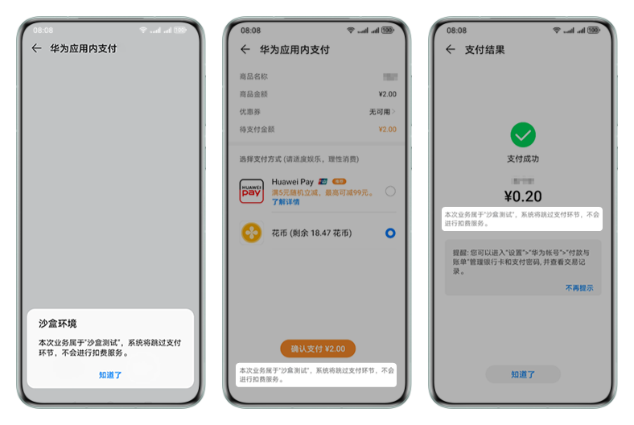

沙盒测试允许您在接入应用内支付服务联调过程中无需真实支付即可完成端到端的测试。

## 前提条件

* 已[添加沙盒测试账号](https://developer.huawei.com/consumer/cn/doc/distribution/app/agc-help-testaccount-0000001146438651)，测试账号生效需30min~1h。
* 调试手机已安装3.0以上版本的HMS Core APK，否则仍会真实的扣费。
* 若快游戏未上架，请确保测试包的versionCode大于0；若快游戏已在架，请确保测试包versionCode需要大于上架版本的versionCode

## 验证沙盒环境

在使用沙盒测试前，您需要先调用[qg.isSandboxActivated](https://developer.huawei.com/consumer/cn/doc/games-references/games-api-quickgame-runtime-payment-0000002399676809#section181371925102211)判断是否判断当前账号和应用的RPK版本是否满足沙盒条件，并设置success和fail回调函数发起请求：

* 若请求成功，应用将获取success返回值，表示当前账号是沙盒账号，且快游戏版本满足沙盒条件。
* 若请求失败，应用将根据fail返回值判断不支持沙盒测试的原因。

```
qg.isSandboxActivated({
  isSandboxActivatedReq: {
     // 替换为真实有效的APP ID
    "applicationID": "101***751",
  },
  success: function (data) {
    console.log("isSandboxActivated data =", JSON.stringify(data));
  },
  fail: function (data, code) {
    console.log("isSandboxActivated fail data =" + JSON.stringify(data), "code =" + code);
  }
})
```

## 测试商品支付

沙盒测试场景下的购买流程与正式环境的购买流程一致。在设备上登录测试账号，打开测试应用，发起消耗型或非消耗型商品的购买请求，IAP会检测到用户为测试用户，跳过实际支付环节，直接支付成功。IAP购买成功后的收据信息中会携带值为0的purchaseType字段，标识此次购买为沙盒测试的记录。若购买非消耗型商品，购买之后可以消耗，消耗之后可以再次购买，以方便测试。

沙盒测试跳转至IAP收银台时会弹出沙盒环境标志的弹框，收银台和成功页也均有沙盒环境的标志。



## 相关链接

### FAQ

[文档中只描述需要对游戏时长做防沉迷处理，那么未成年人支付如何处理？](/docs/dev/game-dev/games-quickgame-faq-payment-0000002458692481#section14202162622019)

### 案例

[华为快游戏支付验签失败，原因竟是设置的最小平台号版本过低。](https://developer.huawei.com/consumer/cn/forum/topic/0208124109352547335?fid=18)
