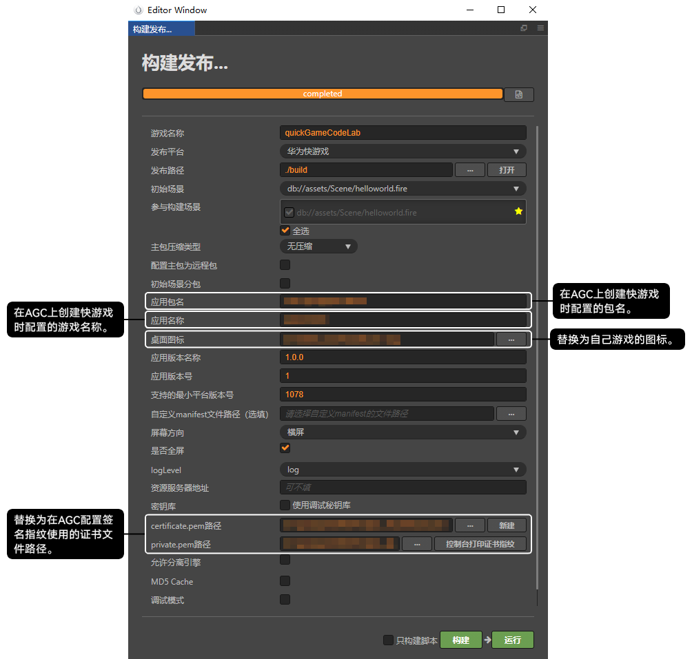
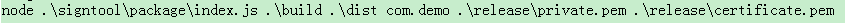
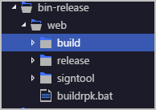

## Cocos Creator

菜单选择“项目 &gt; 构建发布”，在“构建发布”窗口填写发布信息后点击“构建”即可在快游戏项目的\build\huawei\dist路径下生成RPK文件。



## 低版本LayaAir


若LayaAir引擎在**2.8.0及以上版本**，请参考[华为快游戏接入与发布调试指南](https://ldc2.layabox.com/doc/?language=zh&nav=zh-ts-5-9-1)打包快游戏。

若LayaAir引擎**低于2.8.0版本**，打包快游戏步骤如下：

1. 下载[laya\_project\_demo.zip](https://alliance-communityfile-drcn.dbankcdn.com/FileServer/getFile/cmtyPub/011/111/111/0000000000011111111.20260323192519.89743275535527787556677898323914%3A20260603110930%3A2800%3AC75B613A41C0DB01DF4D75A101F7246D3177347B4578A2A5424D054B32FE7277.zip?needInitFileName=true)，提供如下两种打包成RPK文件的方式：

   

   若未安装node.js，或node.js的安装版本小于6，请前往[NodeJS官网](https://nodejs.org/en/)下载安装。

   * **方法一：node 命令方式**。在命令行窗口输入如下命令：

     ```
     // node {签名工具路径} {签名目录} {目标目录} {包名} {私钥} {证书}
     node .\signtool\package\index.js .\web .\dist com.demo .\release\private.pem .\release\certificate.pem
     ```

     
   * **方法二：buildrpk.bat脚本**：
     1. 将生成的签名文件复制到laya发布后的**release**目录下。
     2. 将laya\_project\_demo中的**buildrpk.bat**脚本和**signtool**文件夹复制到laya发布后的**release**目录下。
     3. 双击运行**buildrpk.bat**，将在dist目录下生成RPK包。

## 低版本Egret


若EgretLauncher版本大于等于1.2.1且引擎版本大于等于5.3.9 ，打包快游戏请参考打包指南。

1. 下载[egret\_project\_demo.zip](https://alliance-communityfile-drcn.dbankcdn.com/FileServer/getFile/cmtyPub/011/111/111/0000000000011111111.20260323192519.79417214881371025203898306448469%3A20260603110930%3A2800%3A2A42812D1E18B490FCC95E08BA66385F3ACB8702D7676D41AF990838BCEC1935.zip?needInitFileName=true)，提供如下两种打包成RPK文件的方式：

   

   若未安装node.js，或node.js的安装版本小于6，请前往[NodeJS官网](https://nodejs.org/en/)下载安装。

   * **方式一：node命令方式**。在命令行窗口输入如下命令，其中signtool目录的内容可以从 egret\_project\_demo 中获取。

     ```
     // node {签名工具路径} {签名目录} {目标目录} {包名} {私钥} {证书}
     node .\signtool\package\index.js .\build .\dist com.demo .\release\private.pem .\release\certificate.pem
     ```

     
   * **方式二：buildrpk.bat脚本：**
     1. 将本地egret\_project\_demo中bin-release\web路径下的**release文件夹**、**signtool文件夹**、**buildrpk.bat****脚本**复制到Egret当前项目的bin-release\web路径下，与build目录同级别。

        

        复制到当前项目中的release文件夹、signtool文件夹、buildrpk.bat脚本需与在egret\_project\_demo中的存储路径保持一致。

        
     2. 双击运行**buildrpk.bat**，将在**dist**目录下生成RPK文件。

## 相关链接

### 案例

[快游戏加载资源场景，运行时卡屏报错](/docs/dev/game-dev/games-quickgame-case-0000002318064148#section397430191311)
