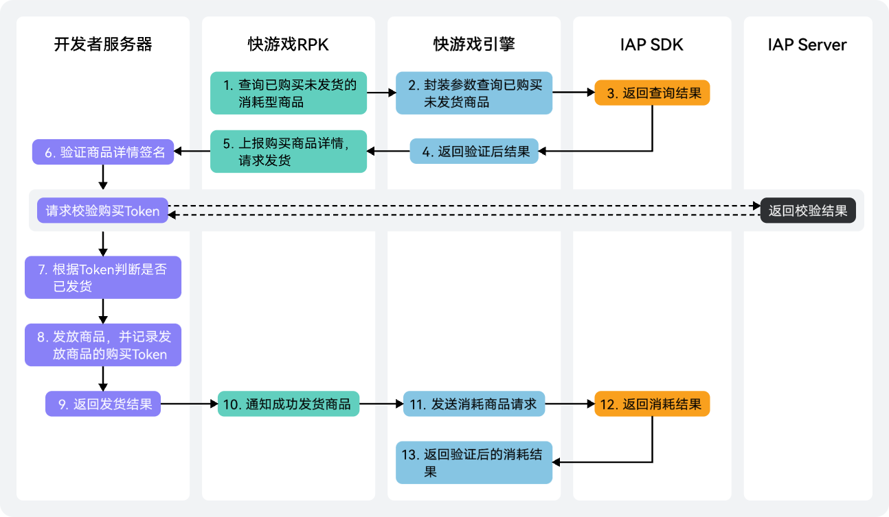

玩家完成消耗型商品的支付后，若出现网络错误、进程被中止等异常情况，导致快游戏无法知道玩家实际是否支付成功，即出现掉单情况。华为应用内支付针对此场景提供了消耗型商品的补单机制，您需要在以下场景触发补单机制：

* 快游戏**启动**时。
* 购买请求返回**-1**时。
* 购买请求返回**60051**时。

补单机制的详细流程如下：



1. 调用[qg.obtainOwnedPurchases](https://developer.huawei.com/consumer/cn/doc/games-references/games-api-quickgame-runtime-payment-0000002399676809#section3284913305)查询用户已购未发货的商品信息。
2. 构建请求参数[ownedPurchasesReq](https://developer.huawei.com/consumer/cn/doc/games-references/games-api-quickgame-runtime-payment-0000002399676809#ZH-CN_TOPIC_0000002399676809__zh-cn_topic_0000001453629405_p15827154893318)并指定**priceType**为0。
3. 若接口请求成功时，可以在success回调中查询用户已购但未发货的商品购买信息及其签名数据。
4. 同时向快游戏返回购买数据及其签名数据。
5. 快游戏向开发者服务器上报购买数据和签名数据，请求发货。
6. 您需使用支付公钥[对返回结果验证](/docs/dev/game-dev/games-quickgame-runtime-iap-consumable-0000002317894836#section9450525193515)。若您的游戏对安全性要求比较高，可通过服务端[Order服务购买Token校验](https://developer.huawei.com/consumer/cn/doc/HMSCore-References/api-order-verify-purchase-token-0000001050746113)，向华为支付服务器发起校验请求，进一步确认订单的准确性。
7. 从购买信息[inAppPurchaseData](https://developer.huawei.com/consumer/cn/doc/games-references/games-api-quickgame-runtime-payment-0000002399676809#ZH-CN_TOPIC_0000002399676809__zh-cn_topic_0000001453629405_p13287101932813)中解析出purchaseState字段，当purchaseState=0时表示此次交易成功，应用仅需要对这部分商品进行补发货操作。

   ```
   qg.obtainOwnedPurchases({
        ownedPurchasesReq: {
          "priceType": 0,
            // 替换为真实有效的APP ID
          "applicationID": "101***751",
           // 替换为真实有效的支付公钥
          "publicKey": "MIIBojANBgkqhkiG9w0BA***************Pf2AaZWT7PzVAeGidLcEeKlAgMBAAE"
        },
        success: function (data) {
          console.log("obtainOwnedPurchases data =", JSON.stringify(data));
        },
        fail: function (data, code) {
          console.log("obtainOwnedPurchases fail data =" + data, "code =" + code);
        }
   })
   ```
8. 若商品未发货，发放消耗型商品并记录购买Token。
9. 开发者服务器返回发货结果给快游戏。
10. 发货成功后，调用[qg.consumeOwnedPurchase](https://developer.huawei.com/consumer/cn/doc/games-references/games-api-quickgame-runtime-payment-0000002399676809#section2946161093810)消耗所有已发货的消耗型商品，以此通知华为支付服务器更新商品的发货状态。
11. 发送商品消耗请求时，请携带购买数据中的purchaseToken。
12. IAP SDK向客户端返回商品消耗结果。
13. 客户端成功消耗商品后，华为支付服务器将对应商品重新设置为可购买状态，用户即可再次购买该商品。

    

    若在服务端发送商品消耗请求，请携带purchaseToken和productId调用[服务端验证购买商品](https://developer.huawei.com/consumer/cn/doc/HMSCore-References/api-purchase-confirm-for-order-service-0000001051066054)。
