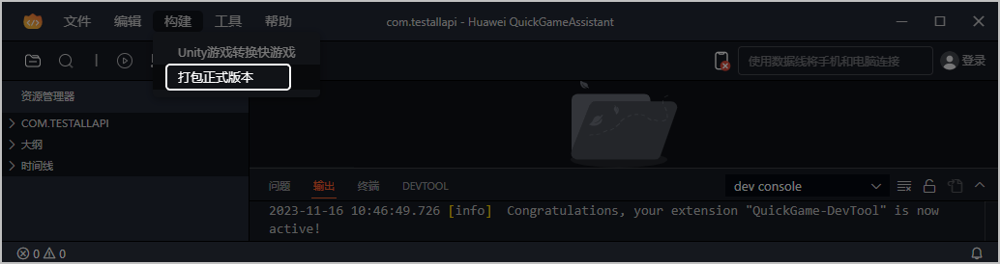
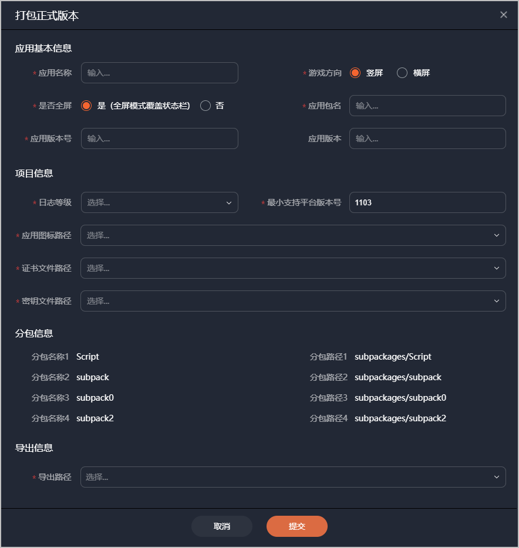
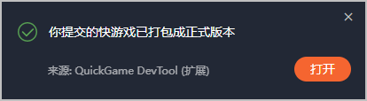

## 准备工作

* 将待打包的快游戏项目尽量优化、缩减，确保打出的正式包不超**20MB**。若正式包超过20MB，将无法在AGC控制台提交上架。
* 在快游戏开发者工具中生成证书、密钥文件，具体操作可参考[生成签名证书](https://developer.huawei.com/consumer/cn/doc/games-guides/games-quickgame-tool-sign-0000002351893601)。
* 准备快游戏图标，要求如下：
  + 图标分辨率216px\*216px，大小不超过2MB的PNG图片。
  + 图标圆角大小为0px。
  + 要和提交上架审核的快游戏图标一致。

## 操作步骤

在快游戏开发者工具中构建正式包的步骤如下：

1. 在快游戏开发者工具中打开快游戏项目。
2. 在工具主界面的菜单栏选择“构建 &gt; 打包正式版本”。

   
3. 在弹出的窗口中填写信息，完成后点击“提交”。

   

   | 分类 | 填写项 | 必填(M)/选填(O) | 说明 |
   | --- | --- | --- | --- |
   | 应用基本信息 | 应用名称 | M | 与AppGallery Connect创建快游戏时填写的应用名称保持一致。 |
   | 游戏方向 | M | 快游戏显示的方向。 |
   | 是否全屏 | M | 玩家打开快游戏后，快游戏界面是否覆盖手机顶部状态栏。 |
   | 应用包名 | M | 与AppGallery Connect创建快游戏时填写的应用包名保持一致。 |
   | 应用版本号 | M | 从1开始，后续重新打包时必须自增1，否则将影响上架版本的更新。例如之前版本号是11，重新打包后需填12。 |
   | 应用版本 | O | 快游戏包体迭代的版本号，例如1.0.0。 |
   | 项目信息 | 日志等级 | M | 在控制台打印的日志等级：  * error：error及以上等级。 * warn：warn及以上等级。 * info：info及以上等级。 * log：log及以上等级。 * debug：debug及以上等级。 |
   | 最小支持平台版本号 | M | 设定值建议不小于**1103**。若未在**manifest**文件中设置minPlatformVersion值，该字段将自动填充为1103。  说明：  * 如果需要使用Br压缩相关能力，该设定值必须不小于1126。 * 当设置为不小于1126的值后，开发者工具会自动将wasm文件压缩为Br格式。 |
   | 应用图标路径 | M | 快游戏图标的路径。 |
   | 证书文件路径 | M | **certificate.pem**证书文件的路径。 |
   | 密钥文件路径 | M | **private.pem**证书文件的路径。 |
   | 分包信息 | 将自动获取并展示快游戏项目的所有分包信息。 | | |
   | 导出信息 | 导出路径 | M | 正式RPK包的路径。 |
4. 请耐心等待打包过程：
   * 若出现如下提示，表示**打包成功**，请前往导出路径查看RPK包。

     
   * 若出现如下提示，表示**打包失败**，请前往C盘用户AppData\Roaming\QuickGameAssistant\logs路径下查看日志，并根据错误的字段进行定位并解决问题。若还是未解决您的问题，请联系minigame@huawei.com。

     
