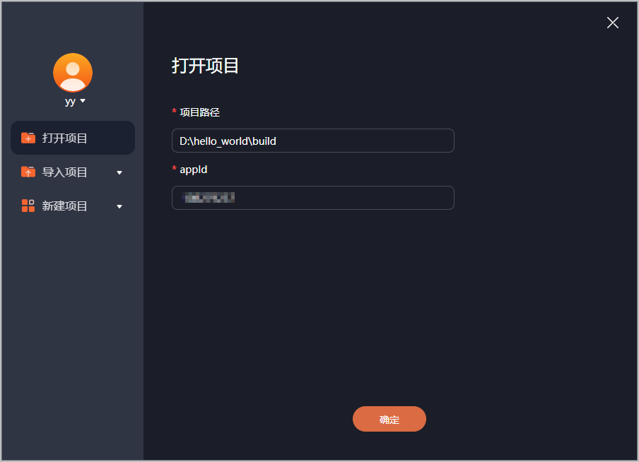
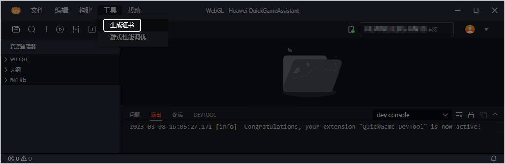
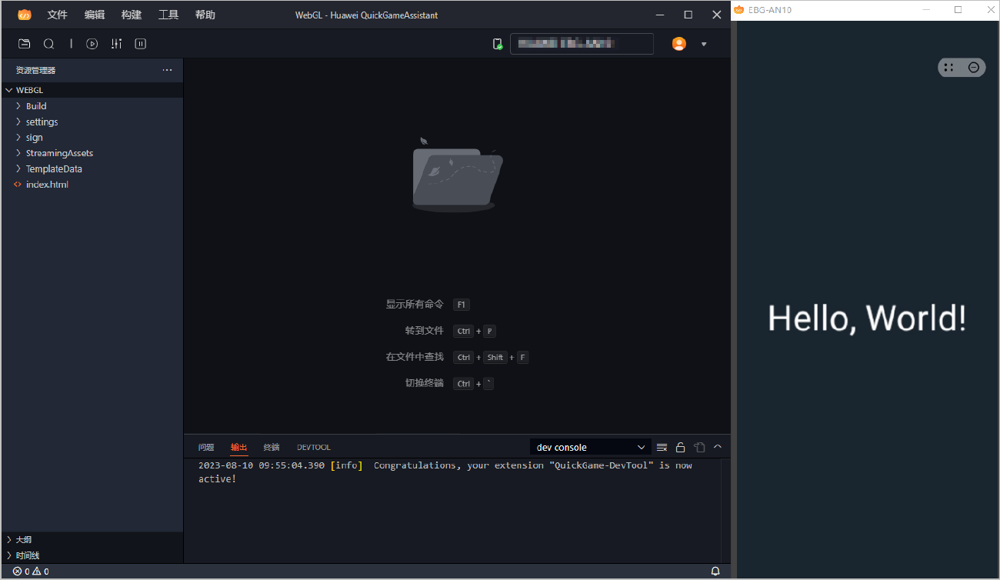
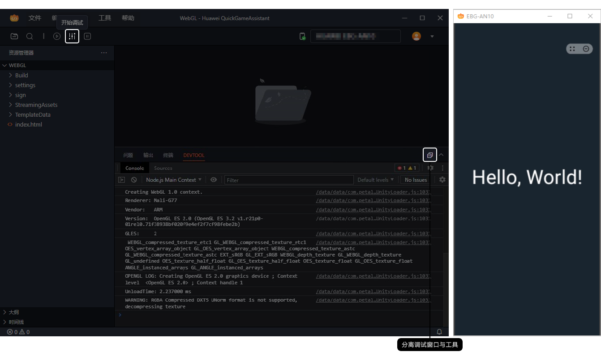
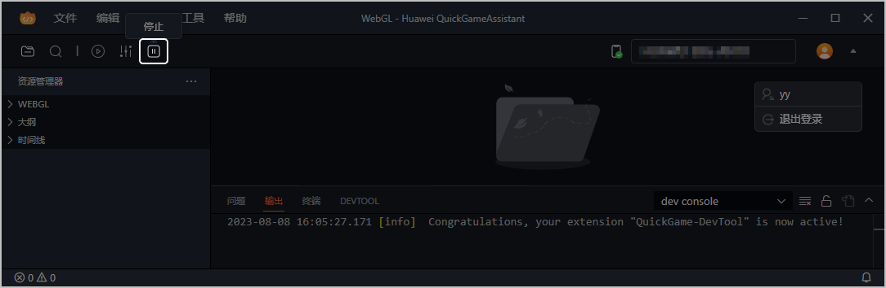
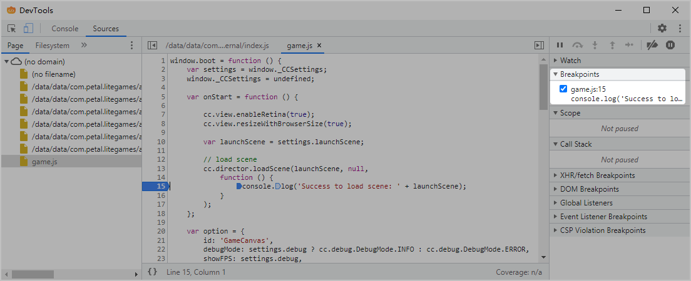
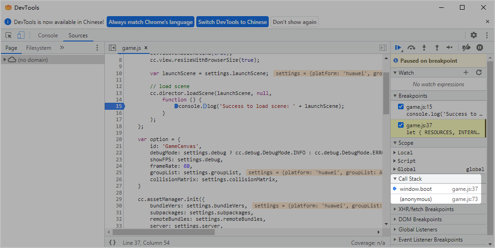
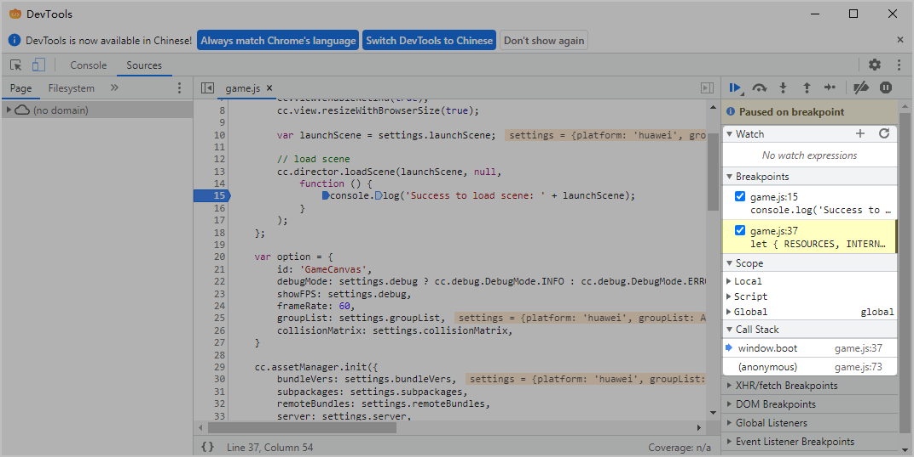
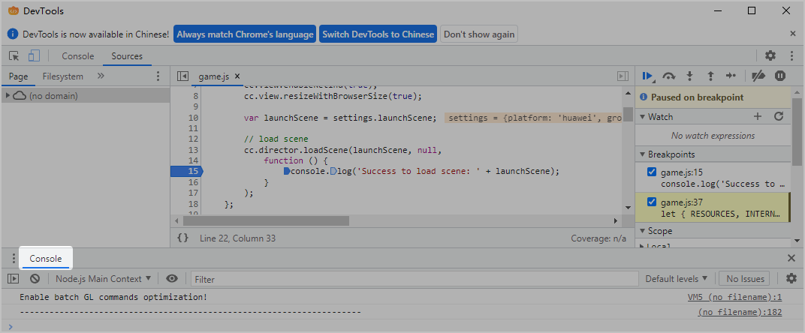

## 前提条件

* 已[获取APP ID](https://developer.huawei.com/consumer/cn/doc/games-guides/games-quickgame-enable-account-kit-0000002317894820#section1148753814717)。
* 准备Android 6.0及以上版本的手机设备，同时要求：
  + 设备上已安装最新版本的花瓣轻游客户端，并使用已实名认证的华为账号登录花瓣轻游。
  + 设备已成功连接电脑，具体操作可参考[华为手机如何成功连接电脑](https://developer.huawei.com/consumer/cn/doc/games-guides/games-quickgame-developer-mode-0000002351904357)。

## 调试步骤

若运行/调试出现问题，您可以通过工具的本地日志进行定位，工具日志的具体位置请参见[如何查看工具详细的报错日志](https://developer.huawei.com/consumer/cn/doc/games-guides/games-quickgame-faq-developer-tool-0000002425133930#section134141449185220)。

1. 打开快游戏开发者工具，与登录花瓣轻游戏相同的华为账号登录快游戏开发者工具。

   

   登录工具的华为账号需和连接设备上的华为账号保持一致。

   
2. 在工具向导界面点击“打开项目”，打开本地快游戏项目文件夹，并填写快游戏**APP ID**，点击“确定”。

   

   项目路径中不允许包含中文字符。

   
3. 若项目没有签名文件，在工具菜单栏选择“工具 &gt; 生成证书”，生成证书文件的具体步骤请参见[生成签名证书](https://developer.huawei.com/consumer/cn/doc/games-guides/games-quickgame-tool-sign-0000002351893601)。

   
4. 确保手机已成功连接后，点击“开始运行”。

   
5. 在手机投屏上运行快游戏。

   
6. 若发现问题，点击“开始调试”，在调试窗口调试并解决问题，详细的代码调试方法请参见[调试方法](#section1125612312118)。
   1. **第一步：设置断点**。您可以在关键代码行的行标处打断点。
   2. **第二步：运行调试**。刷新页面后，点击跟踪按钮开始逐步跟踪代码行，程序会自动停在断点处。
   3. **第三步：查看代码**。每到一处断点，您可以查看此处代码行的执行情况，以此查看出错的精准位置。

   

   

   * 工具支持分离/融合调试窗口，为了方便您调试代码，建议您分离工具与调试窗口。若要重新融合调试窗口与工具，需要重新点击“开始调试”。
   * 若adb端口被占用，或者adb版本不兼容工具自带的adb命令时，请参见[如何使用工具自带的adb](https://developer.huawei.com/consumer/cn/doc/games-guides/games-quickgame-faq-developer-tool-0000002425133930#section65941620195111)。
   * 若运行快游戏时正常，但调试快游戏时出现**黑屏**，这是因为花瓣轻游版本与工具版本不匹配。您需要先卸载手机上的花瓣轻游，再点击工具的“开始调试”，待手机上自动安装工具内置的花瓣轻游后即可解决该问题。
7. 点击“停止”结束调试快游戏。

   

## 调试方法

调试是指在一个脚本中找出并修复错误的过程，它也可以让我们一步步地跟踪代码以查看当前实际运行情况。

### 第一步：设置断点

断点是浏览器调试工具自动暂停执行的地方，在代码断点处，您可以检查当前的变量值，在控制台执行命令等调试操作。步骤如下：

1. 在**Sources**面板左侧选择页面文件，例如html、js文件后，在中间源码区域点击代码行的行标进行打断点，您可在**Breakpoints**栏查看所有的断点。

   

   点击会打开文件列表的选项卡，点击隐藏资源列表来给源码展示腾出一些空间。

   
2. 您可以在断点的附近写上您自己的调试代码。

### 第二步：运行调试

重新加载页面后，点击**Sources**面板的调试按钮开始跟踪运行程序，程序会暂停在每一处的断点，在**Call Stack**栏查看当前调用信息。

主要有如下调试按钮：

| 按钮 | 按钮名称 | 快捷键 | 使用说明 |
| --- | --- | --- | --- |
|  | Resume script execution | F8 | 自动执行下一个断点前的所有代码，并且暂停在断点处。 |
|  | Step over next function call | F10 | 和**Step**类似，但会跳过内建的函数，例如alert函数等。若对内建函数的内部执行不感兴趣，您可以点击此按钮。 |
|  | Step into next function call | F11 | 和**Step**类似，但会忽略异步函数的异步行为。 |
|  | Step out of current function | Shift+F11 | 自动执行当前函数内的剩余代码，并退出当前函数，暂停在调用当前函数的下一行代码。若您偶然进入到一个无关紧要的函数内，想要尽快执行到最后并退出当前函数时，可以点击此按钮。 |
|  | Step | F9 | 逐步执行代码行。 |
|  | Deactivate breakpoints | Ctrl+F8 | 启用/禁用所有断点，这个按钮不会影响程序的执行。 |
|  | - | - | 启用/禁用出现错误时自动暂停脚本执行。若我们的脚本因为错误挂掉，启动该功能后重新加载页面，在**Sources**面板查看变量、分析上下文并定位问题。 |

### 第三步：查看代码

程序每到一处断点，您可以查看此处的代码执行情况，您可以在**Sources**面板右侧、或在**Console**面板进行查看：

* **方式一**：在**Sources**面板右侧区域监测代码运行情况：
  + **Watch**栏，显示任意表达式的当前值。点击右上角“+”，输入一个表达式后，调试器将显示它的值，并在执行过程中自动重新计算该表达式。
  + **Breakpoints**栏，显示当前暂停的断点处。
  + **Call Stack**栏，显示当前调用的函数名。若没有函数名，将显示（anonymous）。若点击一个堆栈项，调试器将跳到对应的代码处，还可以查看其所有变量。
  + **Scope**栏：
    - Local：显示当前函数中的变量，同时变量和变量值也会高亮显示在源码区域中。
    - Global：显示不在任何函数中的全局变量。

  
* **方式二**：按下Esc，下方会出现**Console**面板。我们可以查询当前语句的变量值，执行结果显示在下一行。

  

## 申请权限控制

若期望严格限制调试快游戏的华为账号范围，您可以向华为工作人员发送如下邮件，仅限指定的华为账号可在**快游戏开发者工具**中调试对应的快游戏，其它开发者的华为账号将无法调试。

|  |  |
| --- | --- |
| 邮件标题 | 在**快游戏开发者工具**中限制华为账号**调试**对应的快游戏 |
| 邮件内容 | * 团队账号中主账号的Developer ID。 * 快游戏APP ID。 * 快游戏名称。 |
| 邮箱地址 | minigame@huawei.com |

若团队账号的主账号拥有调试快游戏的权限，主账号可为团队中的成员账号添加调试权限。
