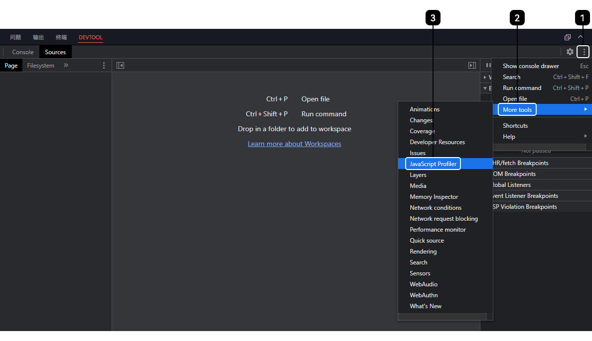
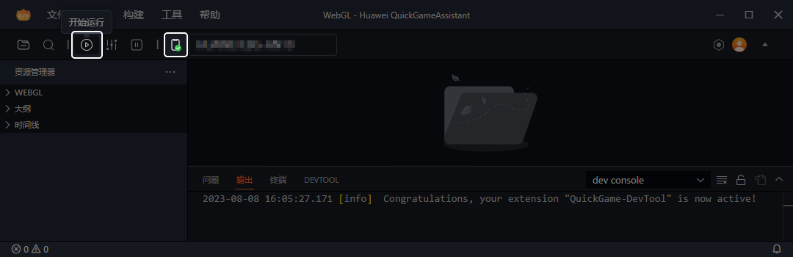
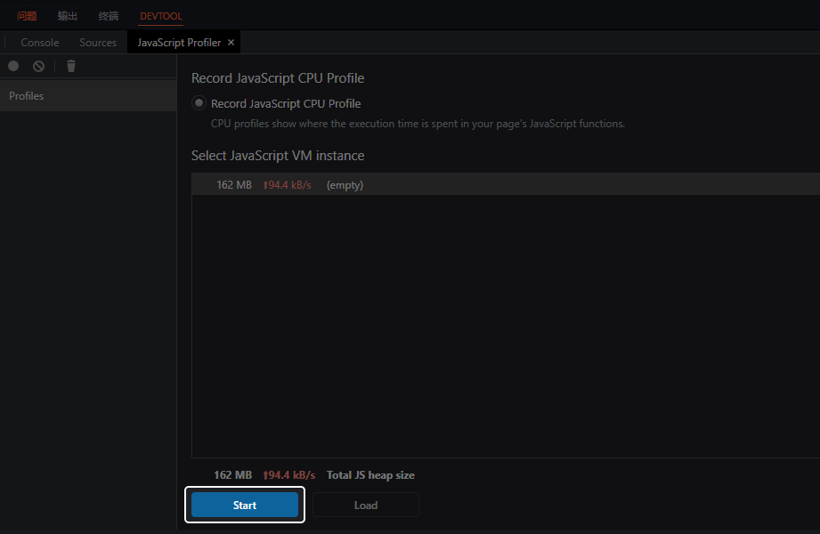
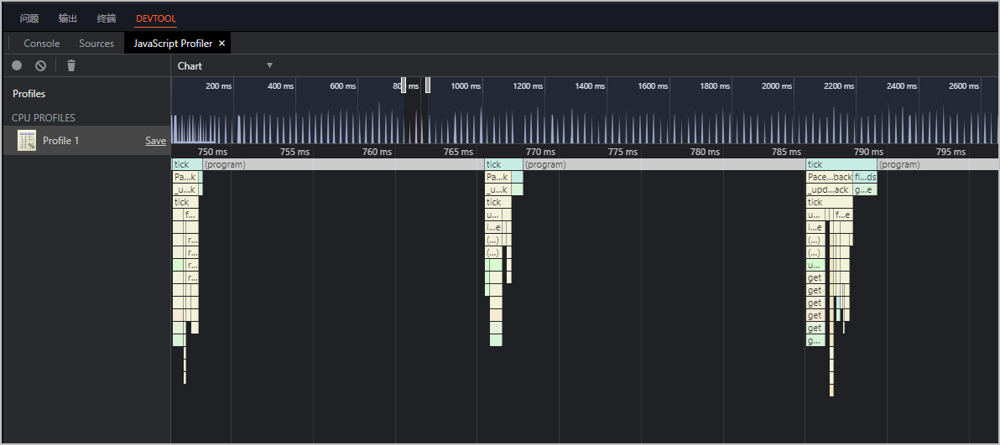
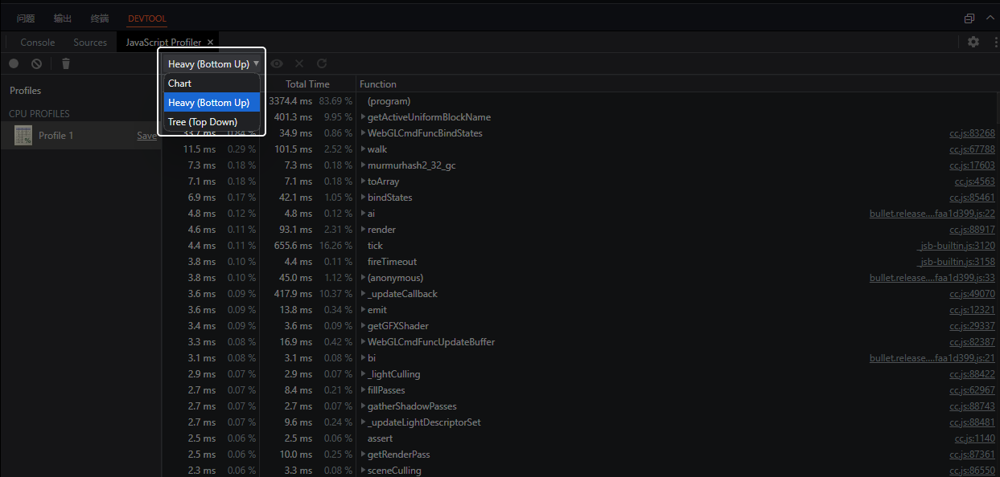

快游戏开发者工具内提供了可用于JavaScript性能分析的工具，并提供了Chart、Heavy (Bottom Up)和Tree (Top Down)三种模式，帮助您在调试时全面地分析快游戏的JavaScript性能问题，并进行针对性优化。

## JS-CPU-Profiler

快游戏开发者工具中的DEVTOOL调试器内提供了性能分析工具JS-CPU-Profiler。您可以在DEVTOOL内点击“右上角三个点的按钮 &gt; More tools &gt; JavaScript Profiler”，打开性能分析面板。

## 性能分析步骤

1. 确保手机已成功连接后，点击“开始运行”。

   
2. 游戏运行后，您可以在JavaScript Profiler面板内点击“Start”开始抓取profiler数据。

   
3. 运行一段时间后点击“Stop”停止抓取，您可以在JavaScript Profiler面板内看到CPU的使用情况，如下图所示。

   
4. 点击左上角的下拉菜单，您可以选择您所希望查看数据的模式：
   * Chart：显示按时间顺序排列的火焰图。
   * Heavy (Bottom Up)：按照函数对性能的影响排列，同时可以检查函数的调用路径。
   * Tree (Top Down)：显示调用结构的总体状况，从调用堆栈的顶端开始。

   
5. 您可以结合三种模式按照以下步骤对快游戏的JavaScript性能问题进行全面的分析，并进行针对性优化。
   1. 查看Heavy (Bottom Up)模式获取优化目标。
   2. 查看Tree (Top Down)模式，分析调用链关系，判断是否可以优化调用层级。
   3. 查看Chart模式，判断函数的时间分布情况。
