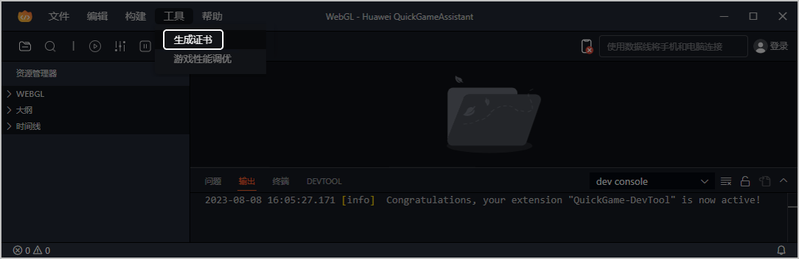
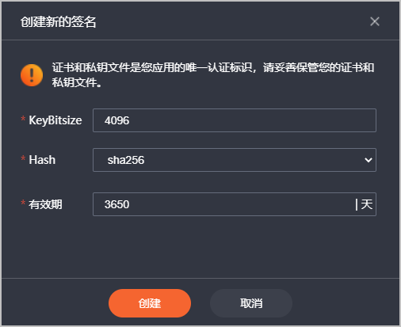
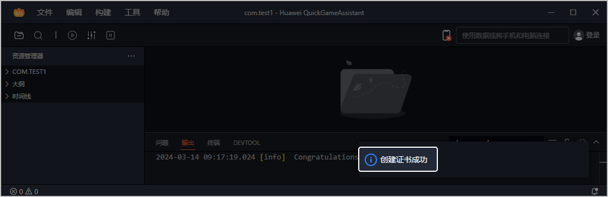
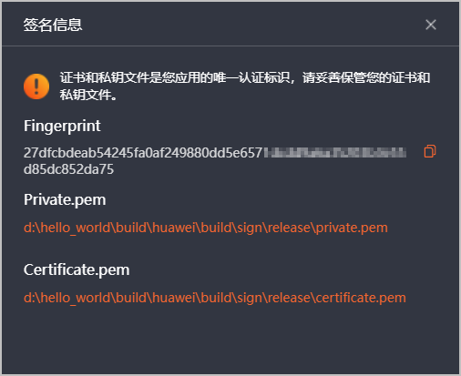

1. [打开项目](https://developer.huawei.com/consumer/cn/doc/games-guides/games-quickgame-tool-open-0000002317894968)进入工具主界面后，在顶部菜单栏选择“工具 &gt; 生成证书”。

   
2. 在弹出的“创建新的签名”窗口中点击“创建”。

   

   若签名证书创建成功，将在右下角弹出“创建证书成功”的提示。

   
3. 您可在主界面的顶部菜单栏选择“工具 &gt; 生成证书”查看生成的签名信息。

   
