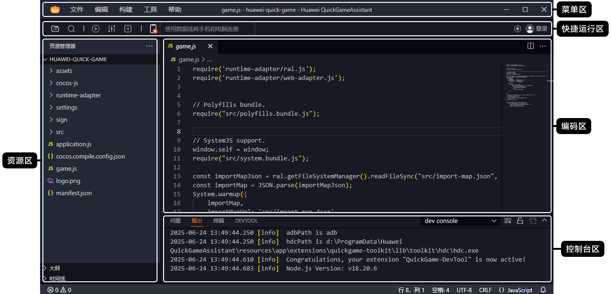

## 向导界面

快游戏开发者工具向导界面有如下功能：

* 打开项目：打开快游戏项目。
* 新建项目：新建元服务项目。

## 主界面

**快游戏开发者工具**主界面包括菜单区、快捷运行区、资源区、编码区、控制台区。

其中**菜单栏**包含如下功能：

* 文件：打开项目、导入项目、新建项目、保存、自动保存、另存为、关闭文件夹、退出。
* 编辑：撤消、恢复、剪切、复制、粘贴、查找、替换、在文件中查找、在文件中替换。
* 构建：打包正式版本。
* 工具：生成证书、游戏性能调优。
* 帮助：文档、FAQ、关于、版本更新。
