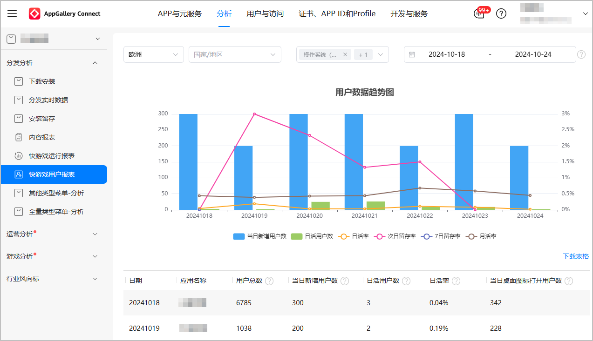
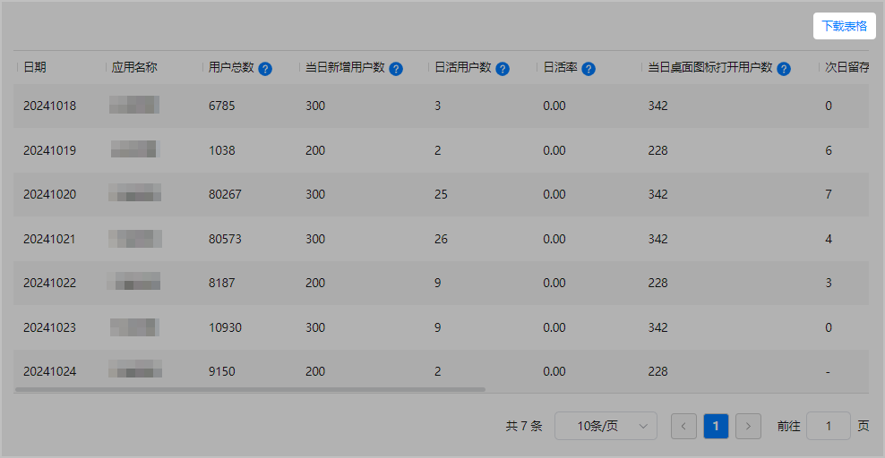
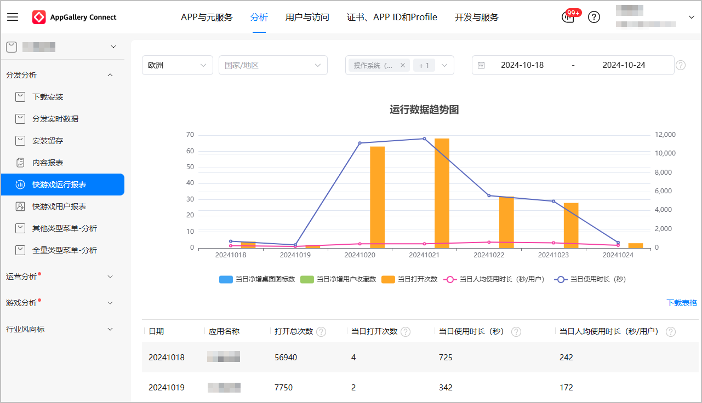
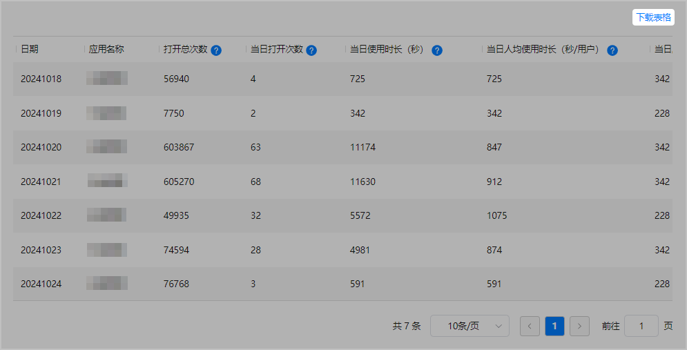

## 快游戏用户报表

1. 登录[AppGallery Connect](https://developer.huawei.com/consumer/cn/service/josp/agc/index.html)。
2. 选择“分析”并选择需要查询的快游戏，或选择“APP与元服务”并选择需要查询的快游戏，点击“分析”页签。
3. 点击左侧导航“分发分析 &gt; 快游戏用户报表”。
4. 选择国家/地区、操作系统、起始时间和结束时间，查询相关数据。

   

   * 操作系统可选择“HarmonyOS NEXT”和“EMUI & HarmonyOS”。
   * 起始时间和结束时间的时间跨度不能超过31天。

   
5. 如需将报表数据保存到本地，可点击“下载表格”，将统计数据以Excel形式下载。

   

   统计项说明如下表所示。

   | 统计项 | 说明 |
   | --- | --- |
   | 用户总数 | 历史曾经打开过快游戏的用户去重总数（账号数，数据从22年1月开始累计）。 |
   | 当日新增用户数 | 当日新增的用户去重数（账号数）。 |
   | 日活用户数 | 当日打开过的用户去重数（账号数）。 |
   | 日活率 | 日活用户数/用户总数（账号数）。 |
   | 当日桌面图标打开用户数 | 当日通过桌面图标打开的用户总数（账号数）。 |
   | 次日留存用户数 | 当日首次打开的用户中后一日再次打开的用户数量（账号数）。 |
   | 次日留存率 | T+1日（明日）留存用户数/T日（今日）打开用户数。 |
   | 7日留存用户数 | 当日首次打开的用户中，T+6日再次打开的用户数（账号数）。 |
   | 7日留存率 | T+6日留存用户数/T日（当日）打开用户数。 |
   | 月活用户数 | 最近31日（含当天）打开过的用户数（账号数）。 |
   | 月活率 | 月活用户数/用户总数（账号数）。 |

## 快游戏运行报表

1. 登录[AppGallery Connect](https://developer.huawei.com/consumer/cn/service/josp/agc/index.html)。
2. 选择“分析”并选择需要查询的快游戏，或选择“APP与元服务”并选择需要查询的快游戏，点击“分析”页签。
3. 点击左侧导航“分发分析 &gt; 快游戏运行报表”。
4. 选择国家/地区、操作系统、起始时间和结束时间，查询相关数据。

   

   * 操作系统可选择“HarmonyOS NEXT”和“EMUI & HarmonyOS”。
   * 起始时间和结束时间的时间跨度不能超过31天。

   
5. 如需将报表数据保存到本地，可点击“下载表格”，将统计数据以Excel形式下载。

   

   统计项说明如下表所示。

   | 统计项 | 说明 |
   | --- | --- |
   | 打开总次数 | 用户累计打开总次数，数据从22年1月开始累计。 |
   | 当日打开次数 | 用户当日打开总次数。 |
   | 当日使用时长（秒） | 当日所有用户累计使用时长（秒）。 |
   | 当日人均使用时长（秒/用户） | 当日使用时长（秒）/日活用户数（账号数）。 |
   | 当日桌面图标打开次数 | 当日通过桌面图标打开的总次数。 |
   | 当日净增桌面图标数 | 当日净增桌面图标数（当日成功-当日删除）。 |
   | 添加桌面图标数 | 当日添加桌面图标总次数（含操作成功和失败次数）。 |
   | 添加桌面图标数（成功） | 当日成功添加桌面图标数。 |
   | 删除桌面图标数 | 当日删除桌面图标数。 |
   | 当日净增用户收藏数 | 用户当日添加到收藏的总数（当日添加-当日取消）。 |
