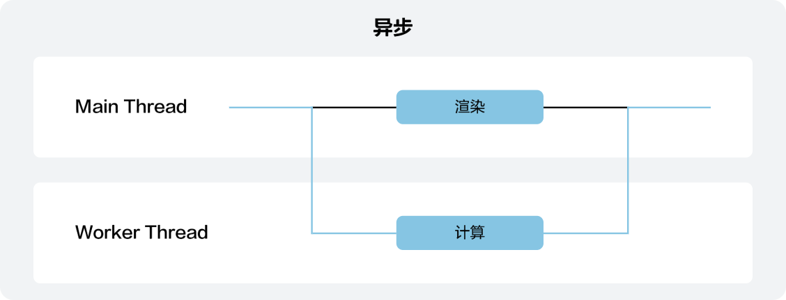

## 场景介绍

游戏默认每16ms刷新一次屏幕，若主线程在16ms内出现耗时任务，将不能及时刷新游戏画面，导致游戏画面不流畅、用户体验不佳，因此建议开发者把**耗时任务**放置在Worker子线程中运行，这种异步处理方式将大大提高游戏程序的运行流畅度。

## 工作原理

Worker子线程与主线程在执行任务方式、通信方式均采用**异步**方式：

* 执行任务方式：Worker子线程独立于主线程，支持处理主线程中较耗时的任务，但不会阻塞主线程执行任务。
* 通信方式：主线程通知子线程执行耗时任务，Worker子线程任务执行结束后，再把任务完成结果反馈给主线程。



## 可行性评估

快游戏的Worker子线程、主线程与Web Worker存在差异，在能力的体现上对比如下：

| 能力 | 快游戏Worker子线程 | 快游戏主线程 | Web Worker |
| --- | --- | --- | --- |
| 渲染能力 |  |  |  |
| JS(qg) API |  |  |  |
| 网络I/O |  |  |  |
| JS 运行时 |  |  |  |
| 计时器 |  |  |  |
| JIT |  |  | - |
| 引擎能力 |  |  | - |
| 并发数量 | 不能超过1个 | - | 无限制 |
| 线程通信数据传输方式 | 结构化克隆 | - | 结构化克隆/可转移对象 |
| 线程通信数据传输类型 | JS对象类型及基本类型 | - | JS对象类型及基本类型 |

## 开发步骤

1. 在快游戏目录下新建Worker脚本文件。示例如下：

   ```
   workers/index.js
   ```

   添加文件后的目录结构示例如下：

   ```
   ├── game.js
   ├── manifest.json
   └── workers      // 存放Worker脚本的目录，支持放置JS文件，例如Worker脚本及其require脚本；不支持放置图片、视频等静态文件。
         └── index.js
   ```
2. 在manifest.json文件中配置Worker脚本的路径。

   ```
   {
     "workers": {
       "path": "workers",  // 必选，指定Worker脚本的相对路径
     }
   }
   ```
3. （可选）目前仅支持同时存在**1**个Worker子线程。若存在已创建且未销毁的Worker子线程，您需先在主线程中调用[Worker.terminate](https://developer.huawei.com/consumer/cn/doc/games-references/games-api-quickgame-runtime-worker-0000002366156880#section135891211462)结束之前的Worker子线程。

   ```
   worker.terminate()
   ```
4. 调用[qg.createWorker](https://developer.huawei.com/consumer/cn/doc/games-references/games-api-quickgame-runtime-worker-0000002366156880#section95225429541)，在主线程中创建新的Worker子线程。

   ```
   const worker = qg.createWorker('workers/index.js')
   ```
5. 在主线程或Worker子线程中发送消息。

   

   Worker子线程不支持qg开头的快游戏API接口。

   ```
   // 主线程向Worker线程发送消息
   // worker是主线程调用qg.createWorker接口返回的对象
   worker.postMessage({
     msg: 'hello from main'
   })

   // Worker线程向主线程发送消息
   // 在Worker子线程中，worker是全局变量
   worker.postMessage({
     msg: 'hello from worker'
   })
   ```
6. 在主线程或Worker子线程中接收消息。

   ```
   // 主线程接收Worker线程发送的消息
   // worker是主线程调用qg.createWorker接口返回的对象
   worker.onMessage((message) => {
     console.log(`received message from worker: ${message}`)
   })

   // Worker线程接收主线程发送的消息
   // 在Worker子线程中，worker是全局变量
   worker.onMessage((message) => {
     console.log(`received message from main: ${message}`)
   })
   ```
