如果您当前在架的应用版本存在问题需要下架，或是不想再上架当前应用，您可以申请从华为应用市场下架该应用。应用下架后，用户将无法从华为应用市场搜索到该应用，此时应用会进入草稿状态。如果您想重新上架应用，可以直接在此草稿状态的应用版本基础上编辑、修改，然后重新发布。

下架应用仍会占据包名，只有[删除应用/元服务](https://developer.huawei.com/consumer/cn/doc/games-guides/games-delete-0000002382203969)才会释放包名。

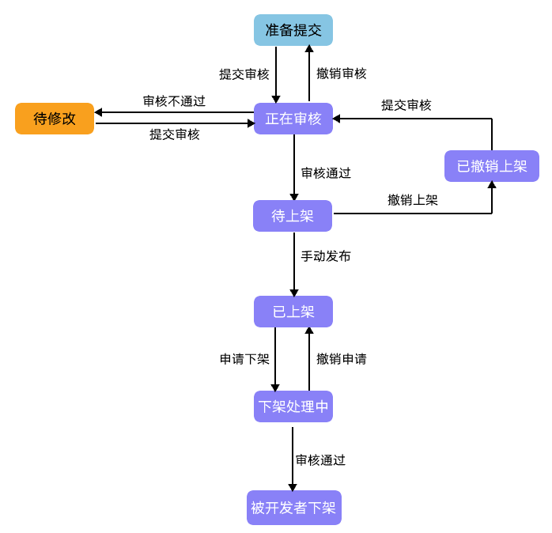

## 前提条件

您想要下架的应用版本在AppGallery Connect中为在架状态，其他状态下的应用版本不支持下架操作。

## 提交下架申请

1. 登录[AppGallery Connect](https://developer.huawei.com/consumer/cn/service/josp/agc/index.html)，选择“APP与元服务”。
2. 在应用列表中点击需要下架的在架应用版本链接，系统进入该版本的“版本信息”页面。
3. 点击右上角的“申请下架”。

   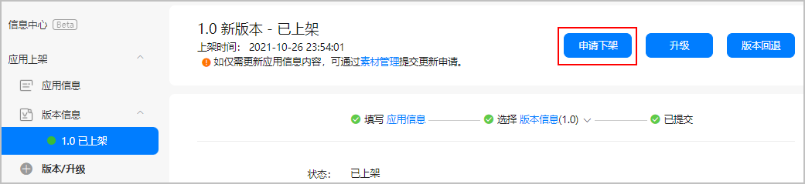
4. 在弹出对话框中填写下架原因、备注（可选）后，点击“确认”。

   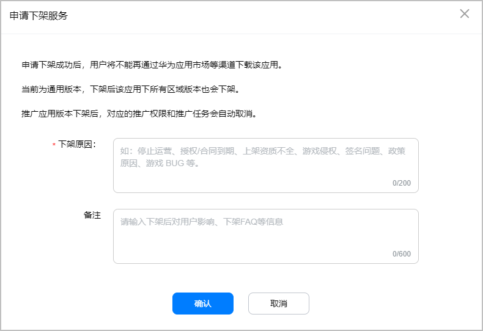
5. 针对游戏应用，点击“申请下架”后，在弹出对话框中填写下架原因，并选择是否停服。
   * 如果“是否停服”参数您选择“否”，请输入客服联系方式以及不停服原因，点击“确认”完成游戏下架申请。

     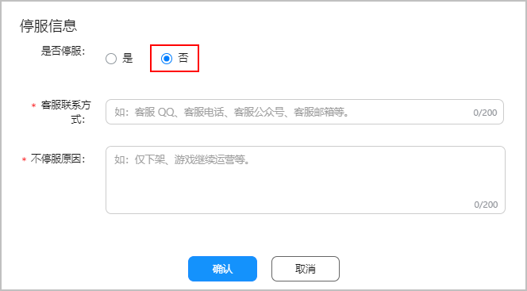
   * 如果“是否停服”参数您选择“是”，请填写下方相关信息，包括关闭服务器时间、发布停服公告时间等。填写完成后，点击“确认”完成游戏下架申请。

     

     当游戏停服时，为保证用户体验，请：

     1. 在游戏关服前至少60天发布停服公告通知玩家，并同时申请游戏下架；

     2. 在游戏关服前至少30天关闭充值，为玩家预留消耗充值的时间；

     3. 关闭注册时间必须早于关闭服务器时间；

     4. 用户补偿策略仅支持：

     + 道具转移：仅支持贵公司旗下其他当前华为在架游戏（需提供具体可选游戏名称）和具体转移策略。
     + 游戏内补偿：具体礼包内容或道具名称/数量。
     + 退款：需提供具体退款方式和策略。

     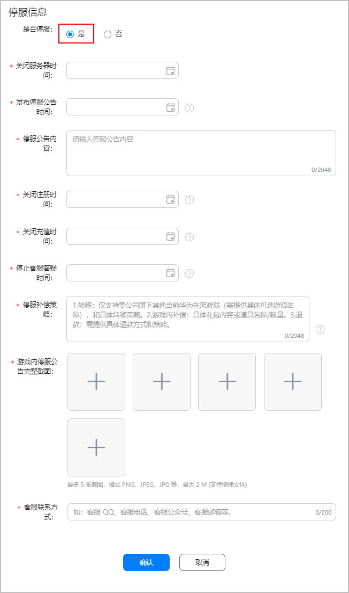
6. 应用下架申请提交成功后，应用状态更新为“下架处理中”，华为方会在提交审核后的1-2个工作日内处理。

   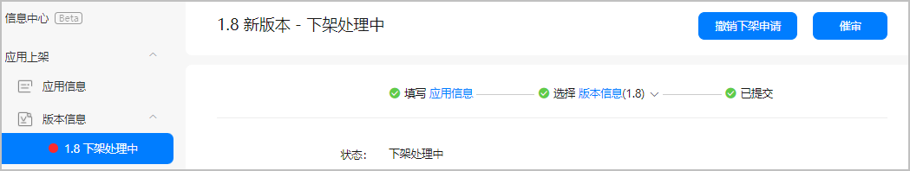

   审核通过后，应用状态将变为“被开发者下架”。

   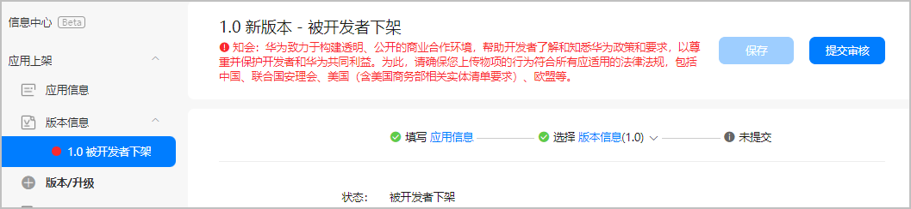

在下架申请审核通过前，您还可以执行“催审”或“撤销下架申请”操作。

## 催审

1. 在版本信息页面，点击右上方的“催审”。

   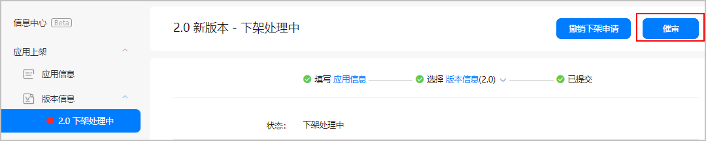

2. 在弹出对话框中，点击“确认”。

## 撤销下架申请

1. 在版本信息页面，点击右上方的“撤销下架申请”。

   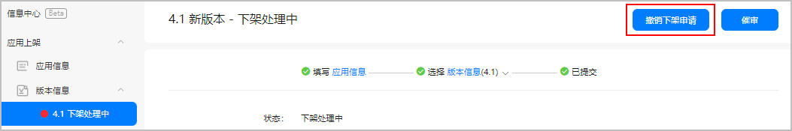
2. 在弹出对话框中，点击“确认”。

## 重新上架应用

若您想重新上架已下架的应用，您可以在填写应用信息和版本信息后，点击“提交审核”申请重新上架应用。待审核通过后，应用将重新上架。

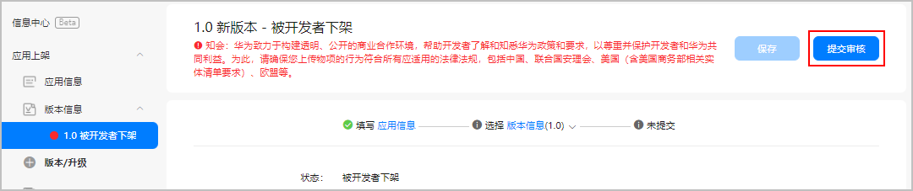

## 撤销待上架应用

若您的应用已经通过审核，但未到指定上架时间，此时应用处于“待上架”状态。您不想再上架该应用，您可以点击“撤销上架”，撤销上架操作不需要人工审核。

1. 在版本信息页面，点击右上方的“撤销上架”。

   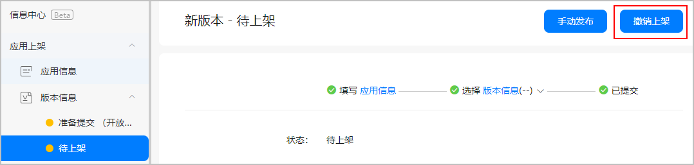
2. 在弹出对话框中，点击“确认”。

   

   如果撤销上架的应用再次申请上架，需要重新提交审核，请确认后再进行撤销操作。

   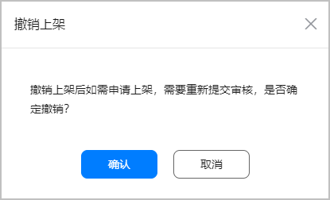
3. 撤销上架操作提交成功后，应用状态更新为“已撤销上架”。

   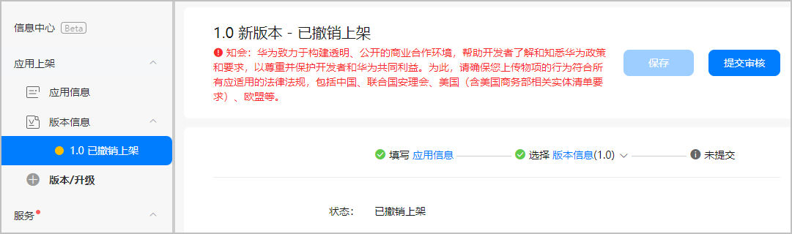

## 重新上架已撤销上架应用

应用撤销上架后，会进入“已撤销上架”状态。您可以直接在此应用版本基础上编辑、修改，然后点击“提交审核”申请重新上架应用。待审核通过后，应用将重新上架。

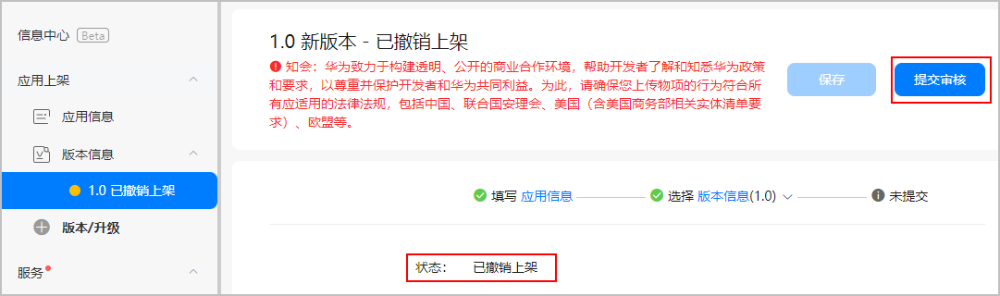
