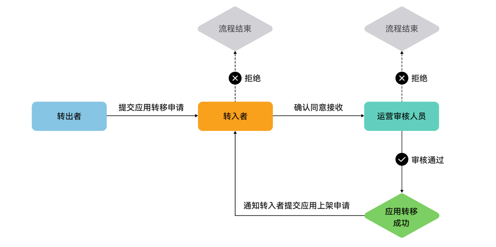
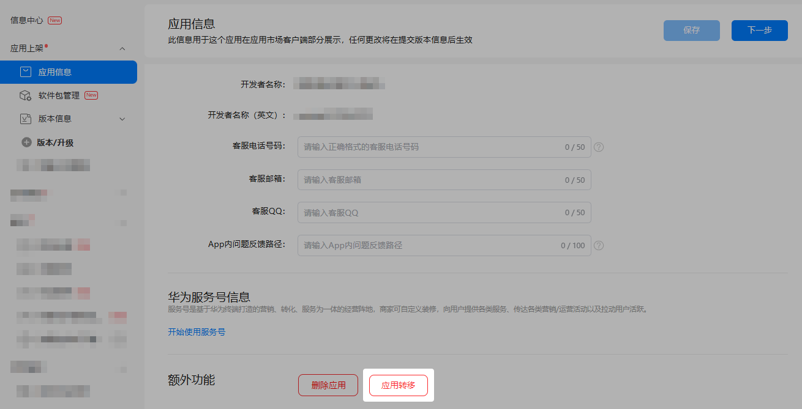
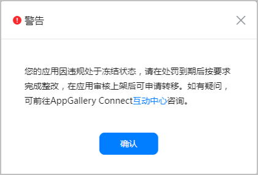
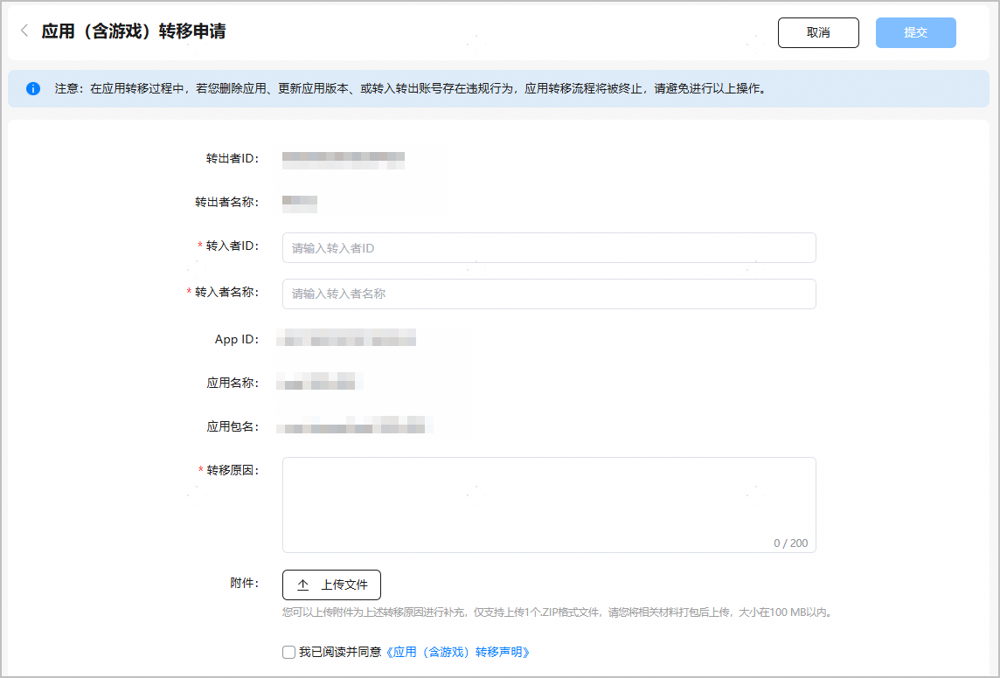
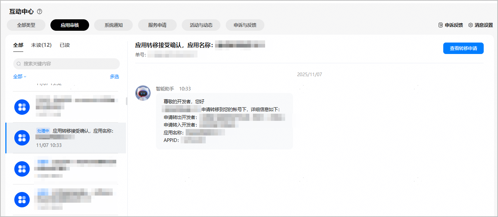
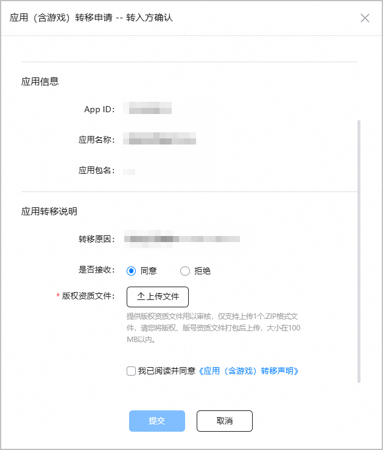
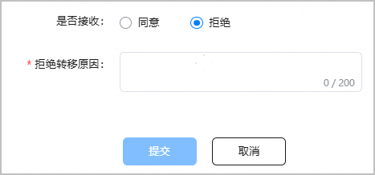
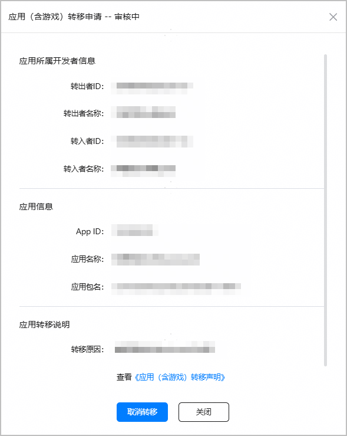
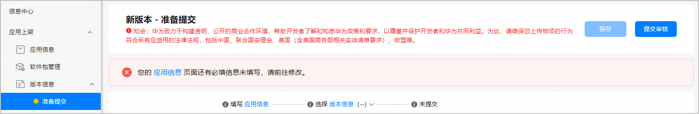
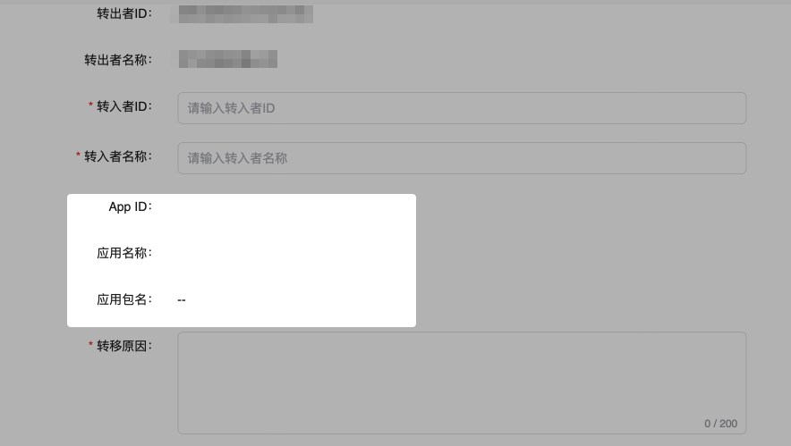

应用转移是指将AppGallery Connect中的应用（含游戏）从一个账号转移到另一个账号进行维护。

* 当前应用转移仅对账号信息做转移，此前接入的服务和申请的权限等可能无法成功转移，转入方需重新配置所有服务和功能，确保无误后再上架。
* 选择应用转移后，以下信息将不会被转移，需在后续版本更新时及时补充：

  非公开发布问卷审核、测试发布测试群组信息、应用系列信息、测试版本历史信息、年龄分级问卷、自定义应用详情页、隐私托管协议。
* 应用转移后，请使用新的Profile和证书打包，重新上传新包，旧的包不再允许使用。

## 前提条件

* 当前仅支持未绑定华为支付商户号的HarmonyOS应用/元服务转移。
* 当前[In-house应用](https://developer.huawei.com/consumer/cn/doc/app/agc-help-inhouse-0000002281532696)不支持转移。
* 当前支持转移的设备类型：手机、平板、PC/2in1、智慧屏、智能手表、运动手表。

* 待转移应用状态不能在审核中，需属于“准备提交”、“待上架”、“已上架”、“待修改”、“已撤销上架”或“被开发者下架”中的一种。
* 若应用开通了HealthServiceKit服务，请先完成转入方开发者资质审核，具体请参见运动健康服务《[应用开发者申请资质说明](https://developer.huawei.com/consumer/cn/doc/harmonyos-guides/health-application-qualifications)》。
* 转入方、转出方开发者账号都已实名认证，未被冻结，且无违规处罚记录（已取消处罚或已缴清违约金等）。
* 转出方开发者需使用团队账号转移应用，且转入方开发者需使用团队账号接收应用。
* 若转出方为商户用户，转入方需开通商户服务才可以接收应用。
* 推广应用请排查以下情况：
  + 若应用存在有效投放任务，需要前往[华为应用市场付费推广平台](https://developer.huawei.com/consumer/cn/service/apcs/promote/chassis/home)完成或者取消任务。
  + 若应用已授权给客户投放伙伴，需要前往[华为应用市场付费推广平台](https://developer.huawei.com/consumer/cn/service/apcs/promote/chassis/home)取消授权。
* 存在运营活动请排查以下情况：
  + 若应用下的礼包任务状态为“草稿”、“新建驳回”、“撤销”或“下线通过”时可转移，如不处于以上状态，需要下线或删除礼包后申请转移。
  + 若活动的奖品是华为优惠券，且活动的任务状态为“草稿”、“新建驳回”、“撤销”时可转移，如不处于以上状态，需要活动结束15天后申请转移。
  + 若活动的奖品是礼包或第三方卡券，且活动的任务状态为“草稿”、“新建驳回”、“撤销”、“终止”、“下线通过”时可转移，如不处于以上状态，需要活动结束后申请转移。
* 若计划转移的应用已接入数字商品服务，请完成以下操作：
  1. 在应用转移完成之前，转入方开发者主体需[签署《华为数字商品及联运服务协议》](https://developer.huawei.com/consumer/cn/doc/app/business-activation-0000001958955081#section104021121114213)，以确保转移后的结算准确无误。
  2. 应用转移完成后，需要登录转入方开发者账号，在[AppGallery Connect](https://developer.huawei.com/consumer/cn/service/josp/agc/index.html#/)的“开发与服务”中选择该转移应用，然后在“应用内购买服务（HarmonyOS NEXT）”菜单页面中重新为该应用[激活开通服务](https://developer.huawei.com/consumer/cn/doc/app/parameters-0000001931995692)。服务开通后，该应用的关键事件通知地址将自动关联转移前的配置。此外，需要在该开发者账号下生成新的[服务端密钥](https://developer.huawei.com/consumer/cn/doc/app/key-management-0000001931836312)，后续发起的服务端API请求应使用新生成的密钥。

## 操作流程

## 提交应用转移申请

### 转出方发起应用转移申请

1. 登录[AppGallery Connect](https://developer.huawei.com/consumer/cn/service/josp/agc/index.html)，点击“APP与元服务”。
2. 在应用列表中选择待提交应用转移申请的应用，进入应用详情页。
3. 点击页面底部的“应用转移”，系统会自动检测应用是否符合转移条件。

   

   如果您的应用在转移流程中，则不能再申请应用转移。点击“应用转移”仅用于申请操作，若您想要查看审核情况，请参见“[查看应用转移进度](#section897674113113)”。

   
4. 若应用不符合转移条件，需根据提示进行处理，可参考[前提条件](#section1511853114505)排查原因。

   
5. 若应用符合转移条件，则进入“应用（含游戏）转移申请”页面，填写完成后点击“提交”。
   * 转入者ID：接收应用的开发者账号。
   * 转入者名称：接收应用的开发者名称。
   * 转移原因：申请应用转移的原因（最多200字）。
   * 附件：补充应用转移原因的附件（大小在100MB以内的zip格式文件）。

   

### 转入方确认接收应用

当转出方已确认转出应用，转入方即可收到应用转移申请。

1. 转入方登录[AppGallery Connect](https://developer.huawei.com/consumer/cn/service/josp/agc/index.html)，点击首页左下角“互动中心待办”的“更多”，进入互动中心页面。
2. 选择“应用审核”，点击“应用转移接受确认”，在对话界面点击“查看转移申请”。

   
3. 在弹出的“转入方确认”框中，您可以同意或拒绝接收应用。

   
   * 如果您同意接收应用：
     1. 在“是否接收”处选择“同意”。
     2. 在“版权资质文件”处上传版权和版号资质（大小在100MB以内的zip格式文件）。具体请参见《[应用资质审核要求](https://developer.huawei.com/consumer/cn/doc/app/80301)》和《[元服务资质审核要求](https://developer.huawei.com/consumer/cn/doc/app/80302)》。

        

        + 若应用所属原公司已注销无法提供公章，或者个人开发者离职需转移至本公司却无法提供签名，还需要提供相关证明文件进行申请。
        + 若应用状态是“准备提交”（草稿态）或者提交的软件包分发地不包含中国大陆，则不需要提交版权资质文件。
     3. 勾选“我已阅读并同意《应用（含游戏）转移声明》”。
     4. 点击“提交”，应用转移提交华为方审核。
   * 如果您拒绝接收应用：
     1. 在“是否接收”处选择“拒绝”。
     2. 在“拒绝转移原因”处输入拒绝接收应用的原因（最多200字）。
     3. 点击“提交”，应用转移流程结束。

     

### 查看应用转移进度

登录[AppGallery Connect](https://developer.huawei.com/consumer/cn/service/josp/agc/index.html)，点击首页左下角“互动中心待办”的“更多”，进入互动中心页面，在应用转移的对话界面点击“查看转移申请”，可以查看转移进度。

* 当应用转移申请状态处于“审核中”时，如果转入方还未确认接收，转出方可以通过点击“取消转移”来撤回应用转移申请。

  
* 当应用转移申请状态处于“检测通过”时，表示转入方已经确认接收。
* 当应用转移申请状态处于“资质审核中”时，表示转入方已经提交资质审核。

  

  审核人员会在3个工作日内处理应用转移申请，并通过邮件或者互动中心发送审核结果，请耐心等待。
* 当应用转移申请状态处于“资质审核通过”时，表示转入方提交的资质审核已经通过。
* 当应用转移申请状态处于“转移驳回”时，表示华为方不同意应用转移申请， 转出方需要根据审核意见修改后再次提交申请。
* 当应用转移申请状态处于“转移成功”时，表示华为方已经同意应用转移申请， 应用转移完成。

## 提交审核

应用转移成功后，华为方会通过邮件或者互动中心发送转移成功通知。

转入方需在3个工作日内登录AppGallery Connect重新提交应用审核并更新版权、版号等资质文件，审核通过后华为应用市场方能显示新的开发者名称。若未及时更新或更新的文件不符合华为应用市场资质审核标准，则华为应用市场有权下架该应用。

## FAQ

### Mac电脑的Safari浏览器阻止打开应用转移页面，如何处理？

**现象描述：**使用Mac电脑进行应用转移，点击“应用转移”按钮时，Safari浏览器会阻止打开应用转移页面。

取消阻止后，打开的应用转移页面没有展示应用相关信息。

**解决方案：**请重新点击“应用转移”按钮，进入应用转移页面；或者更换为Chrome浏览器进行应用转移操作。

### 应用转移后正在使用的服务/开放能力可以继续使用吗？

具体情况如下表。

| **服务模块** | 服务 | **应用转移后是否可以继续使用** |
| --- | --- | --- |
| 运营 | 礼包管理 | 是 |
| 活动管理 | 是 |
| 云开发 | 认证服务 | 否，需要重新配置/接入/集成 |
| 云缓存 | 否，需要重新配置/接入/集成 |
| 云存储 | 否，需要重新配置/接入/集成 |
| 云数据库 | 否，需要重新配置/接入/集成 |
| 云函数 | 否，需要重新配置/接入/集成 |
| 云托管 | 否，需要重新配置/接入/集成 |
| 预加载 | 否，需要重新配置/接入/集成 |
| 增长 | App Linking | 否，需要重新配置/接入/集成 |
| 社区管理 | 是 |
| 质量 | 云测试 | 否，需要重新配置/接入/集成 |
| 云调试 | 否，需要重新配置/接入/集成 |
| APMS | 是 |
| 构建 | 地图服务 | 否，需要重新配置/接入/集成 |
| 安全检测服务 | 否，需要重新配置/接入/集成 |
| 华为账号服务 | 否，需要重新配置/接入/集成 |
| 企业来电显示 | 否，需要重新配置/接入/集成 |
| 游戏服务 | 否，游戏相关服务的转移细节请发邮件咨询game.business@huawei.com |
| 联机对战服务 | 是 |
| 游戏多媒体 | 是 |
| 高光时刻 | 是 |
| 盈利 | 鸿蒙支付服务 | 否，需要重新配置/接入/集成 |
| 应用内购买服务（IAP Kit） | 否，需要重新配置/接入/集成 |
| 安全 | 可信应用服务 | 否，需要重新配置/接入/集成 |
| 分发 | 测试用户 | 是 |

### 应用转移后数据会发生变化吗？

* 前台数据：应用市场上已产生的下载量、用户评论数据不会清零。

* 后台数据：华为开发者联盟会员中心中该应用数据会清零，且不会迁移到新账号下。若您继续选择转移，则默认您已知晓并接受此种情况。

| **服务模块** | **一级菜单** | **二级菜单** | **应用转移后是否可以查看历史数据** |
| --- | --- | --- | --- |
| 分析 | 概览 | - | 否 |
| 分发分析 | 下载安装 | 是 |
| 游戏新增与留存 | 是 |
| 用户分析 | 是 |
| 运营分析 | 数字商品服务分析 | 否 |
| 质量分析 | 安装失败 | 是 |
| 运营 | 用户运营 | 互动评论 | 是 |

### 为什么提示接收方不符合接收条件？

请排查以下情况：

1. [In-house账号](https://developer.huawei.com/consumer/cn/doc/app/agc-help-inhouse-0000002281532696)无法接收应用。
2. 若您的应用为[非公开发布](https://developer.huawei.com/consumer/cn/doc/app/agc-help-non-public-release-0000002278016482)等特殊发布类型，转入方需要提前申请权限，否则无法接收应用。

### 推广应用转移后，账户仍有余额，如何处理？

可以申请[线上退款](https://developer.huawei.com/consumer/cn/doc/0010011)。

### 是否支持跨站点转移？

支持。
