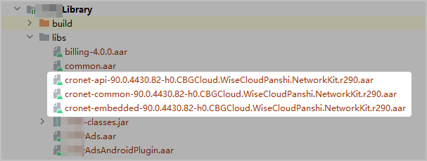
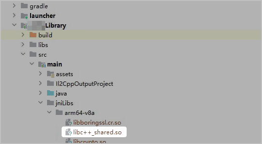

集成游戏联机对战C# SDK进行代码开发后，如果帧同步过程中使用UDP协议，您需要在游戏引擎导出的Android Studio工程（UDP协议当前仅支持Android平台下arm64-v8a架构）中进行如下配置。

1. 将SDK中“Plugins &gt; Android &gt; libs”路径下的aar包，拷贝到已导出的Android Studio工程xxxxxLibrary/libs中。如已自动添加，可跳过此步骤。

   
2. 在工程的“xxxxxLibray &gt; build.gradle &gt; dependencies”中，添加如下依赖。如已自动添加，可跳过此步骤。

   ```
   // 添加NetworkKit依赖
   implementation(name: 'cronet-api-90.0.4430.82-h0.CBGCloud.WiseCloudPanshi.NetworkKit.r290', ext:'aar')
   implementation(name: 'cronet-common-90.0.4430.82-h0.CBGCloud.WiseCloudPanshi.NetworkKit.r290', ext:'aar')
   implementation(name: 'cronet-embedded-90.0.4430.82-h0.CBGCloud.WiseCloudPanshi.NetworkKit.r290', ext:'aar')
   ```
3. 在工程的“xxxxxLibray &gt; src &gt; main &gt; jniLibs &gt; arm64-v8a”中，添加libc++\_shared.so动态库。

   

   libc++\_shared.so文件可以在NDK的安装目录（例如\&#123;NDK\_HOME\&#125;/sources/cxx-stl/llvm-libc++/libs/arm64-v8a/libc++\_shared.so）下查找。

   
4. 在XxxxxPlayerActivity.java中添加如下代码。

   ```
   static {
       System.loadLibrary("network-common");
       System.loadLibrary("network-hwhttp");
       System.loadLibrary("sparkrtc-rtsa");
   }
   ```
