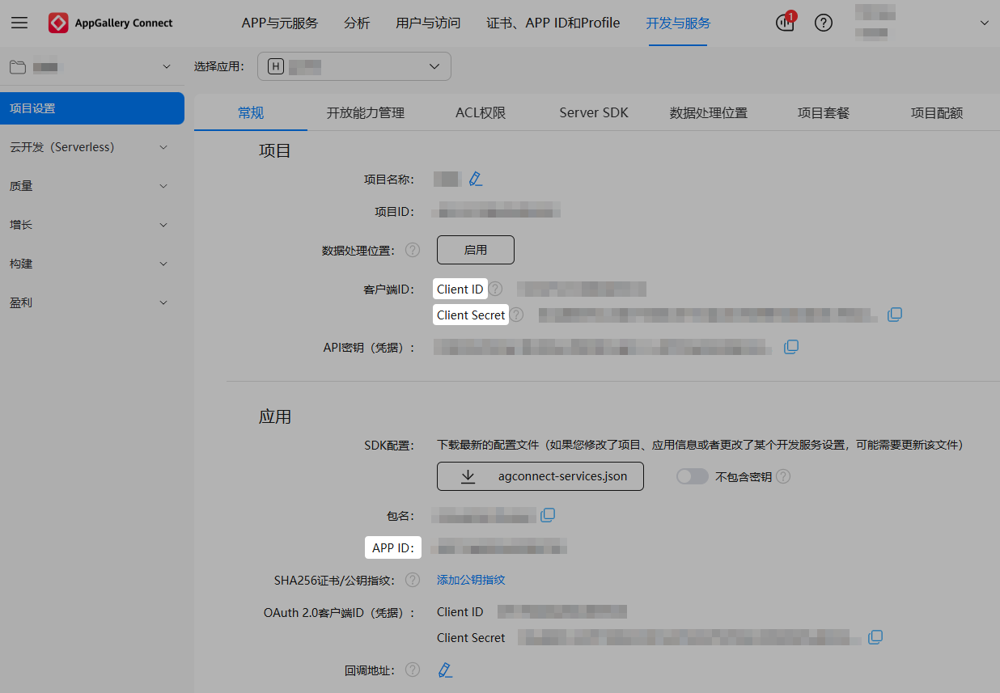

## 注册开发者账号

若您还没有实名认证的华为开发者账号，请前往华为开发者联盟网站注册开发者账号并完成实名认证，详细操作请参见[注册账号](https://developer.huawei.com/consumer/cn/doc/start/registration-and-verification-0000001053628148)。

## 创建项目和应用

若尚未在AGC控制台中创建项目和应用，请参考[创建项目](https://developer.huawei.com/consumer/cn/doc/app/agc-help-create-project-0000002242804048)和[创建HarmonyOS应用](https://developer.huawei.com/consumer/cn/doc/app/agc-help-create-app-0000002247955506)。为HarmonyOS应用创建APP ID时要求：

* “应用类型”选择“HarmonyOS应用”。
* “支持设备”选择“手机”。

## 获取游戏信息

1. 登录[AppGalleryConnect](https://developer.huawei.com/consumer/cn/service/josp/agc/index.html)，点击“开发与服务”，在项目列表中找到需要获取游戏参数的项目及项目下的游戏。
2. 在“项目设置 &gt; 常规”页面下记录**Client ID**、**Client secret**、**APP ID**。

