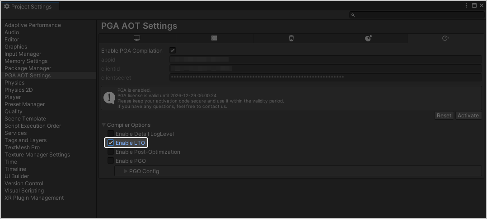

## 概述

LTO（Link Time Optimization，链接时优化）是一种编译器优化技术，它将优化的主要过程从传统的编译单元（单个源文件）级别推迟到了整个程序链接级别，允许编译器在最终的链接阶段获取到整个程序（或整个静态库）的所有代码，从而进行全局的、跨模块的优化。

LTO是现代高性能编译工具链（如 Clang、GCC、MSVC）的核心特性，与PGO结合使用是目前已知的最强大的优化组合之一。


* 您可以选择单独使用LTO优化编译，或者和[PGO](/docs/dev/game-dev/pga-pgo-0000002415517840)结合使用。与PGO结合使用时，必须要将编译器替换为BiSheng编译器。
* 当前仅支持构建平台为Windows、目标平台为OpenHarmony时可使用。

## 适用范围

LTO是编译器在链接阶段进行的全局优化，几乎所有追求性能的通用项目都可以适用，使用语言包含C、C++、Rust和D等编译型语言。

## 本地工具配置

1. 点击“Jobs &gt; PGA &gt; PGA Settings”，进入“PGA AOT Settings”页面。

   
2. 勾选“Enable LTO”，然后前往“Build Settings”页面[打包](/docs/dev/game-dev/pga-package-0000002089873625)即可，PGA会默认开启thin模式。

   

## 流水线工具配置

修改游戏项目下“ProjectSettings &gt; PgaAotSettings\_OpenHarmony.json”内“enableLto”的值，实现使用LTO优化编译。

```
{
  "hybridclrIl2cppPath": "",
  "currentPgoStep": 0,
  "enableLto": true,
  "enablePga": true,
  "enablePgo": false,
  "enablePostOpt": false,
  "enableSyntaxCheck": true,
  "excludeCLRAssemblyNames": "",
  "hasHybridclr": false,
  "licensePath": "",
  "openHarmonySDKRoot": "",
  "pgoSdkSavePath": "",
  "postOptLibPath": "Editor\\BiSheng\\lib\\libStateLessFuncAcc.so",
  "scriptingBackend": "",
  "targetArchitectures": 2,
  "toolchainPath": "",
  "useBiShengCompiler": false,
  "enableVisa": "false"
}
```

| 属性 | 类型 | 必填(M)/选填(O) | 描述 |
| --- | --- | --- | --- |
| enableLto | Boolean | O | 是否在构建打包时开启LTO。   * true：构建打包时使用thin模式LTO。 * false：关闭LTO。   默认值为false。 |
