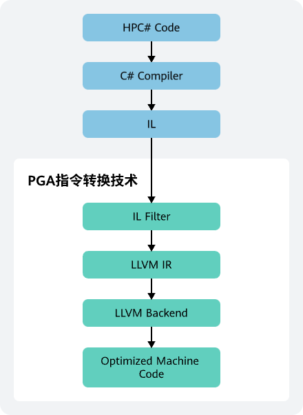

为了解决手机游戏中可能存在的响应速度慢、动作不流畅、画面卡顿等性能、功耗问题，华为推出了花瓣游戏加速器（PGA，Petal Game Accelerator），该工具可以将C#代码转换成更为高效的本地代码（自研毕昇编译器），并且可以使用SIMD（Single Instruction Multiple Data，单指令多数据流加速）、别名分析等技术来优化代码的性能，改善程序运行时的CPU性能与功耗，解锁游戏性能。

## 基本原理

## 平台支持说明

| 平台 | 是否已支持 |
| --- | --- |
| HarmonyOS 5.0及以上 |  |
| HarmonyOS 3.1/4.0及以下 |  |
| iOS |  |

## 开发语言限制

PGA当前支持的函数开发语言为HPC#（High Performance C#）。

## 兼容性

针对使用过Burst的遗留项目，PGA内部兼容Burst语法，无需重新调整代码即可使用PGA进行优化；针对新项目，支持使用[PGACompile]标签标记需要优化的函数使用PGA进行优化。

## 实现流程

| 步骤 | 操作 | 说明 |
| --- | --- | --- |
| 1 | [准备工作](https://developer.huawei.com/consumer/cn/doc/games-guides/pga-preparation-0000002018742342) | 为了保证PGA的正常使用，您需要提前做好准备工作。 |
| 2 | [游戏接入PGA](https://developer.huawei.com/consumer/cn/doc/games-guides/pga-game-access-0000002045616586) | 游戏接入PGA的示例代码及相关说明。 |
| 3 | [执行PGA优化](https://developer.huawei.com/consumer/cn/doc/games-guides/pga-execute-optimization-0000002062918986) | 游戏接入PGA后执行PGA优化。 |
| 4 | [打包](https://developer.huawei.com/consumer/cn/doc/games-guides/pga-package-0000002089873625) | 将优化后的项目导出为OpenHarmony工程，同时检验是否PGA优化是否生效，再使用优化后的项目进行测试及验证收益。 |
| 5 | [测试及验证收益](https://developer.huawei.com/consumer/cn/doc/games-guides/pga-test-verification-0000002083371437) | * 测试优化后游戏场景的功耗、性能；测试游戏整体的稳定性、安全性、兼容性。 * 使用开源性能工具抓取整个游戏优化前、后的数据指标，量化优化产生的效果，例如[HiSmartPerf](https://developer.huawei.com/consumer/cn/doc/AppGallery-connect-Guides/smartperf-tool-0000001873208929)。 |
