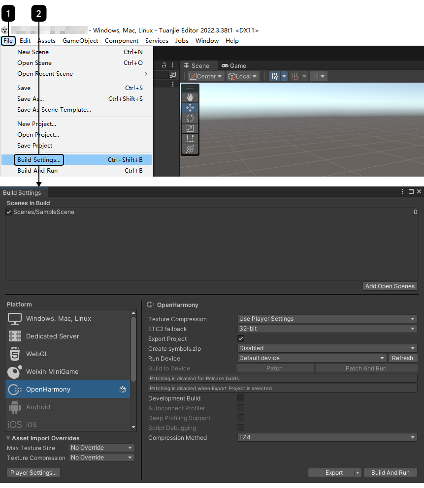
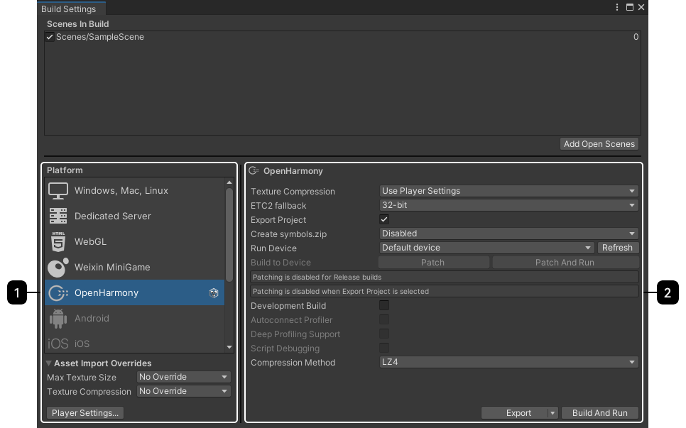
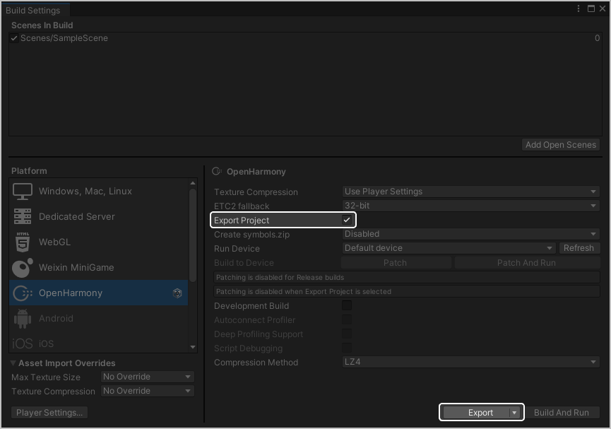
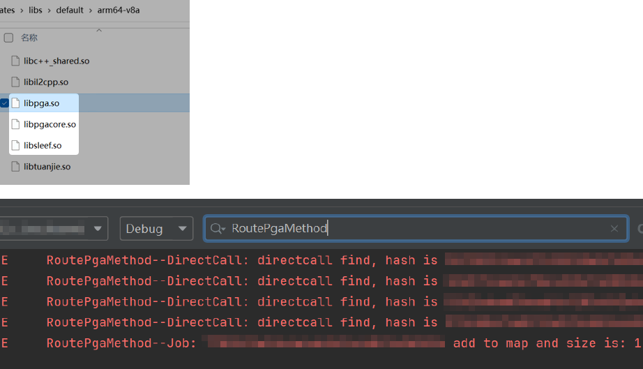
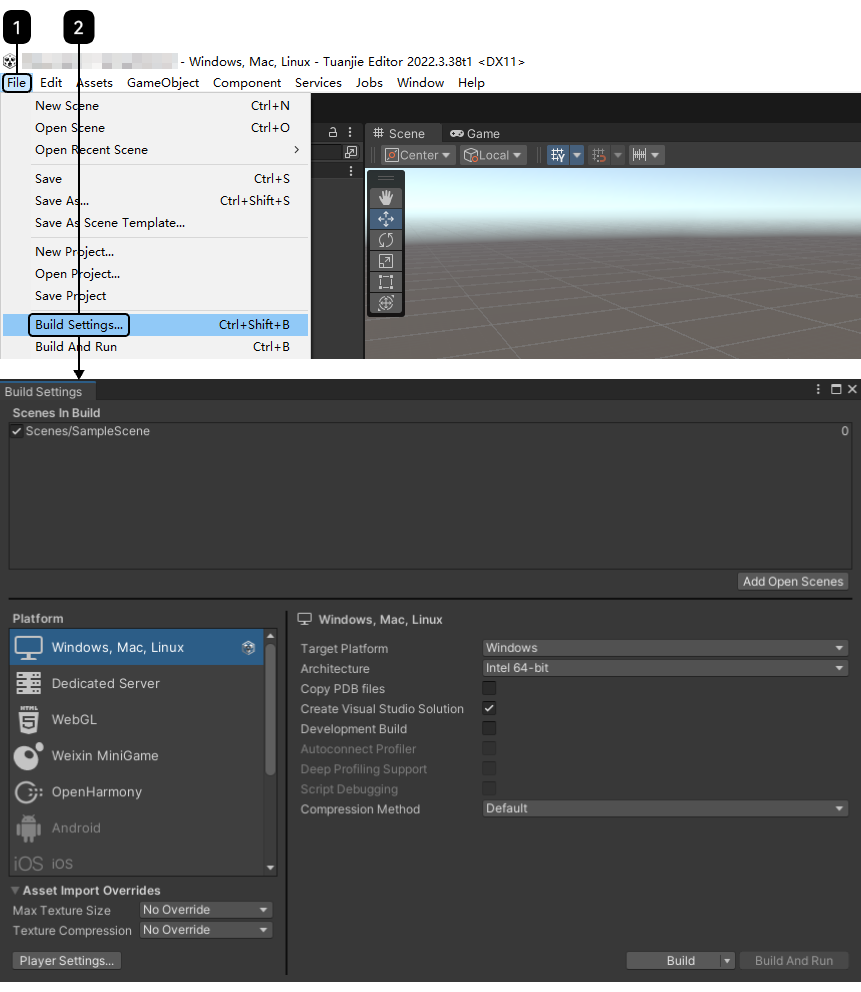
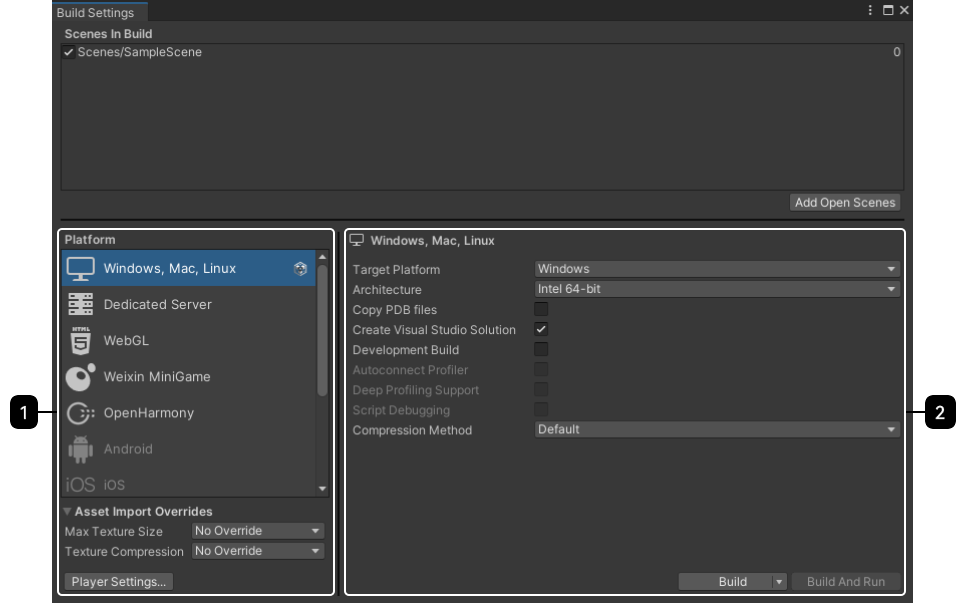
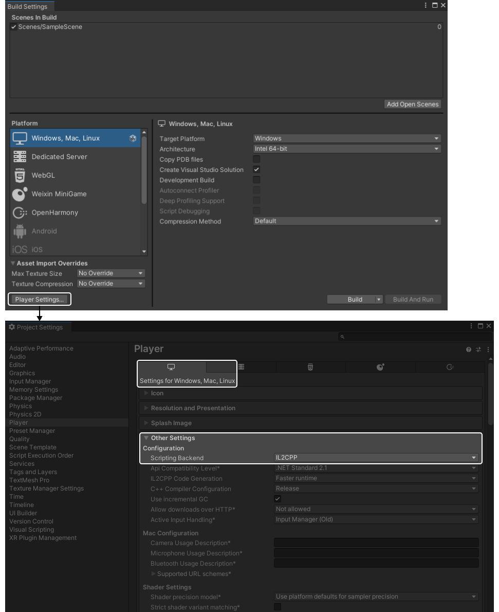
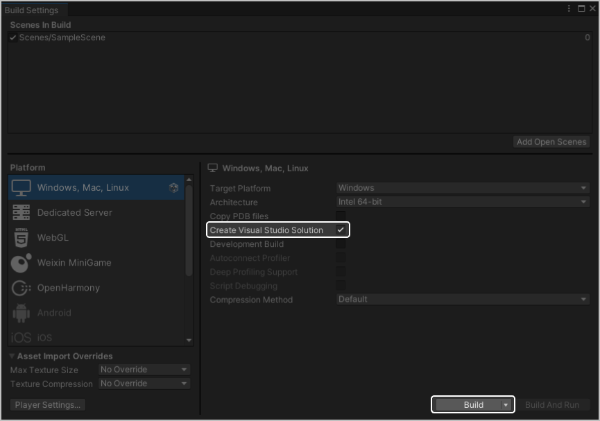
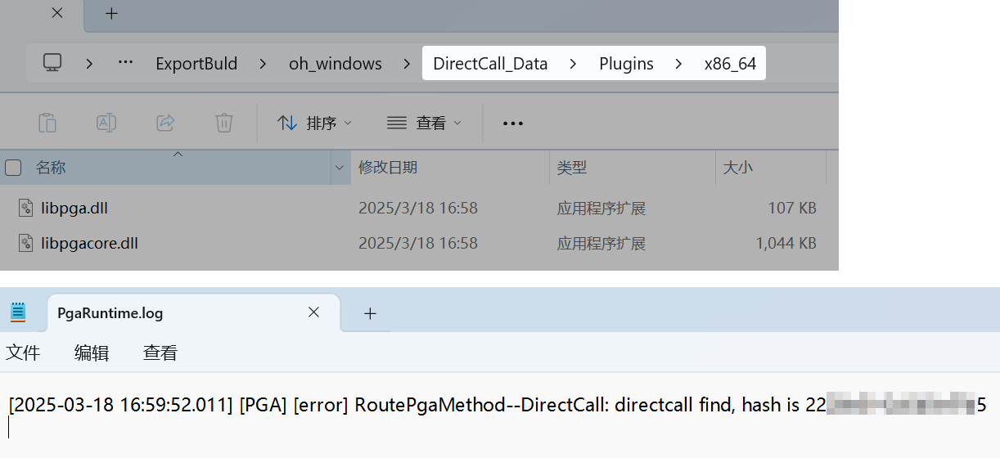

## 导出为Openharmony工程

### 导出步骤

1. 点击“File &gt; Build Settings”，进入“Build Settings”页面。

   
2. 在左侧“Platform”中选择“OpenHarmony”选项，并在右侧“OpenHarmony”中配置相关信息。

   
3. 勾选“Export Project”选项，点击“Export”，导出OpenHarmony工程。

   

   如果是打包为HAP包，则不需要勾选“Export Project”选项。

   

### 检查PGA优化是否生效

导出工程后打开工程文件夹，如果看到在工程的“libs &gt; default &gt; arm64-v8a”文件夹下增加了libpga.so、libpgacore.so和libsleef.so3个so后缀的文件，同时在运行日志文件内搜索“RoutePgaMethod”并出现相关内容，则说明PGA优化生效。

## 导出为Windows工程

### 导出步骤

1. 点击“File &gt; Build Settings”，进入“Build Settings”页面。

   
2. 在左侧“Platform”中选择“Windows, Mac, Linux”选项，并在右侧“Windows, Mac, Linux”中配置相关信息。

   

   目前“Target Platform”选项仅支持选择Windows平台。

   
3. 点击“Player Settings”，在“Settings for Windows, Mac, Linux &gt; Other Settings &gt; Configuration”的“Scripting Backend”选择“IL2CPP”选项。

   

   目前“Scripting Backend”选项仅支持选择“IL2CPP”。

   
4. 勾选“Create Visual Studio Solution”选项，点击“Build”，导出Windows可执行程序。

   

   如果是打包Windows工程，则不需要勾选“Create Visual Studio Solution”选项。

   

### 检查PGA优化是否生效

导出工程后打开工程文件夹，如果看到在导出目录的“DirectCall\_Data &gt; Plugins &gt; x86\_64”文件夹下增加了libpga.dll、libpgacore.dll2个dll后缀的文件，同时在导出的可执行程序的Logs目录下的PgaRuntime运行日志文件内搜索“RoutePgaMethod”并出现相关内容，则说明PGA优化生效。

