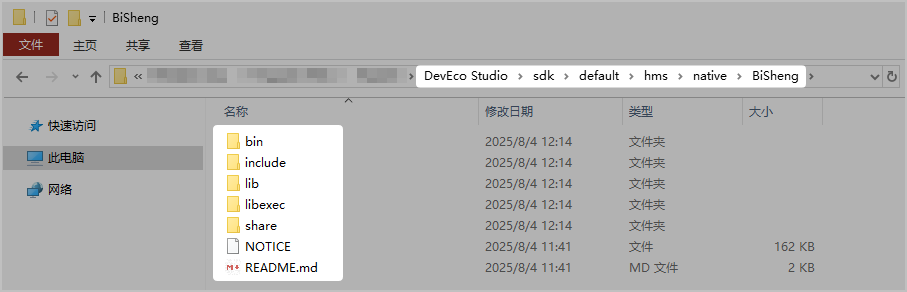
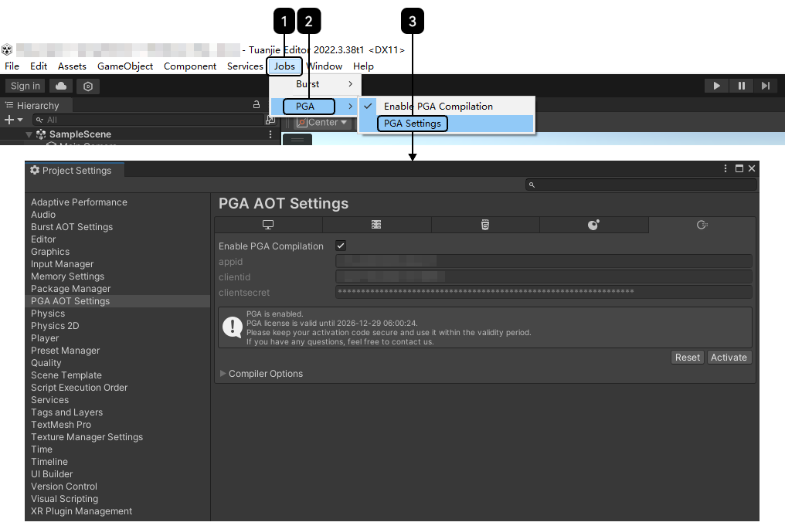
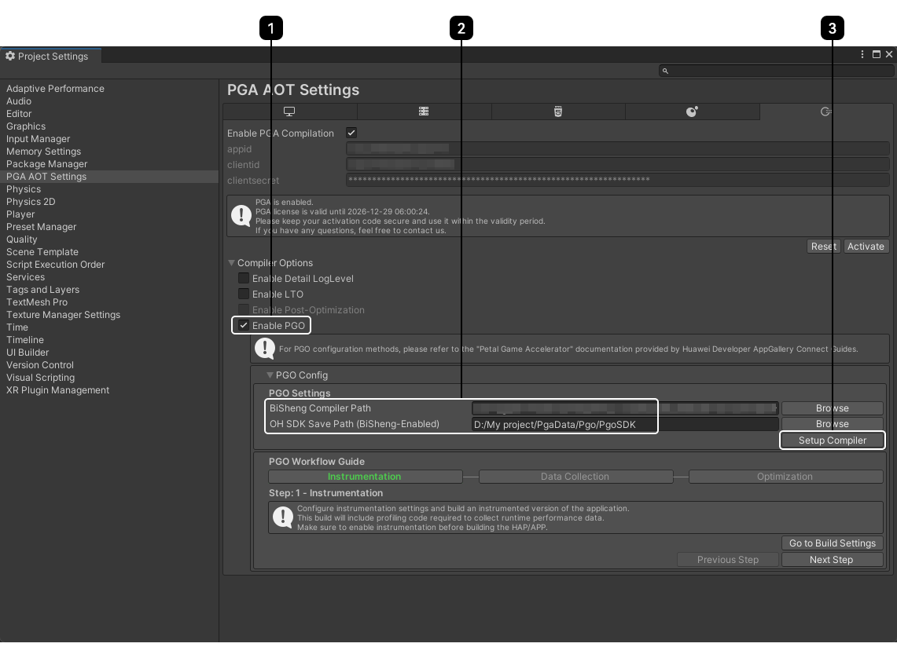
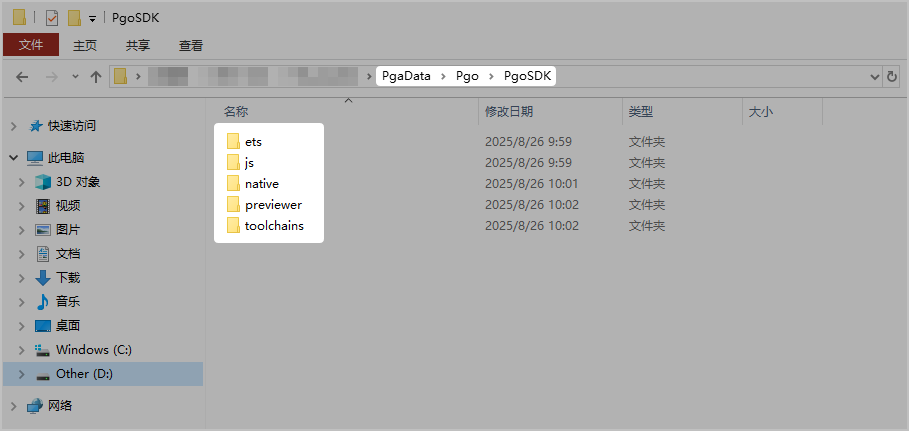
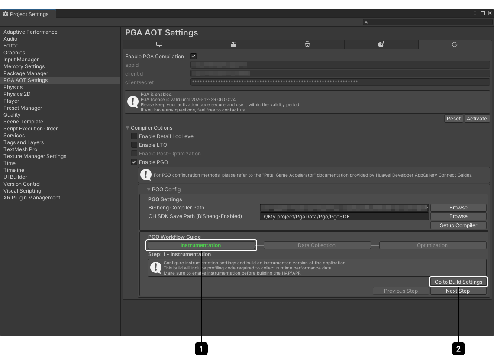
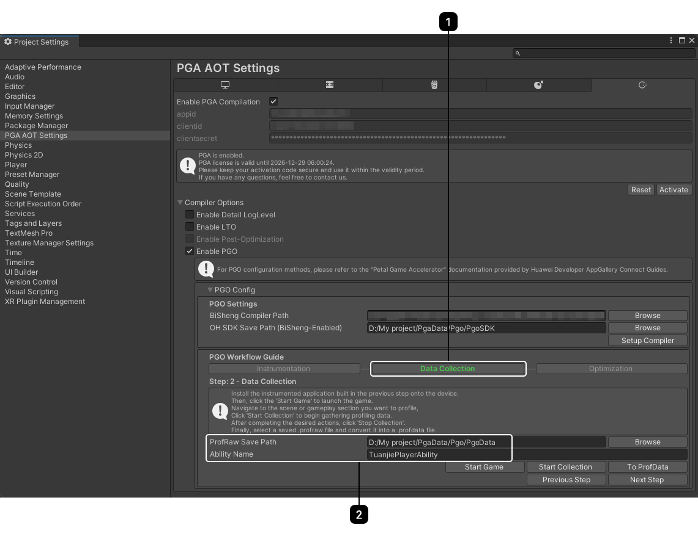
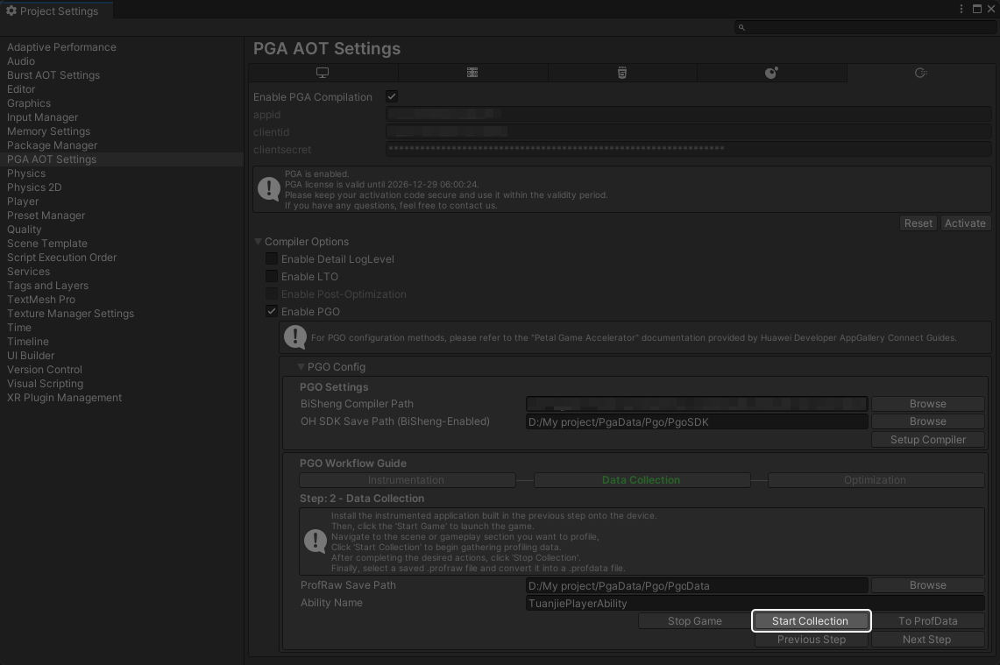
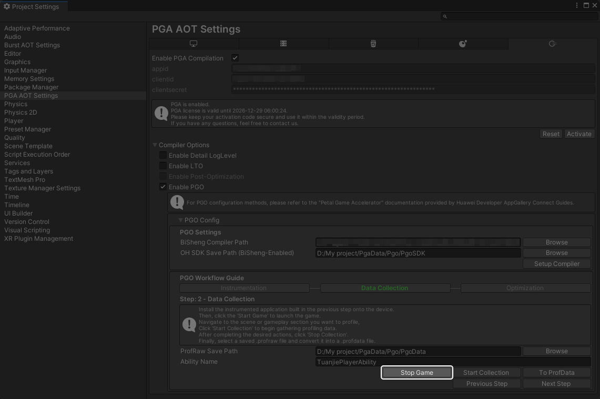
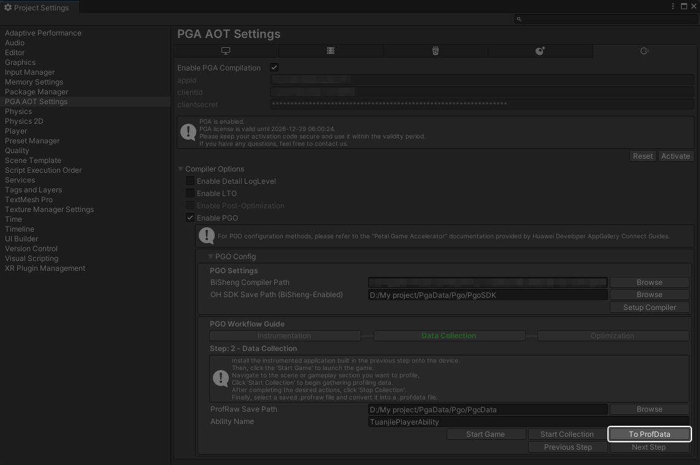
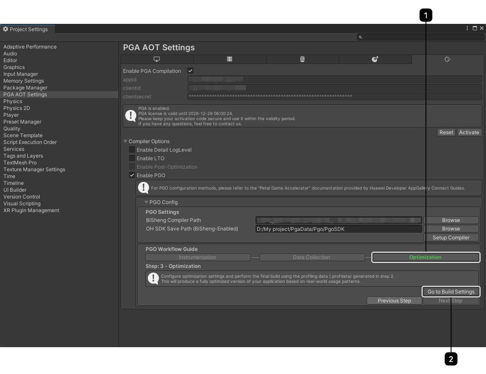

## 概述

PGO（Profile-Guided Optimization，剖析引导优化），是一种先进的编译器优化技术。其核心原理是根据程序在实际运行中的行为数据做出更智能、更有效的优化决策，提升程序的运行速度，减少代码包大小。

## 应用场景

主要对热点函数和核心性能路径进行优化，通常在典型玩法或高负载场景中采集数据，以获取真实的运行特征。


* 您可以选择单独使用PGO，也可以选择和[LTO](/docs/dev/game-dev/pga-lto-0000002415677696)结合使用，以获得更好的优化效果。
* 当前仅支持构建平台为Windows、目标平台为OpenHarmony时可使用。

## 工具下载

使用PGO需要下载5.0.5 Release及以上版本的[DevEco Studio](https://developer.huawei.com/consumer/cn/download/)。下载并安装完成后，打开DevEco Studio的安装路径，按照路径“DevEco Studio &gt; sdk &gt; default &gt; hms &gt; native &gt; BiSheng”即可看到BiSheng编译器文件。



## 使用本地工具优化编译

### 工具配置

1. 点击“Jobs &gt; PGA &gt; PGA Settings”，进入“PGA AOT Settings”页面。

   
2. 点击展开“Compiler Options”，勾选“Enable PGO”。展开“PGO Config”，填写“PGO Settings”中相关配置项，然后点击“Setup Compiler”，等待几分钟完成编译器设置。

   

   | 配置项 | 说明 |
   | --- | --- |
   | BiSheng Compiler Path | 请填写[工具下载](#section15596124141217)中BiSheng编译器文件所在路径。 |
   | OH SDK Save Path (BiSheng-Enabled) | 请填写OpenHarmony SDK修改后的保存路径，该路径默认为游戏项目内“PgaData \&gt; Pgo \&gt; PgoSDK”文件夹下，也可以点击“Browse”自定义存储位置。  说明：  该路径可以复用其他项目保存OpenHarmony SDK的路径，所保存的OpenHarmony SDK可共同使用。当复用其他项目的路径时，当前项目无需再设置BiSheng Compiler Path。 |
3. 设置成功后可以在你所设置的存储OpenHarmony SDK的路径下看到替换了BiSheng编译器的OpenHarmony SDK。

   

### 插桩编译

插桩编译是指在游戏编译过程中向游戏代码插入额外指令或代码片段的技术，主要用于动态分析、调试、性能监控或测试等场景。其核心目的是在不修改原始逻辑的前提下增强程序的可观测性或控制能力。

完成编译器设置后，在“PGO Workflow Guide”中选择第一步“Instrumentation”，然后点击“Go to Build Settings”前往“Build Settings”页面[打包](/docs/dev/game-dev/pga-package-0000002089873625)。此时生成的游戏带有插桩代码，能够采集运行时的游戏性能数据生成.profraw文件。



### 数据采集和数据转换

在获取到已完成插桩编译的游戏应用之后，需要获取重载场景下的负载情况和热点函数，为PGO优化编译提供指导。具体流程如下：

1. 点击“Data Collection”到第二步采集游戏数据，填写相关配置项。

   

   | 配置项 | 说明 |
   | --- | --- |
   | ProfRaw Save Path | 请填写ProfRaw数据采集文件存储路径。该文件的存储路径默认为项目目录下“PgaData \&gt; Pgo \&gt; PgoData”文件夹内，也可以点击“Browse”自定义存储位置。  注意：  请避免选择系统限制路径（如C盘Program Files路径下）。 |
   | Ability Name | 请填写当前游戏项目的entryAbility名称。该值在团结引擎内默认为TuanjiePlayerAbility。 |
2. 确保手机端已使用USB与PC端连接后，点击“Start Game”在手机端启动已完成插桩编译的游戏。启动游戏时，请关闭其它无关应用程序的后台，确保当前仅有待采集ProfRaw数据的游戏处于运行状态中。

   
3. 在游戏内进入待采集ProfRaw数据的游戏场景。为了达到更好的优化效果，请选择[合适的游戏场景](https://developer.huawei.com/consumer/cn/doc/AppGallery-connect-Guides/binary-optimization-select-scene-0000001529316326)进行采集数据。
4. 点击“Start Collection”开始采集数据，选择合理时机点击“Stop Collection”停止采集，完成游戏场景数据采集。

   

   * 单次采集只能捕获单个ProfRaw文件。
   * 采集过程中请避免中途关闭游戏进程，保证采集的连贯性。

   
5. 重复[第四步](#ZH-CN_TOPIC_0000002415517840__li57001933203916)，完成多个游戏场景数据采集。停止采集后，点击“Stop Game”终止游戏。

   

   若采集过程中失败，请解决导致失败的问题后重新点击“Start Game”启动游戏。

   
6. 当前采集的数据为ProfRaw格式，并不能直接用于后续优化流程，需要您选择具体场景数据，点击“To ProfData”将其转换为ProfData数据，在游戏项目的“.\PgaData\Pgo\PgoData”路径下生成ProfData文件default.profdata。

   

   目前仅支持使用单一游戏场景采集的数据文件来指导优化编译，暂不支持将多个场景的ProfRaw文件融合为一个ProfData文件使用。

   

### 优化编译

完成数据采集和数据转换得到ProfData文件后，在“PGO Workflow Guide”中选择第三步“Optimization”，然后点击“Go to Build Settings”前往“Build Settings”页面[打包](/docs/dev/game-dev/pga-package-0000002089873625)，生成优化后的游戏应用。



## 使用流水线工具优化编译

### 工具配置

修改游戏项目下“ProjectSettings &gt; PgaAotSettings\_OpenHarmony.json”内部分键的值，实现使用PGO优化编译时的一些自定义操作。

```
{
  "hybridclrIl2cppPath": "",
  "currentPgoStep": 0,
  "enablePga": true,
  "enablePgo": false,
  "enablePostOpt": false,
  "enableSyntaxCheck": true,
  "excludeCLRAssemblyNames": "",
  "hasHybridclr": false,
  "licensePath": "",
  "openHarmonySDKRoot": "",
  "pgoSdkSavePath": "",
  "postOptLibPath": "Editor\\BiSheng\\lib\\libStateLessFuncAcc.so",
  "scriptingBackend": "",
  "targetArchitectures": 2,
  "toolchainPath": "",
  "useBiShengCompiler": false,
  "enableVisa": "false"
}
```

| 属性 | 类型 | 必填(M)/选填(O) | 描述 |
| --- | --- | --- | --- |
| enablePgo | Boolean | O | 是否在构建打包时开启PGO。   * true：构建出包时开启PGO。 * false：构建出包时关闭PGO。   默认值为false。 |
| currentPgoStep | Number | O | 开启PGO时当前执行步骤。使用该属性需要开启PGO。   * 0：插桩编译阶段。 * 1：数据采集阶段。 * 2：优化编译阶段。   默认值为0。 |
| useBiShengCompiler | Boolean | O | 开启PGO时是否设置BiSheng编译器。使用该属性需要开启PGO并填写tool chain路径。   * true：构建打包时自动设置编译器。此时将自动复制“toolchainPath”参数指向的BiSheng SDK，并向其中添加PGO工具链。该过程在构建的前置阶段进行。 * false：不进行编译器设置。   默认值为false。 |
| toolchainPath | String | O | 开启PGO时使用的BiSheng编译器路径，该路径为[工具下载](#section15596124141217)中BiSheng编译器文件所在路径。 |
| pgoSdkSavePath | String | O | 保存修改后的OpenHarmony SDK的路径，不填写该值时默认存储至游戏项目内“PgaData \&gt; Pgo \&gt; PgoSDK”文件夹下。 |

### PGO插桩编译阶段、数据采集阶段和优化编译阶段的参数设置

* PGO插桩编译阶段参数设置：

  ```
  enablePgo = true
  currentPgoStep = 0
  ```
* PGO数据采集阶段参数设置：

  ```
  enablePgo = true
  currentPgoStep = 1
  ```
* PGO优化编译阶段参数设置：

  ```
  enablePgo = true
  currentPgoStep = 2
  ```


第一次使用PGO时需要设置编译器，若未设置BiSheng编译器，则需额外添加以下参数：

```
useBiShengCompiler = true
toolchainPath = "YourPath\DevEco Studio\sdk\default\hms\native\BiSheng"
```

设置如上参数后，在后续流水线出包时PGO会自动进行编译器设置，设置完成后，游戏项目下将生成目录".\PgaData\Pgo\PgoSDK"。后续再次使用PGO时可以选择将如上参数恢复为默认值。

### 优化编译

完成数据采集和数据转换后将在游戏项目的“.\PgaData\Pgo\PgoData”路径下生成ProfData文件default.profdata，将default.profdata放置到流水线上相同路径".\PgaData\Pgo\PgoData"下即可优化编译。
