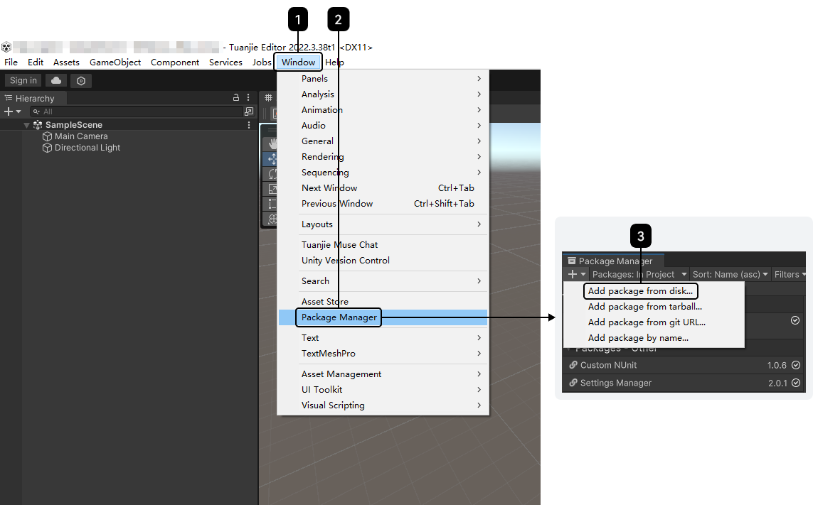
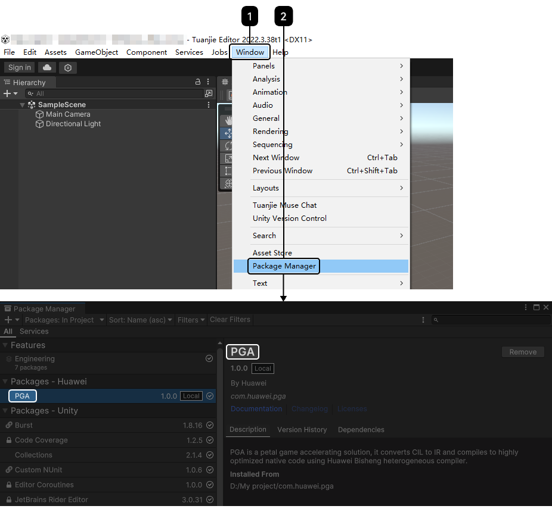
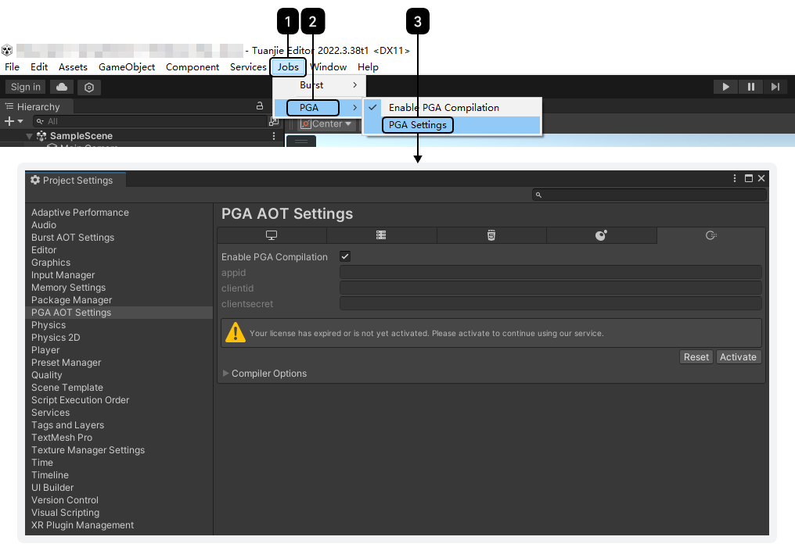
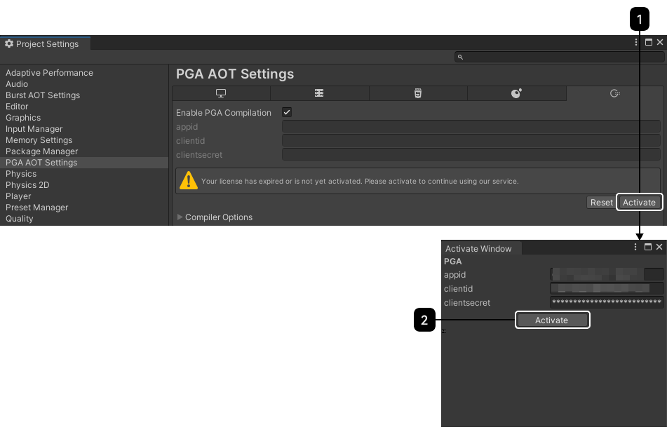
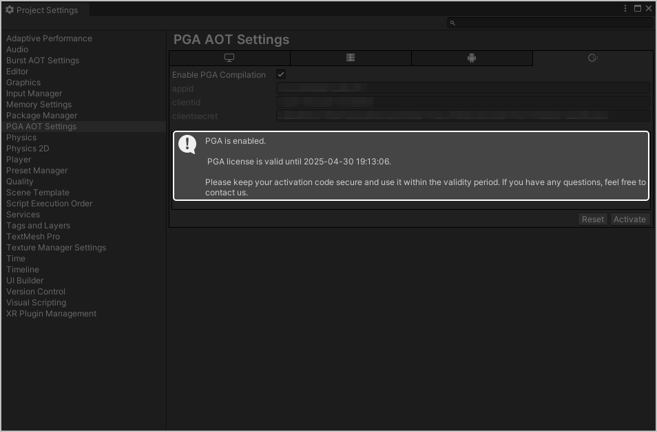
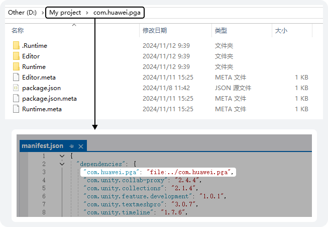
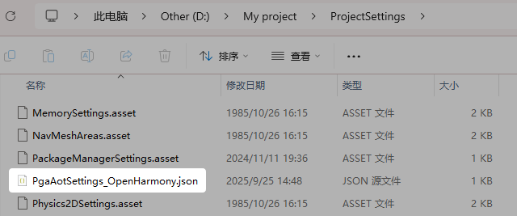

## 本地工具配置

### 项目工程导入PGA工具

1. 通过团结Hub打开项目工程。

   

   当您打开已导入PGA的项目工程时，若使用的引擎版本较导入PGA时的版本更高，则需要重新导入PGA；若使用的引擎版本较导入PGA时的版本更低，则不需要重新导入PGA。如果在需要重新导入PGA时未导入PGA直接导出工程，会提示IL2cpp不存在。
2. 点击“Window &gt; Package Manager”，打开Package Manager，点击左上角“Add Package From Disk”，选择PGA文件导入Unity工程。

   
3. 导入成功后可在“Window &gt; Package Manager”中查看。

   

### 团结引擎编辑器配置软件许可

1. 点击“Jobs &gt; PGA &gt; PGA Settings”，进入“PGA AOT Settings”页面。

   
2. 点击“Activate”，在“Activate Window”中输入从AGC控制台获取的**APP ID**、**Client ID**、**Client Secret**，具体获取方式请参见[获取游戏信息](https://developer.huawei.com/consumer/cn/doc/games-guides/pga-agc-preparation-0000002053782502#section95331129879)。点击“Activate”鉴权。

   
3. 鉴权成功后会出现“PGA is enabled.”和当前license有效期的提示。

   

## 流水线工具配置

### 流水线导入包

1. 将com.huawei.pga包放入项目工程的文件夹内。
2. 打开当前项目Packages文件夹内的manifest.json，在dependencies内新增com.huawei.pga的依赖，并配置到com.huawei.pga所在的文件夹。

   

   “com.huawei.pga”的值可以为绝对路径或相对路径，请根据需要自行决定。

   
3. 提交至远程流水线仓库后，再进行工程构建即可使用PGA。此时会将“com.huawei.pga &gt; .Runtime”下的settings.json文件复制到游戏项目的“ProjectSettings”文件夹下，得到PgaAotSettings\_OpenHarmony.json文件，即PGA配置文件。

   

### 流水线配置软件许可

1. 创建登录配置信息文件clientInputFile.bin，并放置在项目路径“.\UserSettings”下。

   

   该放置路径为默认路径，若想自定义此处的路径，可通过[自定义设置com.huawei.pga包](#section2415145114120)进行修改。
2. 打开clientInputFile.bin文件，在文件内按照**appId**、**clientId**、**clientSecret**的顺序设置JSON数组，填写从AGC控制台获取的值，具体获取方式可参见[获取游戏信息](https://developer.huawei.com/consumer/cn/doc/games-guides/pga-agc-preparation-0000002053782502#section95331129879)。对应的clientInputFile.bin文件具体内容如下：

   ```
   {
       "appId": "000000001",
       "clientId": "000000000000000002",
       "clientSecret": "00XXXXXXXXXAF"
   }
   ```

### 自定义设置com.huawei.pga包

可通过修改游戏项目下“ProjectSettings &gt; PgaAotSettings\_OpenHarmony.json”内不同键的值来实现对PGA的一些自定义操作。


使用定制引擎或使用Hybridclr包的项目，部分内容为必填。

```
{
  "hybridclrIl2cppPath": "",
  "enablePga": true,
  "enableSyntaxCheck": true,
  "hasHybridclr": false,
  "licensePath": "",
  "openHarmonySDKRoot": "C:\Users\xxxx\AppData\Local\OpenHarmony\Sdk\12",
  "scriptingBackend": "",
  "targetArchitectures": 2,
  "excludeCLRAssemblyNames": "",
  "enableVisa": "false"
}
```

| 属性 | 类型 | 必填(M)/选填(O) | 描述 |
| --- | --- | --- | --- |
| hybridclrIlcppPath | String | O | 项目所使用的HybridCLR包内“il2cpp plus”文件夹的绝对路径，例如“D:\\IL\\demo\\2\_PGA\\HybridCLRData\\il2cpp\_plus\_repo”。 |
| enablePga | Boolean | M | PGA的开关。   * true：导出时PGA正常介入。 * false：导出时PGA不介入。   默认值为true。 |
| enableSyntaxCheck | Boolean | M | 是否开启对HPC#语法进行检查。   * true：开启检查，若发现错误将中断PGA流程。 * false：关闭检查。   默认值为true。 |
| hasHybridclr | Boolean | M | 项目是否使用了HybridCLR包。   * true：项目使用了HybridCLR包，此时[hybridclrIlcppPath](#ZH-CN_TOPIC_0000002089781453__p493612125112)为必填。 * false：项目未使用HybridCLR包。   默认值为false。 |
| licensePath | String | Null | O | 软件许可的配置信息文件路径，该值为空时默认为项目路径“.\UserSettings”下。  注意：  该值为项目的相对路径。例如，如果想把clientInputFile.bin文件放入项目路径“.\Packages\com.huawei.pga\.Runtime”下，直接填入值“.\\Packages\\com.huawei.pga\\.Runtime”即可。 |
| openHarmonySDKRoot | String | Null | * M（定制引擎） * O（非定制引擎，或已设置环境变量“OPENHARMONY\_SDK\_ROOT”） | OpenHarmony SDK的路径。 |
| scriptingBackend | Null | O | 脚本编译方式，该值为空时默认为使用IL2PP编译。由于当前暂未开放其他选项，因此该值当前固定为空。 |
| targetArchitectures | Number | M | OpenHarmony的CPU架构，请填写CPU架构所对应的值。   * 0：无效架构。 * 1：32位ARM。 * 2：64位ARM。 * 3：64位Intel。   默认值为2。 |
| excludeCLRAssemblyNames | String | Null | O | 不进行IL注入的程序集名称。填写格式为"\&#123;excludeAssemblyA;excludeAssemblyB\&#125;"，多个程序集名称之间以分号（;）分隔，且需省略“.dll”后缀。 |
| enableVisa | Boolean | M | 是否启用VISA。   * true：项目启用VISA。 * false：项目不启用VISA。   默认值为false。  说明：  若当前文件内不存在该字段，请手动添加该字段至文件内。 |
