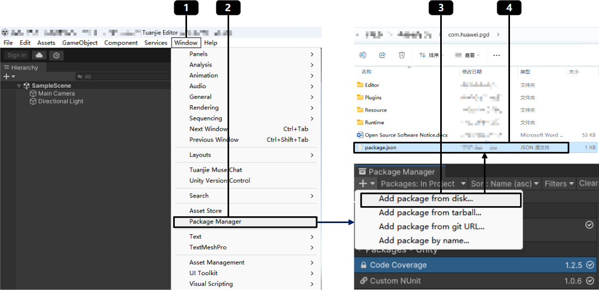
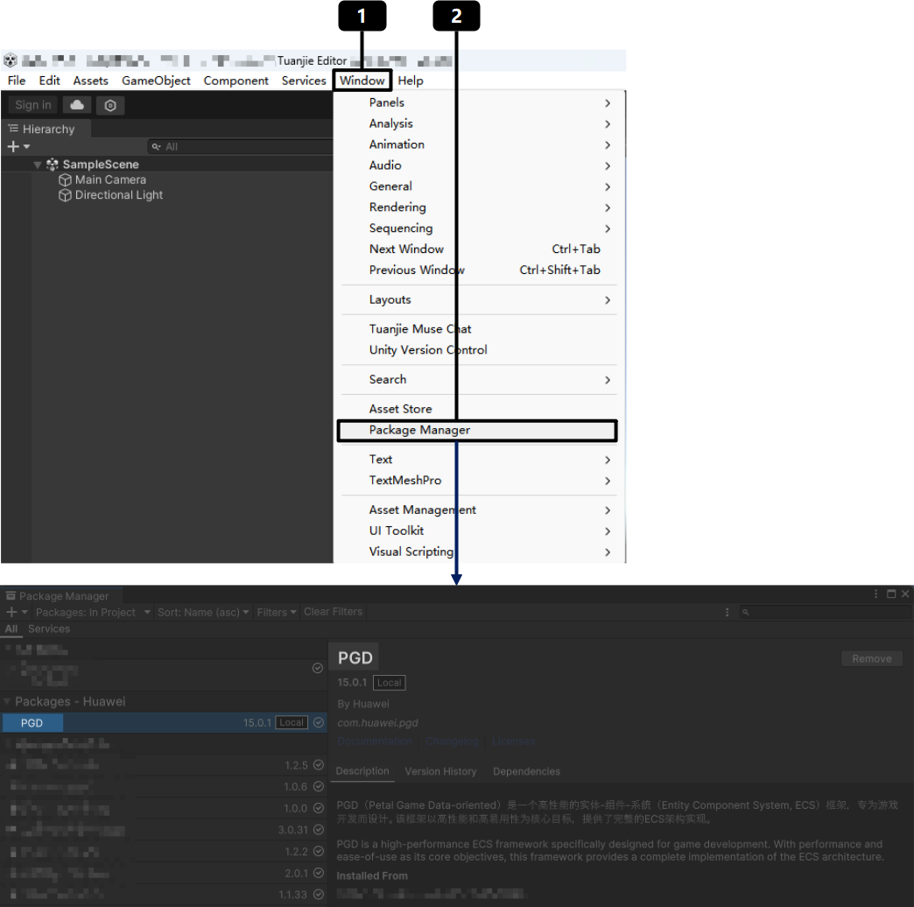
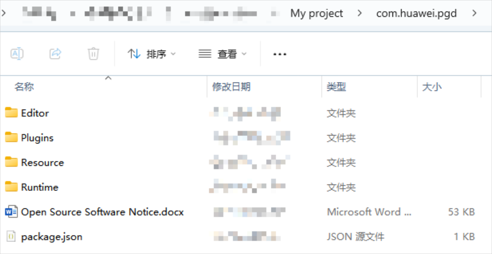
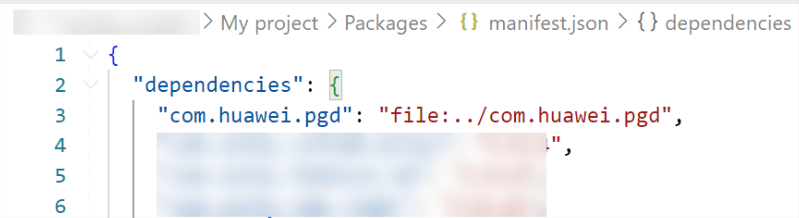

在团结Editor中导入PGD Package，为接下来的游戏开发做准备。

## 前提条件

[下载PGD C# Package](https://developer.huawei.com/consumer/cn/doc/AppGallery-connect-Library/sdk-0000002468289653)。

PGD动态库运行的目标框架为.NET Standard 2.1。

## 导入方式一：使用团结Editor

1. 在团结Hub打开项目工程。
2. 进入团结Editor，点击“Window &gt; Package Manager”，打开Package Manager，点击左上角“Add Package From Disk”，将本地下载好的PGD导入团结工程。

   

   com.huawei.pgd为示例包名，请以实际下载的PGD Package文件名为准。

   
3. 导入成功后，在“Window &gt; Package Manager”中查看。

   

## 导入方式二：使用资源管理器

此处以Windows操作系统的资源管理器为例，My project为游戏项目工程。

1. 将PGD Package放入My project项目工程的文件夹内。

   
2. 打开当前项目工程文件夹内的Packages，修改manifest.json文件，在dependencies内新增com.huawei.pgd的依赖，并配置到com.huawei.pgd所在的文件夹。

   

   “com.huawei.pgd”建议使用相对路径，请根据实际情况填写正确路径。
