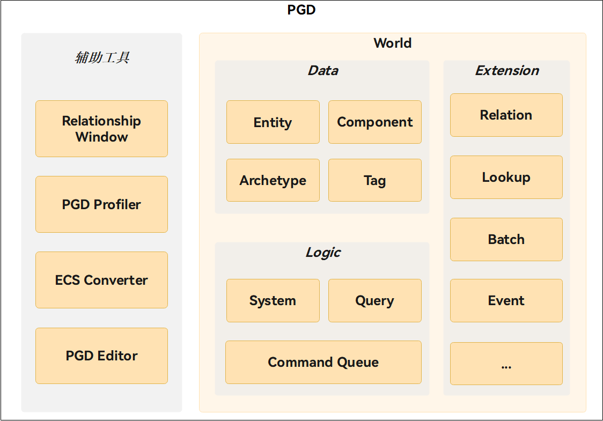

## 产品简介

花瓣游戏数据驱动（PGD，Petal Game Data-oriented-programming）是专为游戏开发设计的高性能实体组件系统框架，其采用标准的ECS（Entity Component System）架构模式，通过内存布局优化和数据管理机制，将传统面向对象编程中紧耦合的数据和行为进行解耦，形成一个面向数据的游戏架构解决方案，实现数据驱动的游戏逻辑设计，为游戏开发者提供了一个高性能易用的开发平台。

ECS（Entity Component System）架构模式的详细介绍请参见[Entity Component System](https://en.wikipedia.org/wiki/Entity_component_system)。

## PGD架构概览

PGD采用标准的ECS架构模式，主要包含如下模块：

| 分类 | 模块 | 模块说明 |
| --- | --- | --- |
| [World](https://developer.huawei.com/consumer/cn/doc/games-references/world-0000002467496845)  整个ECS（Entity Component System）框架的容器，负责管理所有实体、组件、系统的生命周期。 | [Entity](https://developer.huawei.com/consumer/cn/doc/games-references/entity-0000002433883738) | 游戏对象的唯一标识，本身不包含数据。 |
| [Component](https://developer.huawei.com/consumer/cn/doc/games-references/component-0000002467282393) | 存储数据的容器，定义实体的属性。 |
| [Archetype](https://developer.huawei.com/consumer/cn/doc/games-references/archetype-0000002467362257) | 一组特定组件的组合，用于定义实体的类型。 |
| [Tag](https://developer.huawei.com/consumer/cn/doc/games-references/tag-0000002433723890) | 轻量级标记，用于分类和过滤实体。 |
| [System](https://developer.huawei.com/consumer/cn/doc/games-references/system-0000002467576713) | 处理游戏逻辑的核心组件。系统负责在每个游戏循环中对符合特定条件的实体进行处理，实现游戏的各种功能逻辑，如移动、碰撞检测、伤害计算等。 |
| [Query](https://developer.huawei.com/consumer/cn/doc/games-references/query-0000002433978188) | 高效查找和迭代符合条件的实体。它提供高效的方式来筛选具有特定组件和标签组合的实体，并对它们进行批量处理。 |
| [CommandQueue](https://developer.huawei.com/consumer/cn/doc/games-references/system-commandqueue-0000002477718909) | 延迟执行机制，用于解决在查询迭代过程中不能进行结构性修改的问题。 |
| [Relation](https://developer.huawei.com/consumer/cn/doc/games-references/relation-0000002467496853) | 关系功能模块，用于表示实体与目标的关系，可通过该模块自定义关系。 |
| [Lookup](https://developer.huawei.com/consumer/cn/doc/games-references/lookup-0000002433818360) | 高性能索引机制，用于基于组件值快速查找实体。传统的ECS查询基于组件类型，而Lookup系统允许基于组件的实际值进行查询，大幅提升特定场景下的查询性能。 |
| [Batch](https://developer.huawei.com/consumer/cn/doc/games-references/batch-0000002433818364) | 高性能批量处理实体的操作机制，用于优化大量实体的创建和修改操作。传统的逐个实体操作可能导致多次结构性变化，而批处理将这些操作合并为一次或少数几次结构变化，优化结构性变更从而获得性能收益。 |
| [Hybrid](https://developer.huawei.com/consumer/cn/doc/games-references/hybrid-0000002451086794) | PGD混合模式对象池用于桥接GameObject与Entity，实现游戏对象的高效复用。 |
| 辅助工具 | [Relationship Window](/docs/dev/game-dev/pgd-tool-window-0000002526353161) | 实时展示System、Component、Entity三者逻辑依赖与数据变化的可视化调试工具。 |
| [PGD Profiler](/docs/dev/game-dev/pgd-tool-profiler-0000002526433123) | 集成于引擎Profiler中的System维度PGD数据监控工具。 |
| [ECS Converter](/docs/dev/game-dev/pgd-tool-converter-0000002494353474) | 将游戏工程的ECS框架转换为PGD框架的辅助转换工具。 |
| [PGD Editor](/docs/dev/game-dev/pgd-tool-editor-0000002494193498) | 以引擎编辑器为核心的PGD构建工具。 |

## 平台支持说明

PGD具有广泛的平台兼容性、跨平台支持能力，支持团结引擎开发，并通过适配层提升了团结Editor的易用性。

## 工作原理

与传统面向对象的架构不同，PGD是建立在数据驱动的基础上，将游戏中的所有对象分解为：

* 组件（Component）：纯数据。
* 系统（System）：处理数据。
* 实体（Entity）：特定组件集合的唯一标识符。

PGD通过Archetype系统实现了高效的数据组织，将具有相同组件构成的实体被自动归类到同一个Archetype中，所有组件数据以结构体数组（SoA）的形式连续存储在内存中，这种数据组织方式极大地提升了CPU缓存的命中率，使得批量数据处理能够充分利用现代处理器的SIMD指令和预取机制。

## 开发语言限制

PGD当前支持的函数开发语言为C#。

## 开发流程

| 步骤 | 操作 | 说明 |
| --- | --- | --- |
| 1 | [导入Package](/docs/dev/game-dev/pgd-import-0000002500629620) | 在团结Editor中导入PGD Package，为后续的游戏开发做准备。 |
| 2 | 开发指导 | * [PGD API 开发指导](/docs/dev/game-dev/pgd-development-0000002428270706)：在团结Editor中使用PGD Package开发游戏重载场景。 * [PGD辅助工具操作指导](/docs/dev/game-dev/pgd-tool-0000002494193496)：在团结Editor中使用辅助工具提升PGD开发效率。 |
