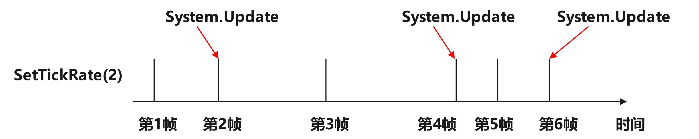
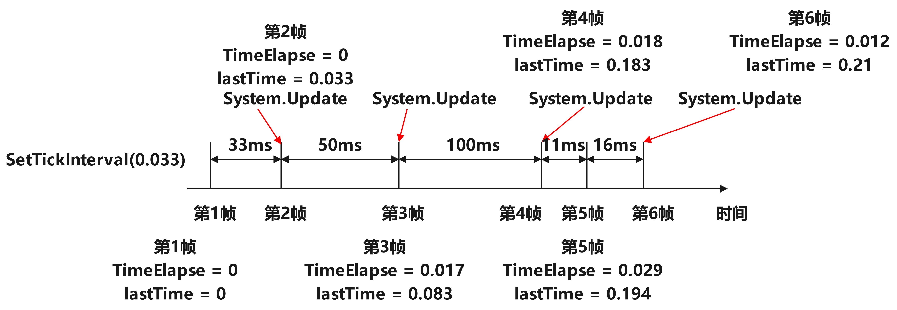

## 灵活调度模式

PGD通过给系统添加内置定时器，支持灵活控制系统的调度时机。System灵活调度功能支持两种模式：

### 设置System更新频率

单位：帧/次。

例如SetTickRate(2)表示系统每2帧更新一次。该模式仅跟帧数有关，跟帧时间长短无关，因此更新间隔不是固定时长。



### 设置System更新间隔

单位：秒/次。

例如，SetTickInterval(0.033)表示系统每0.033s更新一次，即33ms更新一次。该模式是固定时长更新，从而达到FixedUpdate效果。对于设置更新间隔，PgdTimer内部有几个关键参数：fixedInterval记录设置的更新间隔；TimeElapsed记录累计时间，当累计时间超过fixedInterval，PgdTimer激活状态置为*true*，后处理时将TimeElapsed按照fixedInterval取余；lastTime记录前一帧的时间，用于更新TimeElapsed。



| 帧数 | 说明 |
| --- | --- |
| 第1帧 | 初始状态，所有值为0。 |
| 第2帧 | 1. currentTime = 0.033s 2. TimeElapsed = TimeElapsed + currentTime - lastTime = 0 + 0.033 - 0 = 0.033 3. lastTime = currentTime = 0.033 4. TimeElapsed超过了设置的间隔，PgdTimer激活，系统执行更新逻辑 5. 后处理将PgdTimer去激活，并对TimeElapsed取余，因此最后TimeElapsed = 0 |
| 第3帧 | 1. currentTime = 0.083s 2. TimeElapsed = TimeElapsed + currentTime - lastTime = 0 + 0.083 - 0.033 = 0.050 3. lastTime = currentTime = 0.083 4. TimeElapsed超过了设置的间隔，PgdTimer激活，系统执行更新逻辑 5. 后处理将PgdTimer去激活，并对TimeElapsed取余，因此最后TimeElapsed = 0.017 |
| 第4帧 | 1. currentTime = 0.183s 2. TimeElapsed = TimeElapsed + currentTime - lastTime = 0.017 + 0.183 - 0.083 = 0.117 3. lastTime = currentTime = 0.183 4. TimeElapsed超过了设置的间隔，PgdTimer激活，系统执行更新逻辑 5. 后处理将PgdTimer去激活，并对TimeElapsed取余，因此最后TimeElapsed = 0.018 |
| 第5帧 | 1. currentTime = 0.194s 2. TimeElapsed = TimeElapsed + currentTime - lastTime = 0.018 + 0.194 - 0.183 = 0.029 3. lastTime = currentTime = 0.194 4. TimeElapsed未超过设置的间隔，系统不执行更新逻辑 5. 后处理对TimeElapsed取余，因此最后TimeElapsed = 0.029 |
| 第6帧 | 1. currentTime = 0.21s 2. TimeElapsed = TimeElapsed + currentTime - lastTime = 0.029 + 0.21 - 0.194 = 0.045 3. lastTime = currentTime = 0.21 4. TimeElapsed超过了设置的间隔，PgdTimer激活，系统执行更新逻辑 5. 后处理将PgdTimer去激活，并对TimeElapsed取余，因此最后TimeElapsed = 0.012 |

## 设置系统定时器

```
// 设置更新频率，单位为帧/次
var moveSystem = new MoveSystem().SetTickRate(2); // MoveSystem每2帧更新1次
var systemEnableSystemCollection1 = new PgdSystemCollection().SetTickRate(2); // 系统集合每2帧更新1次

// 设置更新间隔，单位为秒/次
var detectSystem = new DetectSystem().SetTickInterval(0.033); // DetectSystem每0.033s(33ms)更新1次
var systemEnableSystemCollection2 = new PgdSystemCollection().SetTickInterval(0.033); // 系统集合每0.033s(33ms)更新1次

// 通过PgdTimer设置系统定时器
PgdTimer timer = new PgdTimer(2); // 创建更新频率2帧/次的定时器
var turnSystem = new TurnSystem().SetTimer(timer); // TurnSystem每2帧更新1次
var systemEnableSystemCollection3 = new PgdSystemCollection().SetTimer(timer); // 系统集合每2帧更新1次
```

## 暂停定时器

```
var moveSystem = new MoveSystem().SetTickRate(2);
var systemEnableSystemCollection1 = new PgdSystemCollection().SetTickRate(2);

// 暂停更新定时器
moveSystem.PauseTimer();
systemEnableSystemCollection1.PauseTimer();

// 恢复更新定时器
moveSystem.PasueTimer(false);
systemEnableSystemCollection1.PauseTimer(false);
```

## 清除定时器

```
var moveSystem = new MoveSystem().SetTickRate(2);
var systemEnableSystemCollection1 = new PgdSystemCollection().SetTickRate(2);

// 清除定时器状态，系统恢复每帧更新
moveSystem.Timer.Clear();
systemEnableSystemCollection1.Timer.Clear();
```
