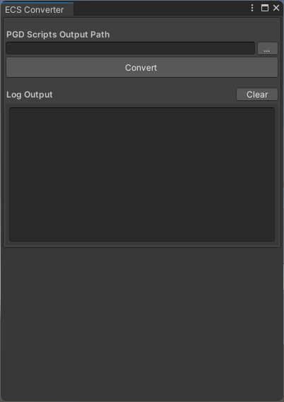

## 功能介绍

ECS Converter是将项目中ECS C#脚本辅助转换为PGD对应功能的工具，例如组件增/删/改/查等，提升开发者切换PGD框架的效率。

## 界面布局

选择“Window &gt; PGD &gt; ECS Converter”，打开ECS Converter窗口。

ECS Converter窗口自上而下分为如下区域：

| 区域 | 说明 |
| --- | --- |
| 输出路径设置（PGD Scripts Output Path） | * 文本框：用于显示当前PGD脚本输出目录，支持手动输入路径。 * “...”按钮：用于选择系统目录。 |
| “Convert”按钮 | 用于执行转换操作。 |
| 转换过程日志输出区域（Log Output） | * “Clear”按钮：用于清空当前窗口中的日志显示内容。 * 文本框：用于展示转换过程中的关键日志。 |
