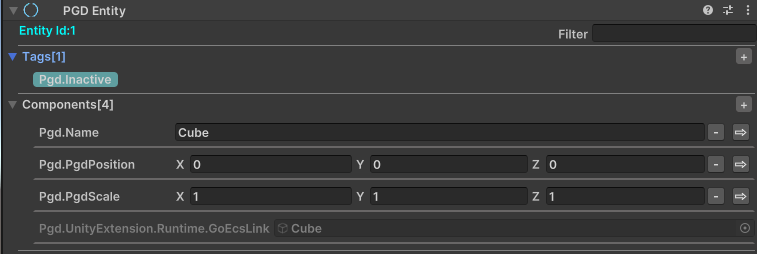
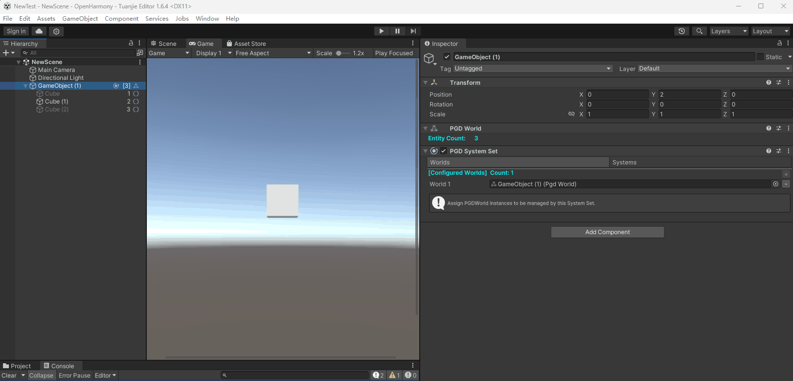
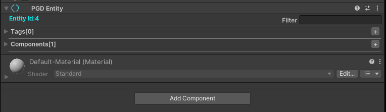
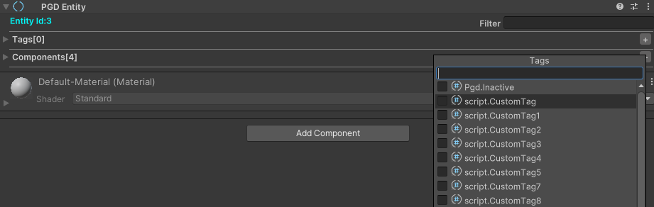
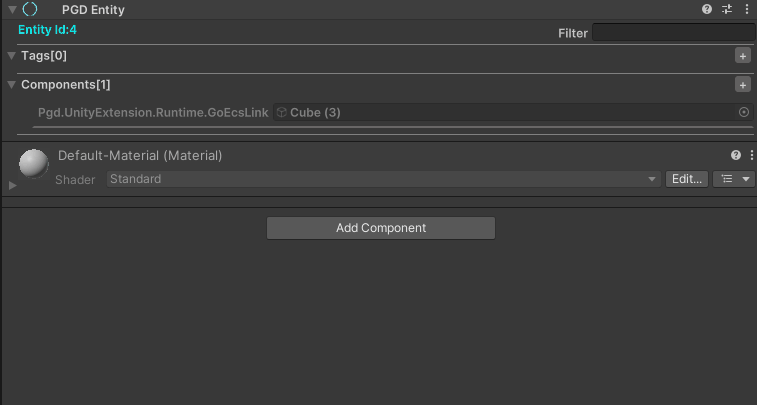
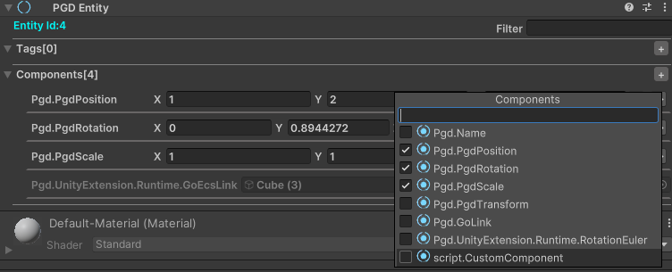
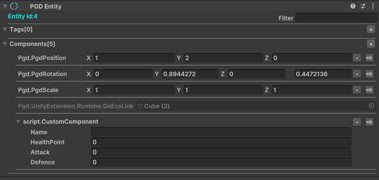
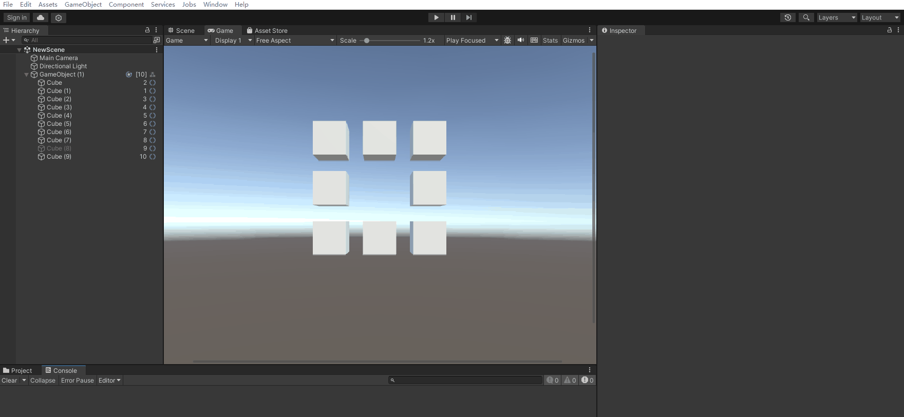

PGD Entity为实体操作模块，开发者可以通过可视化方式操作实体。

## 界面布局



| 界面 | 说明 |
| --- | --- |
| EntityId | 显示为Entity的Id。 |
| Filter | 提供Tag和Component的筛选功能。  使用空格分隔多个筛选条件，多个筛选条件按照“或”逻辑筛选。 |
| Tags[x] | 显示Entity中已添加的Tag，中括号中的数字表示当前Entity已添加的Tag数量。  例如：Tags[1]表示已添加1个Tag。  鼠标右键点击对应Tag，支持删除和跳转至Tag源码（需项目中存在对应Tag源码）。 |
| Tags[x]右侧的“+”按钮 | 该按钮表示新增一个Tag。  点击后弹出一个Tag列表弹窗。 |
| Components[x] | 显示Entity中已添加的Component，中括号中的数字表示当前Entity已添加的Component数量。  例如：Components[3]表示已添加了3个Component。 |
| Components[x]右侧的“+”按钮 | 该按钮表示新增一个Component。  点击后弹出一个Component列表弹窗。 |
| Component右侧的“-”按钮 | 该按钮表示删除一个Component。 |
| Component右侧的“→”按钮 | 点击后跳转至Component源码（需项目中存在对应Component的源码）。 |

## 创建PGD Entity组件


使用PGD Entity前，请先创建PGD World，且PGD Entity需在PGD World节点的子节点中。

1. 在场景中新建GameObject，或选中已创建好的GameObject，进入Inspector。
2. 选择“Add Component &gt; PGD &gt; PGD Entity”，添加PGD Entity组件。



## 管理Tag

### 添加/删除预定义Tag

1. 点击Tags[x]右侧的“+”按钮，新增一个PGD预定义的Tag。

   Inactive表示Entity是否激活，与GameObject的激活状态绑定。
2. 点击鼠标右键，选中已添加的Tag，您可以删除或跳转至Tag源码。



### 添加自定义Tag

除此之外，还提供了自定义Tag。

1. 自行实现ITag的接口定义。示例如下：

   ```
   // CustomTag.cs
   // 定义一个CustomTag
   public struct CustomTag: ITag { }
   ```
2. 完成定义之后，点击Tags[x]右侧的“+”按钮，新增已定义好的Tag。

   

## 管理Component


创建PGD Entity时，会在Component中新增一个名为GoEcsLink的默认Component，用于表示当前Entity与GameObject的绑定关系，这个Component不可修改。

### 添加/删除预定义Component

1. 点击Components[x]右侧的“+”按钮，新增一个PGD预定义的Component。
2. 对每个Component中对应变量进行赋值。

   

   | 指标 | 说明 |
   | --- | --- |
   | Name | Entity名称。 |
   | PgdPosition | Entity位置。  在编辑模式下该Component已与GameObject的Position进行绑定。 |
   | PgdRotation | Entity的旋转。  四元数的形式表示，在编辑模式下该Component已与GameObject的Rotation进行绑定，并自动将其转换为欧拉角形式表示。 |
   | RotationEuler | Entity的旋转。  欧拉角形式表示，在编辑模式下该Component已与GameObject的Rotation进行绑定。 |
   | PgdScale | Entity的缩放大小。  在编辑模式下该Component已与GameObject的Scale进行绑定。 |
   | PgdTransform | 4\*4的float矩阵。 |
3. 点击Component右侧的“-”按钮，删除一个Component。点击Component右侧的“→”按钮，跳转至Component源码，且仅能跳转Component脚本源码在项目中的Component。

### 添加/删除自定义Component

除此之外，还提供了自定义Component。

1. 自行实现IComponent接口。示例如下：

   ```
   // CustomComponent.cs
   // 定义一个CustomComponent
   public struct CustomComponent:IComponent
   {
       public string Name;
       public float HealthPoint;
       public double Attack;
       public int Defence;
   }
   ```
2. 点击Components[x]右侧的“+”按钮，选择新增的自定义Component。

   
3. 选中新增之后，会展示具体字段，可以给其赋值。

   

## 查看运行数据

通过Inspector展示当前运行数据。

运行时，Inspector会额外展示Match Systems，用于展示处理当前Entity的System集合，开发者可以通过System禁用功能和System提供的变量控制运行时行为。


