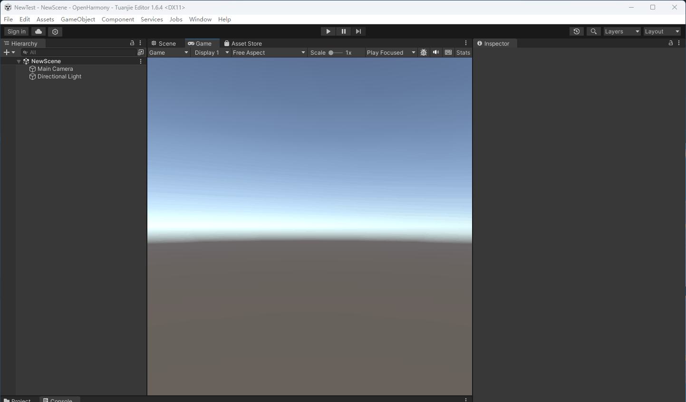
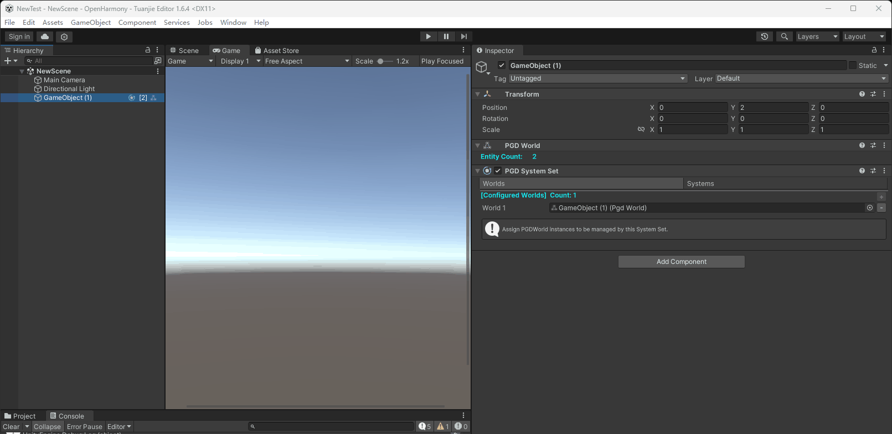
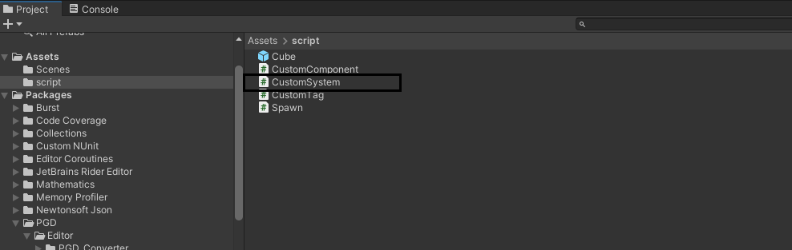
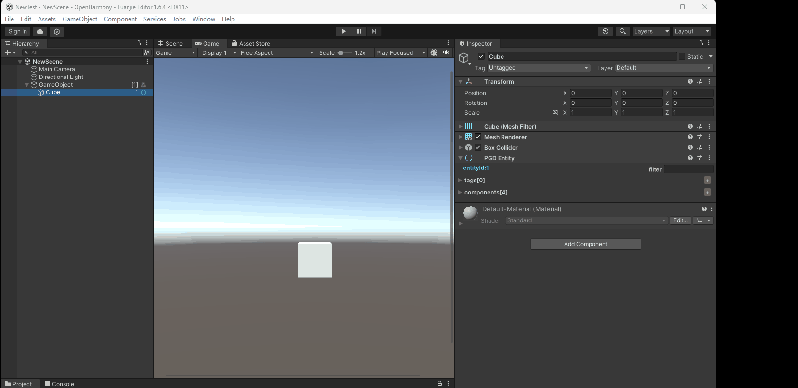
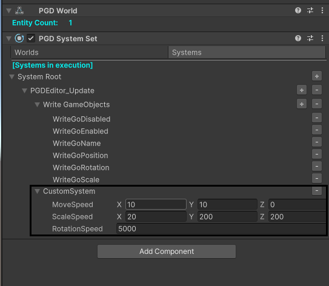
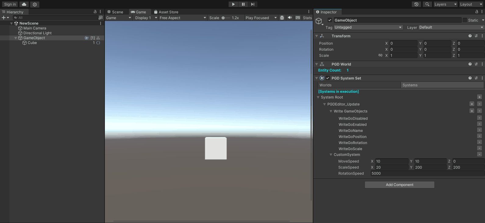

通过如下示例简单演示PGD Editor的使用。

## 第一步：创建一个空项目

参考[官方文档](https://docs.unity.cn/cn/2021.3/Manual/UnityManual.html)创建一个空项目。

## 第二步：添加PGD World

在场景中新建一个空GameObject，并添加PGD World组件。



## 第三步：添加PGD Entity

1. 在已创建的GameObject下添加一个Cube。
2. 在Cube上挂载PGD Entity组件，并添加PgdPosition，PgdScale，RotationEuler三个预置Component。



## 第四步：添加PGD Systems

1. 添加一个和GameObject存在交互的System。示例如下：

   ```
   using Pgd;
   using Pgd.UnityExtension.Runtime;
   namespace script
   {
       public class CustomSystem : PgdSystem<PgdPosition, PgdScale, RotationEuler>
       {
           public System.Numerics.Vector3 MoveSpeed;
           public System.Numerics.Vector3 ScaleSpeed;
           public float RotationSpeed;
           private int_direction = 1;
           protected override void OnUpdate()
           {
               var delta = Tick.DeltaTime * _direction ;
               _direction *= -1;
               foreach (var (positions, scale, rotation, entities) in GetQuery().ArchetypeChunk) {
                   for (int n = 0; n < entities.Length; n++) {
                       // 位置更新
                       positions[n].vec3 += delta * MoveSpeed;
                       // 缩放更新
                       scale[n].vec3 += delta * ScaleSpeed;
                       // 旋转更新
                       var rotationDelta = delta * RotationSpeed;
                       rotation[n].x += delta * rotationDelta ;
                       rotation[n].y += delta * rotationDelta ;
                       rotation[n].z += delta * rotationDelta ;
                   }
               }
           }
       }
   }
   ```

   将上述脚本保存在Assets文件中。示例如下：

   
2. 在GameObject中挂载PGD Systems组件。

   在该组件的World标签页挂载先前创建的World组件，在该组件的Systems标签页添加上述自定义的System（该System会被自动识别）。具体操作请参见[PGD Systems组件](https://developer.huawei.com/consumer/cn/doc/games-guides/pgd-tool-editor-systems-0000002494261300)。

   
3. 在Systems组件中，调整System变量值，完成后注意保存（Ctrl+S）。

   

## 第五步：运行

进入Play Mode，若看到Cube的位置和大小及旋转角度在发生变化，说明该示例正在正常运行。


