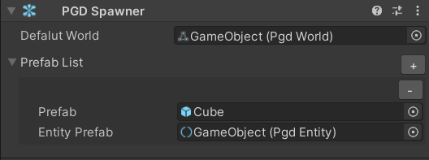
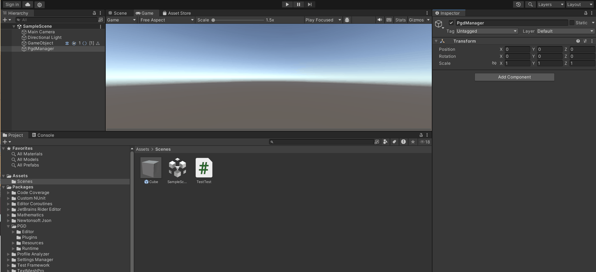
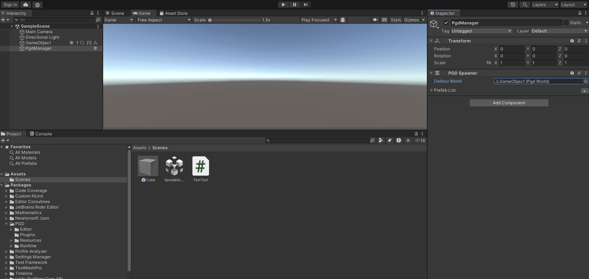
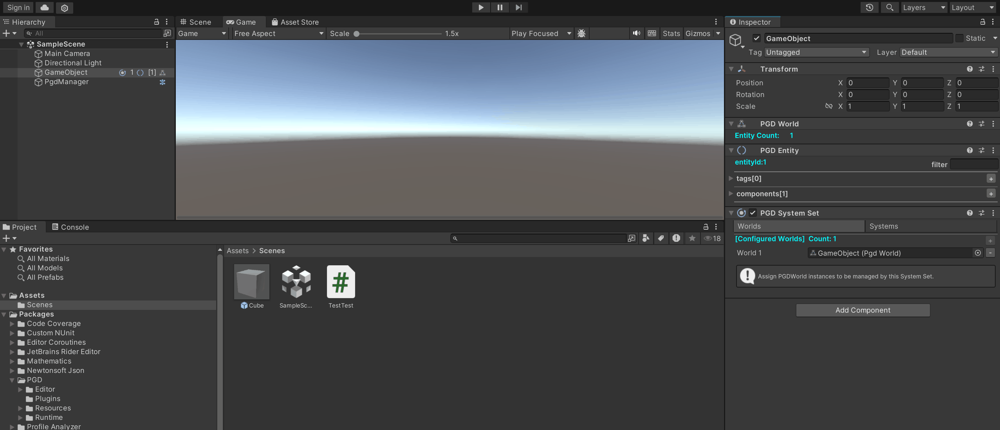

PGD Spawner组件用于对工程中的Prefab资产进行管理。

通过与已创建好的PGD Entity组件进行映射配置绑定，实现基于对象池管理机制，并通过极简代码在运行时基于Prefab进行对象派生。

## 界面布局



| 界面 | 说明 |
| --- | --- |
| Default World | 场景中已挂载PGD World组件的GameObject。 |
| Prefab List | 展示管理中Prefab资产和PGD Entity组件的映射列表。  仅当Default World完成挂载时才会展示。 |
| Prefab | 配置工程中的Prefab资产。 |
| Entity Prefab | 场景中已挂载PGD Entity组件的GameObject。 |

## 创建PGD Spawner组件

1. 新建或选中场景中已经存在的GameObject，进入Inspector。
2. 选择“Add Component &gt; PGD &gt; PGD Spawner”，添加组件。
3. 选中并挂载当前场景中已经存在的PGD World组件后，下方会出现Prefab List列表。



## 配置Prefab和PGD Entity组件映射

1. 选中当前工程中Prefab资产，并匹配对应的PGD Entity组件。
2. 在编辑态对PGD Entity组件进行Component&Tag配置。



## 运行时派生GameObject

PGD Spawner组件提供API用于GameObject派生。

1. 在MonoBehaviour脚本中调用，在需要的时机进行GameObject派生，其规格如下：

   | 方法 | 说明 |
   | --- | --- |
   | public void Instantiate(GameObject prefab) | 根据Prefab在场景中派生GameObject，底层基于对象池进行管理。 |

   完整MonoBehaviour脚本示例如下：

   ```
   public class Test : MonoBehaviour
   {
       public GameObject Cube;
       public GameObject Sphere;
       public PgdSpawner Spawner; // 用于挂载PGD Spawner组件并调用接口

       void Start()
       {
           if (Cube != null)
           {
               Spawner.Instantiate(Cube); // 基于Cube Prefab在场景中派生GameObject
           }

           if (Sphere != null)
           {
               Spawner.Instantiate(Sphere); // 基于Sphere Prefab在场景中派生GameObject
           }
       }
   }

   // 用于将派生出的GameObject进行回收的System
   public class ReturnSystem : PgdSystem<PgdLocalTransform>
   {
       protected override void OnUpdate()
       {
           GetQuery().ForEachEntity((ref PgdLocalTransform transform, IEntity entity) =>
           {
               var dt = UnityEngine.Time.deltaTime;
               var posX = transform.Position.x;
               if (posX > 5f)
               {
                   // 使用CommandQueue进行实体&游戏对象回收
                   CommandQueue.DestroyEntity(entity);
               }
           });
       }
   }

   // 驱动派生GameObject移动的System
   public class MoveSystem : PgdSystem<PgdLocalTransform>
   {
       protected override void OnUpdate()
       {
           GetQuery().ForEachEntity((ref PgdLocalTransform transform, IEntity entity) =>
           {
               var dt = UnityEngine.Time.deltaTime;
               transform.Position.x += dt;
           });
       }
   }
   ```
2. 将脚本挂载至场景中的GameObject中，挂载Prefab和PGD Spawner组件，并配置PGD Systems组件后，即可实现在运行时GameObject派生、移动和回收。

   
