PGD Systems组件为系统操作模块。

通过对该组件的Inspector进行配置，即可完成PGD中System集合的初始化运行。同时，系统的运行状态也将在Inspector中进行可视化展示。

## 界面布局

### PGD Systems组件的Worlds配置界面


* Systems需要注册World对象才可以运行，否则会出现运行时报错。
* 当前一个Systems仅支持注册一个World。

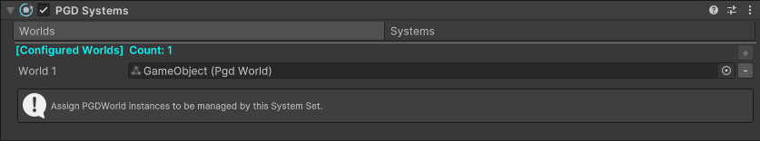

| 界面 | 说明 |
| --- | --- |
| Worlds页签/Systems页签，其中Worlds页签处于高亮状态 | 切换至World配置界面。 |
| “+”/“-”按钮 | 新增/删除该Systems组件需要注册进入的World对象。 |

### PGD Systems组件的Systems配置界面

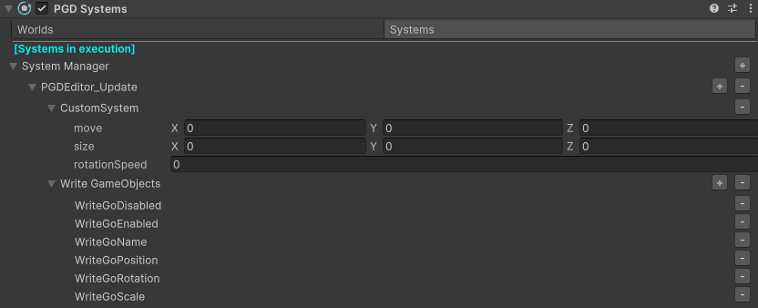

| 界面 | 说明 |
| --- | --- |
| Worlds页签/Systems页签，其中Systems页签处于高亮状态 | 切换至System配置界面。 |
| System Manager | 显示的树形结构为当前Systems的内部组织层级结构。 |
| System Manager右侧的“+”按钮 | 该按钮表示新增System Manager。  点击后增加自动被引擎调用的SystemCollection。 |
| SystemCollection右侧的“+”/“-”按钮 | 该按钮表示新增/删除SystemCollection。 |
| CustomSystem | 具体System定义中的可序列化成员字段的编辑框，可同步进行读写。 |
| System右侧的“-”按钮 | 该按钮表示删除一个System。 |

## 创建PGD Systems组件

1. 在场景中新建GameObject，或选中已创建好的GameObject，进入Inspector。
2. 选择“Add Component &gt; PGD &gt; PGD Systems”，添加PGD Systems组件，且每个PGD Systems组件会自动创建一行System Manager。

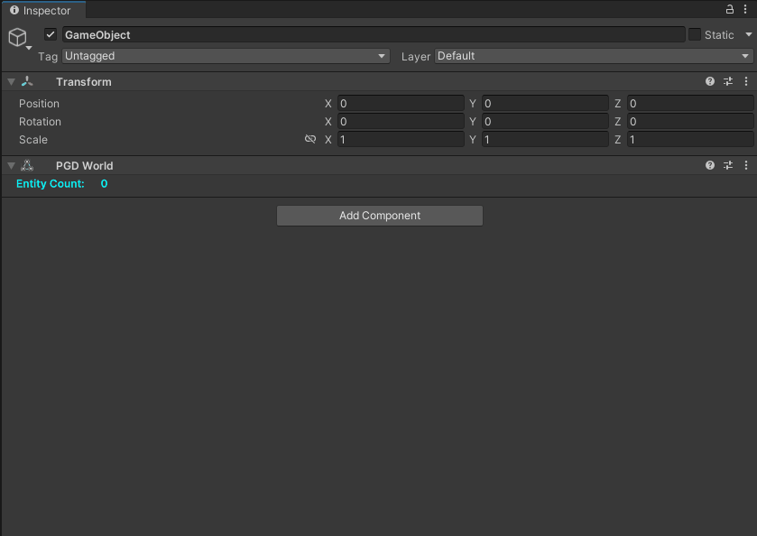

## 添加PGD Systems中的System

### 添加方式

* **方式一****：针对System Manager**

  您可以添加被引擎自动调用的SystemCollection。

  | 按钮 | 说明 |
  | --- | --- |
  | PGDEditor\_Start | 其对应MonoBehavior的Start()函数调用时机。 |
  | PGDEditor\_Update | 其对应MonoBehavior的Update()函数调用时机。 |
  | PGDEditor\_FixedUpdate | 其对应MonoBehavior的FixedUpdate()函数调用时机。 |
  | PGDEditor\_LateUpdate | 其对应MonoBehavior的LateUpdate()函数调用时机。 |

  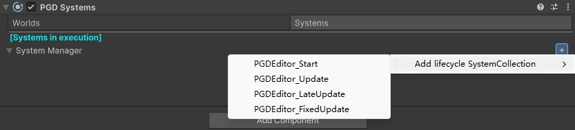
* **方式二****：针对SystemCollection**

  您可以继续添加SystemCollection，或单个具体System。

  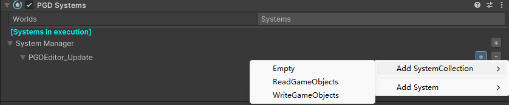

### 添加对象

添加对象共分为两种，**预定义可用System**和**自定义System**。

所有System需在代码中提前声明，该组件会扫描并提供创建选项。

* **预定义可用System**

  共2个SystemCollection，每个SystemCollection包含6个具体的System。您可以选择新增一组或新增一个。

  | 类别 | System | 说明 |
  | --- | --- | --- |
  | Read GameObjects  读取GameObject属性，同步至对应Entity的组件。 | ReadGoPosition | 读取GameObject的Transform.Position属性，同步修改Entity的PgdPosition组件。 |
  | ReadGoRotation | 读取GameObject的Transform.Rotation属性，同步修改Entity的RotationEuler组件。 |
  | ReadGoScale | 读取GameObject的Transform.Scale属性，同步修改Entity的PgdScale组件。 |
  | ReadGoName | 读取GameObject的Name属性，同步修改Entity的Name组件。 |
  | ReadGoDisabled | 读取所有携带Inactive标签的Entity，若对应的GameObject处于激活状态，则移除该标签。 |
  | ReadGoEnabled | 读取所有不携带Inactive标签的Entity，若对应的GameObject处于非激活状态，则添加Inactive标签。 |
  | Write GameObjects  读取Entity的组件，同步至对应GameObject属性。 | WriteGoPosition | 读取Entity的PgdPosition组件值，同步修改GameObject的Transform.Position属性。 |
  | WriteGoRotation | 读取Entity的RotationEuler组件值，同步修改GameObject的Transform.Rotation属性。 |
  | WriteGoScale | 读取Entity的PgdScale组件值，同步修改GameObject的Transform.Scale属性。 |
  | WriteGoName | 读取Entity的Name组件，同步修改GameObject的Name属性。 |
  | WriteGoDisabled | 读取所有携带Inactive标签的Entity，若对应的GameObject置为非激活状态。 |
  | WriteGoEnabled | 读取所有不携带Inactive标签的Entity，若对应的GameObject置为激活状态。 |

  

  若Entity不包含具体系统处理的组件类型，则不会被相应System处理。例如，不包含PgdPosition组件的Entity不会受到ReadGoPosition的System影响。

* **自定义System：**
  1. System提供了自定义拓展功能，请自行实现PgdSystem接口。示例如下：

     ```
     // 定义一个CustomSystem
     namespace script
     {
         public class CustomSystem : PgdSystem<PgdPosition, PgdScale, RotationEuler>
         {
             public System.Numerics.Vector3 move;
             public System.Numerics.Vector3 size;
             public float rotationSpeed;
             private bool flag = false;
             protected override void OnUpdate()
             {
                 // ...
             }
         }
     }
     ```
  2. 点击SystemCollection右侧的“+”按钮，选择“Add System &gt; script &gt; CustomSystem”，选择新增的自定义System。

     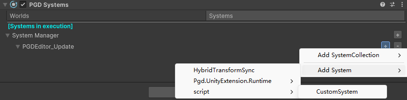
  3. 新增后，展示序列化的具体字段。在编辑器/运行时模式场景下，您可以为对应字段进行赋值。

     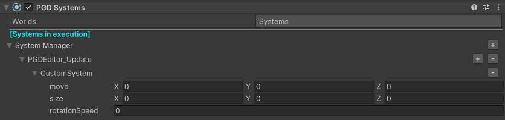

## 删除PGD Systems中的System

点击右侧的“-”按钮，删除一个System，或删除整个SystemCollection。

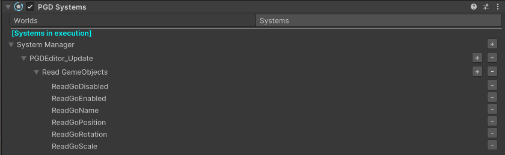

## 重命名PGD Systems中的System

右键点击System Manager或SystemCollection，选择“Rename”选项，重命名System Manager和SystemCollection。

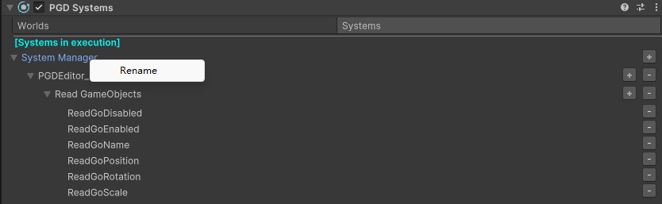

System Manager下创建的被引擎自动调用的SystemCollection不支持重命名。

## 调整PGD Systems中System的执行顺序

System默认执行顺序是从上到下。

除System Manager外，您可以任意拖拽单个System和SystemCollection，调整PGD Systems中System的执行顺序。

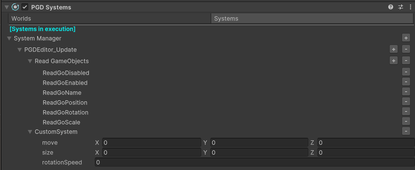

## 快速查看PGD Systems中System的具体定义

右键点击具体System，选择“Edit System”选项，跳转至默认IDE打开该System具体定义的脚本位置。

默认打开的IDE为引擎中设置的IDE，且工程中需包含该定义的脚本源码才可以进行跳转。

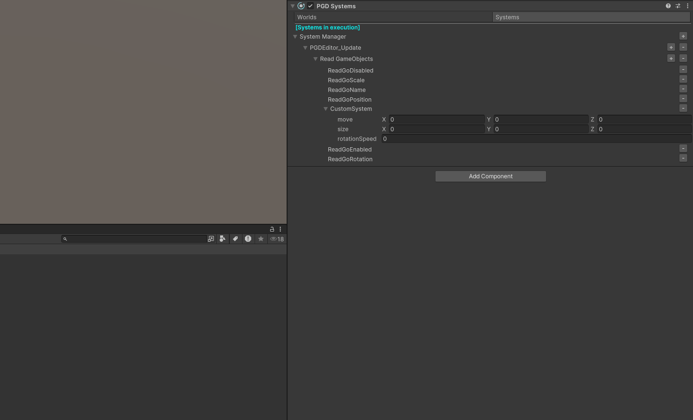

## PGD Systems组件的运行时状态展示

进入Play Mode后，通过Inspector展示当前运行数据。

您可以在运行时修改System的字段值，进行实时调试，并在Inspector中实时观察每个System影响的Entity数，以及执行的时间。

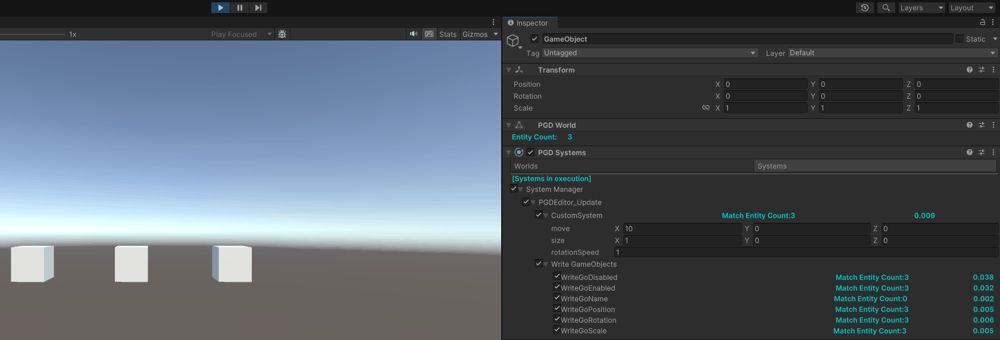
