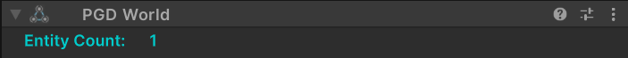
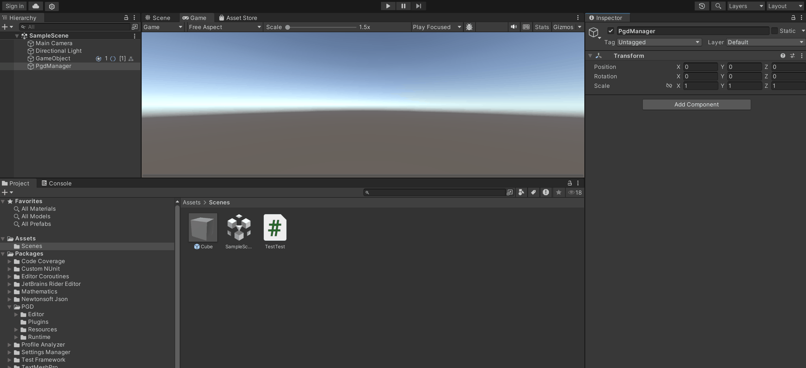

PGD World组件为World管理模块。

通过创建该组件可以新建IECSWorld，实时显示World中的实体数量，并提供给PGD Entity等组件使用。

## 界面布局

| 界面 | 说明 |
| --- | --- |
| Entity Count | 该World下存在的Entity数量。  新建PGD Entity组件或使用该World在运行时创建Entity时该数值会随之变化。 |

## 创建PGD World组件

1. 在场景中新建GameObject，或选中已创建好的GameObject，进入Inspector，
2. 选择“Add Component &gt; PGD &gt; PGD World”，添加PGD World组件，可用于挂载至PGD Systems、PGD Spawner组件中。

