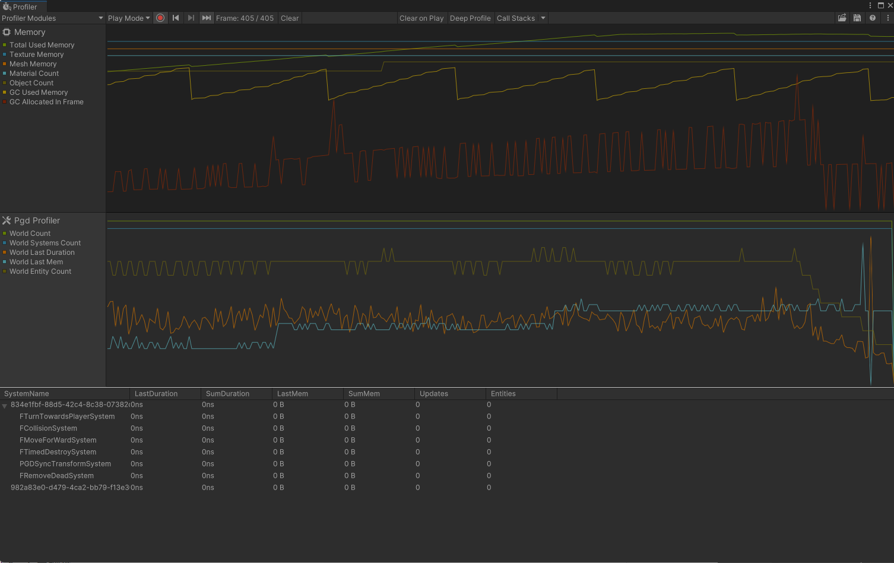

## 功能介绍

PGD Profiler是一套以System为维度监控PGD数据的工具。

您可以在Editor的顶部菜单栏中选择“Window &gt; Analysis &gt; Profiler”，打开Profiler工具。

## 界面布局

| 界面 | 说明 |
| --- | --- |
| PGD Profiler Modules | 可通过Profiler Modules控制启用或是不启用。  在安装了PGD插件的情况下，打开Profiler是默认启用的。 |
| 在详情面板中表示一个World（名称为对应World的ID） | 每个指标为当前World的指标。 |
| World中对应的每个System | 每个指标为当前System的指标。 |

### 指标说明

| 指标类别 | 具体指标 | 说明 |
| --- | --- | --- |
| 折线图指标 | World Count | World数量。  支持多个World中数据监控，每个World在详情面板中按照折叠的形式展示。 |
| World Systems Count | World中System数量。 |
| World Last Duration | World中所有System的执行时间。 |
| World Last Mem | World消耗的内存。 |
| World Entity Count | World中Entity数量。 |
| 每帧详细面板指标 | SystemName | System名称（跟System定义时的类名一致）。 |
| LastDuration | System在frame中的执行时间。 |
| SumDuration | System的总执行时间。 |
| LastMem | System在frame中消耗的内存。 |
| SumMem | System的总消耗内存。 |
| Updates | System的更新次数。 |
| Entities | System中Entity数量。 |
