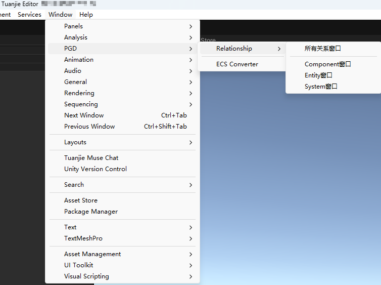
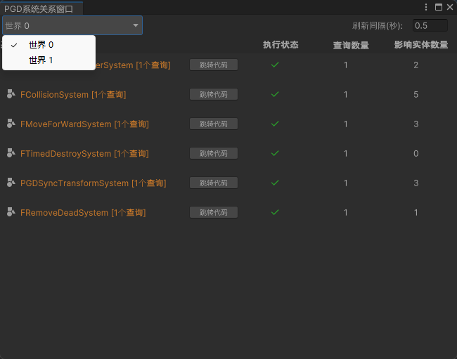
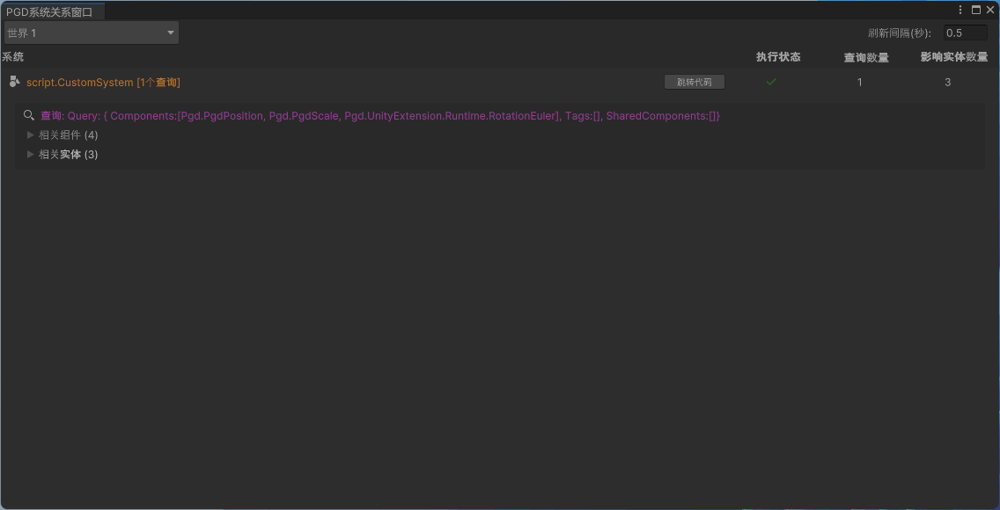
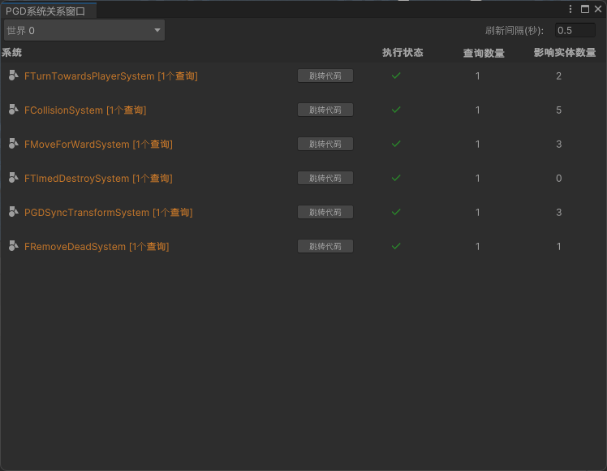
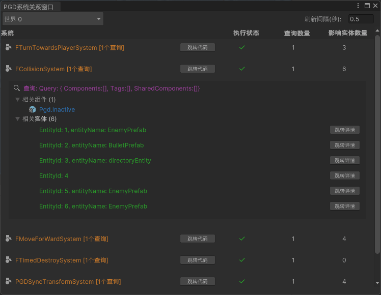
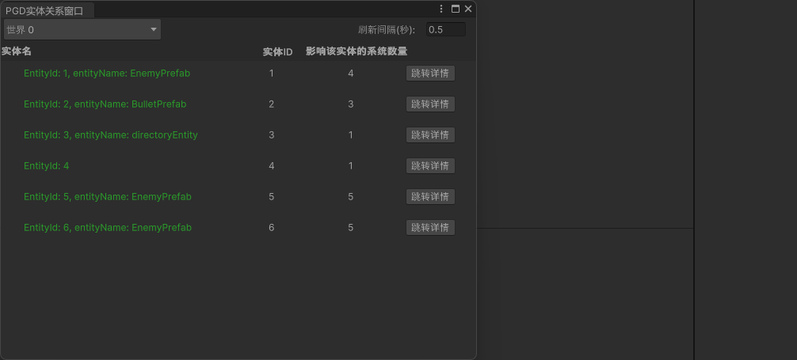

## 单次打开所有关系窗口

您可以在顶部菜单栏选择“Window &gt; PGD &gt; Relationship &gt; 所有关系窗口”，同时打开System、Component、Entity三个窗口，并按左中右的顺序自动完成布局。

若仅打开一个关系窗口，您可以在顶部菜单栏选择“Window &gt; PGD &gt; Relationship &gt; System窗口/Component窗口/Entity窗口”，打开对应关系窗口。

## 切换World

每个窗口可切换World维度进行展示。

## 跳转代码

在System或Component列表项中，点击名称右侧的“跳转代码”，IDE将直接打开对应的C#脚本文件。

当前项目已定义的C#脚本均能进行正常跳转。

## 折叠/展开

所有详情面板均采用折叠式设计，点击具体行可展开查看深层数据。

## 自动刷新

窗口会以固定频率（默认 0.5秒）拉取底层World的最新数据。

该频率可在窗口右上角“刷新间隔”处进行设置，最小可设置为0.1秒，窗口间的设置互不影响。

## 查看Entity详情

在Entity列表项中（System/Component窗口的相关实体项&Entity窗口），点击Entity右侧的“跳转详情”按钮，即可实时地查看Entity的详细属性值。

当前属性的值展示只支持格式为值类型或字符串类型的变量。

