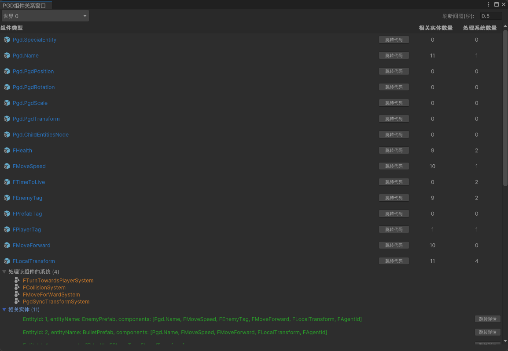

## 功能介绍

Component窗口支持展示工程中所定义组件在被选World下的实时信息。

组件范围包含Component/Tag，当前版本暂不支持SharedComponent的展示。

## 界面布局

| 界面 | 说明 |
| --- | --- |
| 组件类型 | 组件类名。  点击组件类名右侧的“跳转代码”按钮，跳转至代码定义的脚本，一键快速查看逻辑实现。 |
| 相关实体数量 | 当前挂载了该组件的Entity数量。 |
| 处理系统数量 | 当前在读写该组件的System数量。 |

## 交互操作

* 点击列表行：展开详情面板。
* 处理该组件的系统：展示所有依赖此组件的系统。
* 相关实体：展示所有持有该组件的Entity实例。
