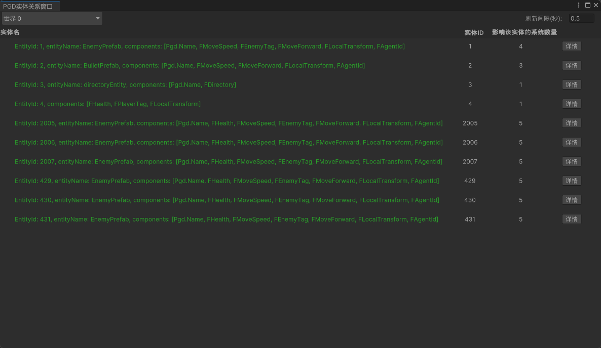

## 功能介绍

Entity窗口支持实时展示被选World下的所有Entity列表，同时支持查看Entity内部的详细属性值、数据情况。

## 界面布局

| 界面 | 说明 |
| --- | --- |
| 实体名 | Entity的调试名称，包含ID、Name等信息。 |
| 实体ID | 全局唯一的Index标识。 |
| 影响该实体的系统数量 | 当前正在处理该Entity的System数量。 |
