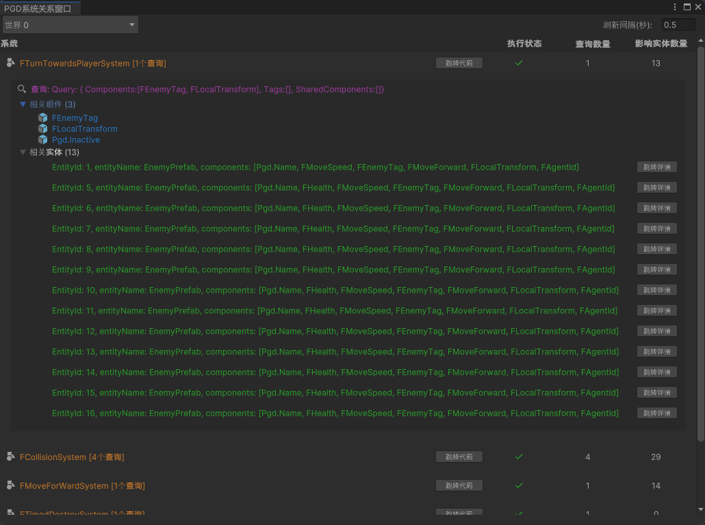

## 功能介绍

System窗口支持实时展示注册在被选World下的System信息，以及其在底层的运行状态。

若仅继承PgdSystem而未设置Query，则默认存在一个查询所有的Entity的Query。

## 界面布局

| 界面 | 说明 |
| --- | --- |
| 系统 | 显示系统类名。  点击系统名称右侧的“跳转代码”按钮，跳转至代码定义的脚本，一键快速查看逻辑实现。 |
| 执行状态 | * ✓ ：System当前处于启用状态。 * ✗ ：System当前处于停止状态。   注：禁用的系统，其关联的实体列表将变灰且无法交互。 |
| 查询数量 | 该System内部定义的Query数量。 |
| 影响实体数量 | 该系统实际处理的Entity总数。 |

## 交互操作

* 点击列表行：展开详情面板。
* 查询Query详情：展示被选System包含的所有Query条件。
* Query下的相关组件：展示对应Query依赖的组件（包含Component/Tag，当前版本暂不支持SharedComponent的展示）。
* Query下的相关实体：展示对应Query中所查询到的所有Entity列表。
