## 简介

同一主体下可能会核准（备案）多个互联网信息，例如网站、App、快应用、快游戏，每个互联网信息的负责团队可能不一样，查看其他团队的互联网信息容易存在隐私合规风险。为了保障各互联网信息的数据隐私，您可以**在华为云核准（备案）系统**使用账号管理进行精细化、统一化管理，限制责任团队仅能操作权限范围内的互联网信息，以此更好地管理好各核准（备案）子账号。

仅PC端华为云核准（备案）系统支持账号管理，移动端华为云App不支持账号管理。

## 操作步骤

### 第一步：创建用户组

1. 登录[华为云核准（备案）系统](https://beian.huaweicloud.com/?utm_source=HUAWEI%2BDeveloper&utm_adplace=AdPlace099034)，在右上角的下拉窗中点击“统一身份认证”。

   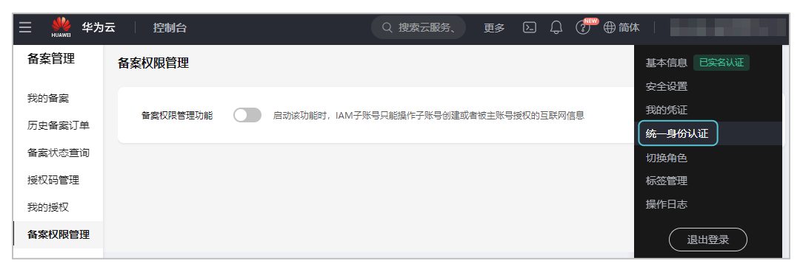
2. 在“统一身份认证服务”页面创建用户组。

   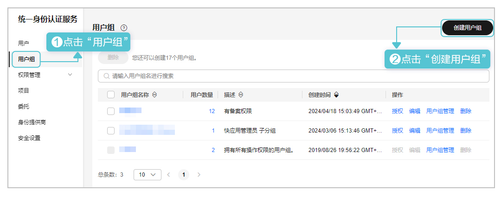
3. 填写用户组名称后，点击“确定”。

   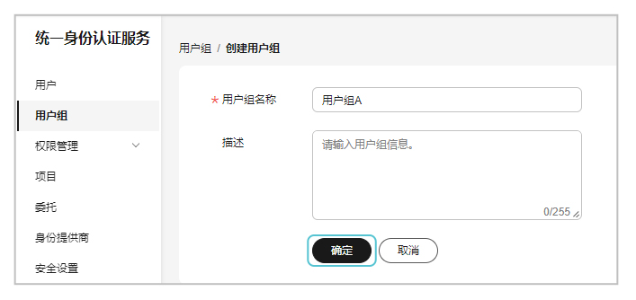

### 第二步：授权用户组

1. 在用户组右侧“操作”列点击“授权”。

   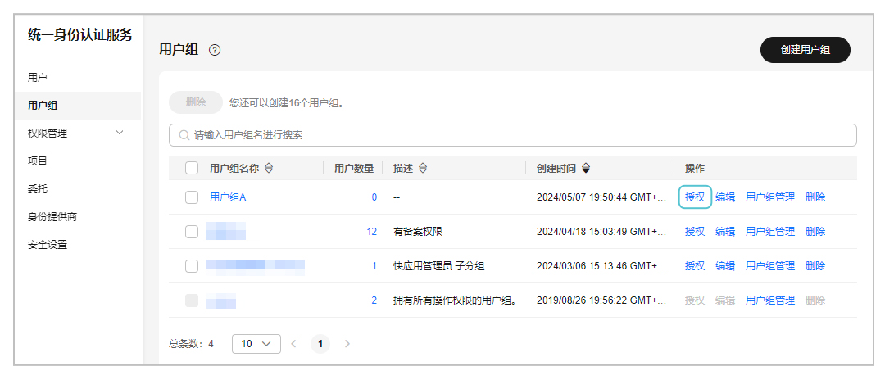
2. 为用户组授权对应的权限。

   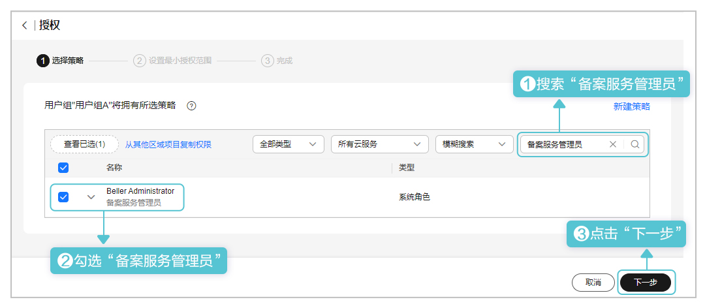
3. 设置最小授权范围后，点击“确定”。

   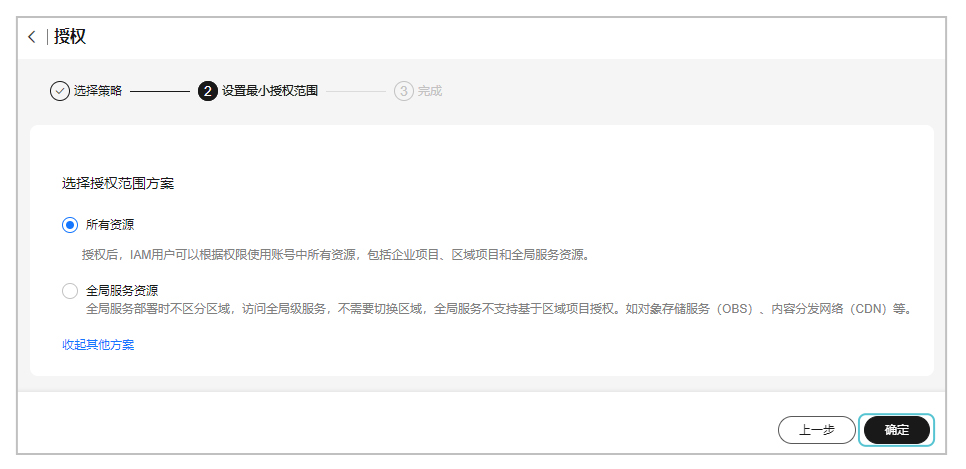
4. 授权成功后，点击“完成”。

   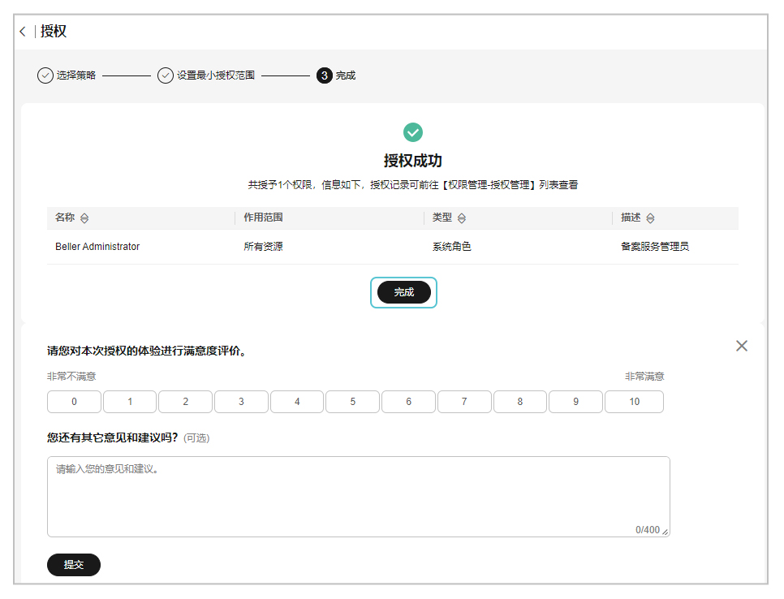

### 第三步：在用户组添加用户

1. 在“统一身份认证服务”页面创建新用户。

   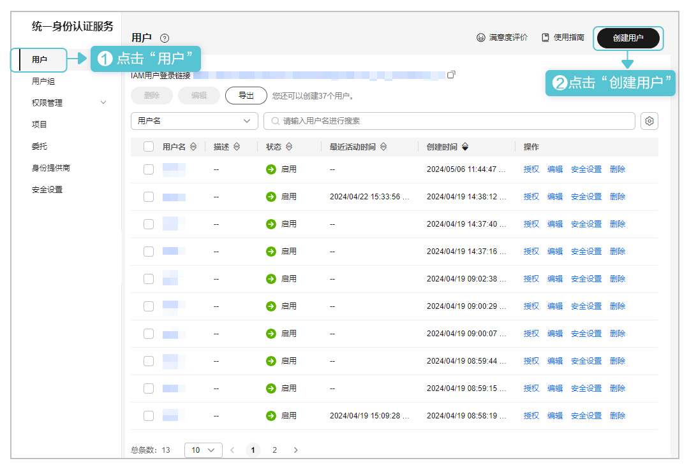
2. 为新用户配置基本信息，例如用户名、密码，完成后点击“下一步”。

   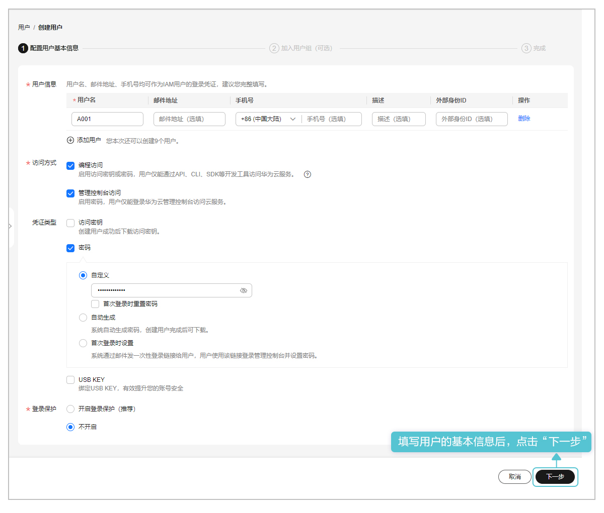
3. 为新用户选择用户组。

   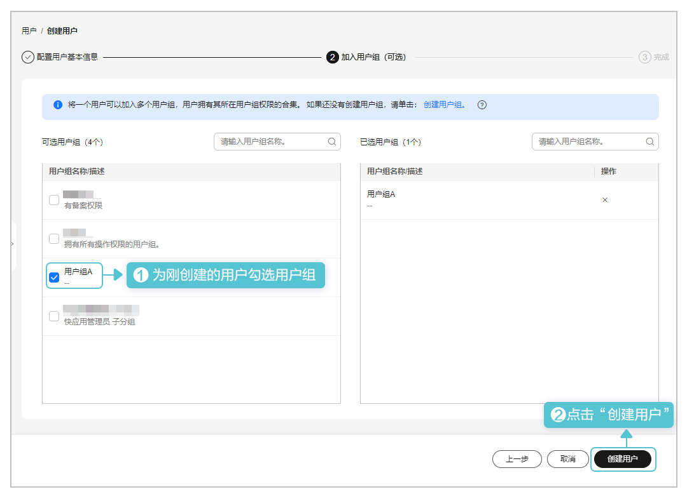
4. 新用户创建成功后，点击“返回用户列表”。

   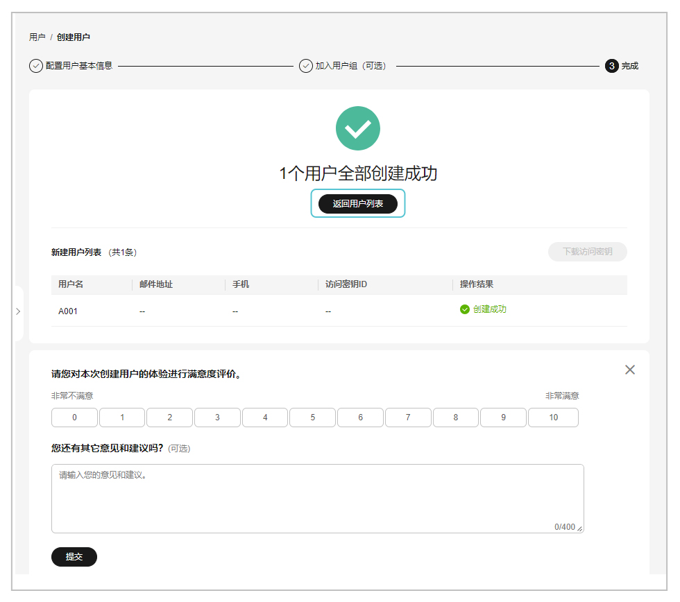

### 第四步：为用户配置权限

1. 回到华为云核准（备案）系统，主账号打开“账号管理功能”开关。

   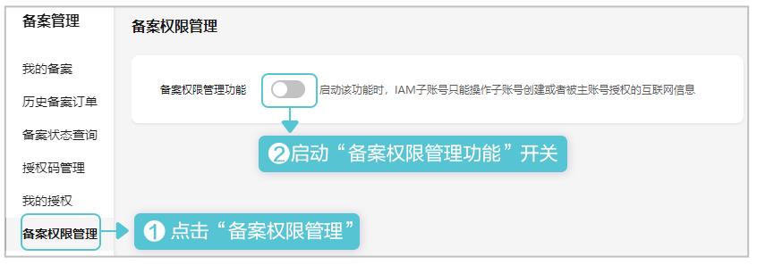

   

   * 主账号和主账号下所有子账号中均无正在进行中的核准（备案）订单，主账号才允许打开/关闭“账号管理功能”开关。在主账号变更开关状态后，子账号新增的核准（备案）订单不受开关影响。
   * 若主账号关闭“账号管理功能”开关，具备核准（备案）权限的子账号将与主账号具备同等的核准（备案）权限，即所有的核准（备案）信息均可操作。
2. 若主账号和待配置权限的子账号均无正在进行中的核准（备案）订单，主账号可以为子账号用户配置权限。完成配置后，对应子账号用户仅具备授予可操作的互联网信息权限，以及后续该子账号创建的互联网信息权限。

   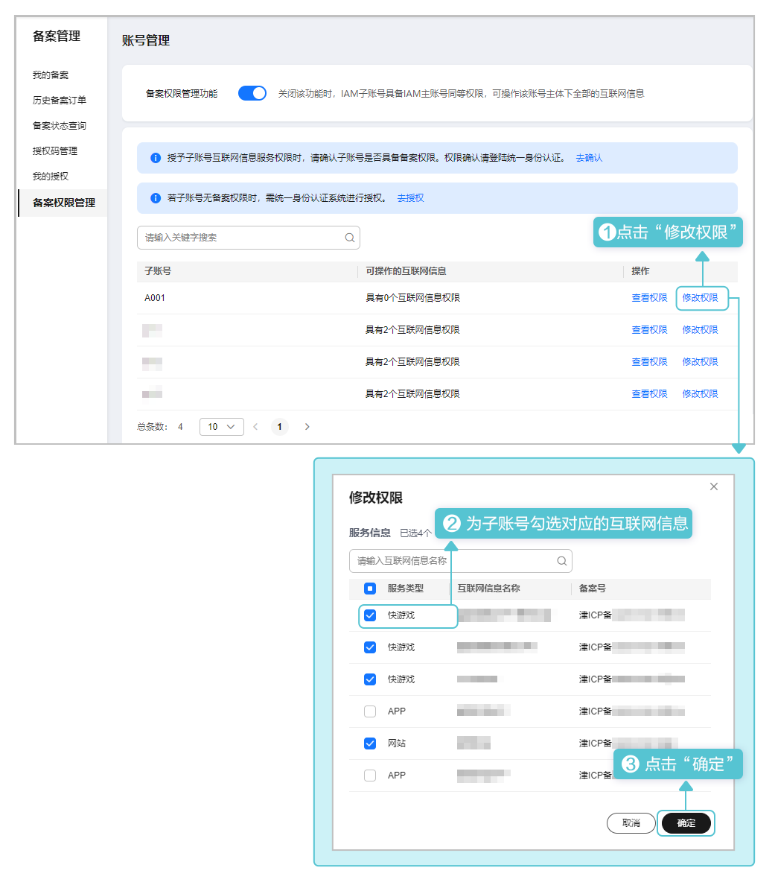
3. 权限配置后，您可以查看用户的权限。

   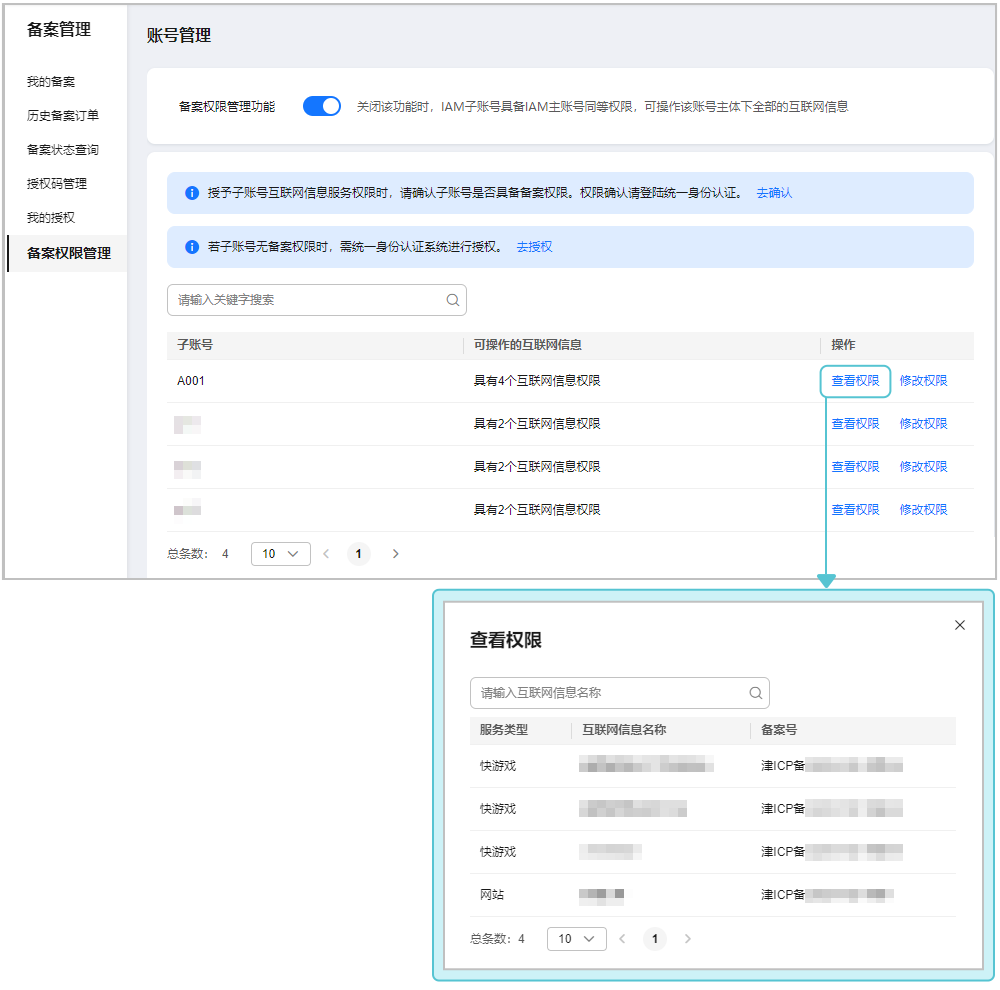
