## 前提条件

已前往应用市场下载最新版本的华为云App。

## 变更核准（备案）

1. 在华为云App的“ICP备案”界面同时变更主体信息和快游戏信息。

   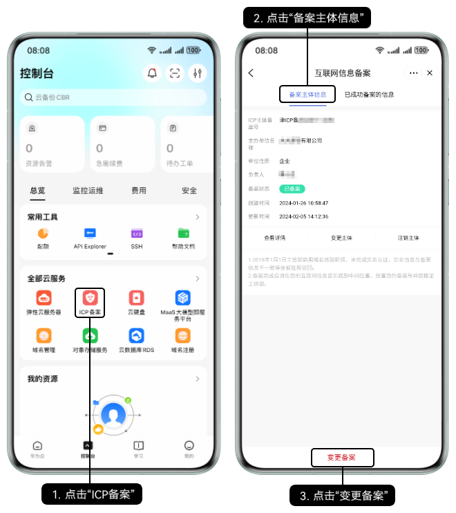
2. 根据实际情况修改主体信息、快游戏信息。

   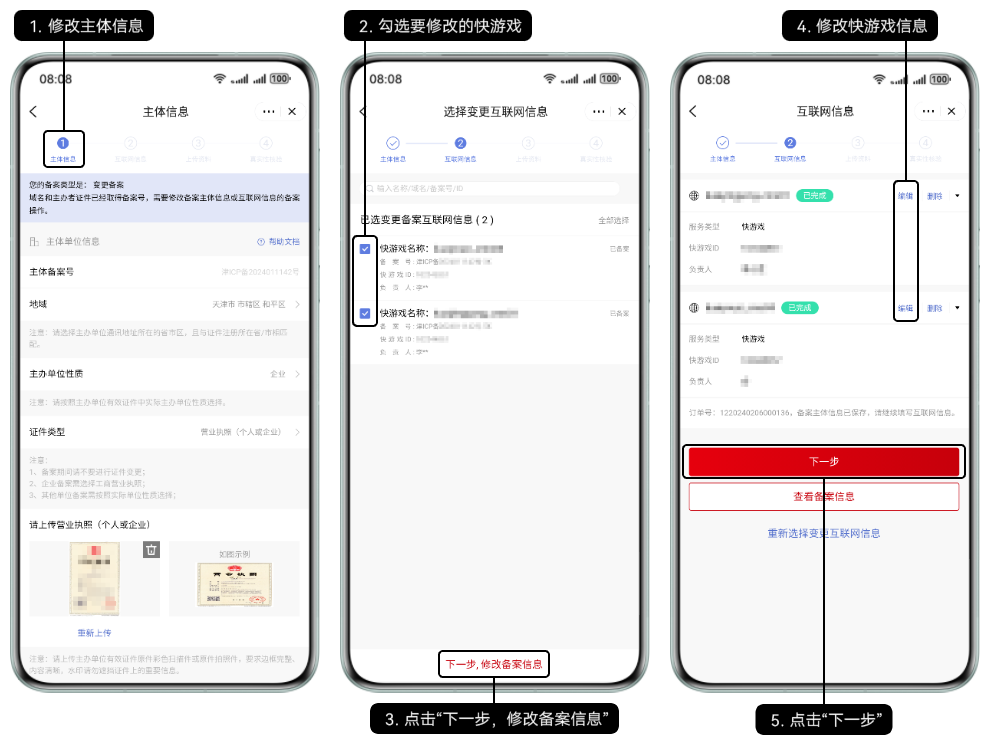
3. 根据提示补充提前准备好的附件材料。

   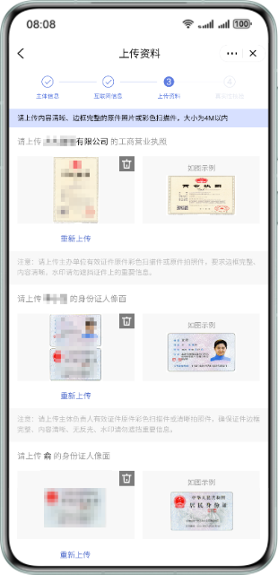
4. 互联网信息负责人人脸核验通过后提交初审。

   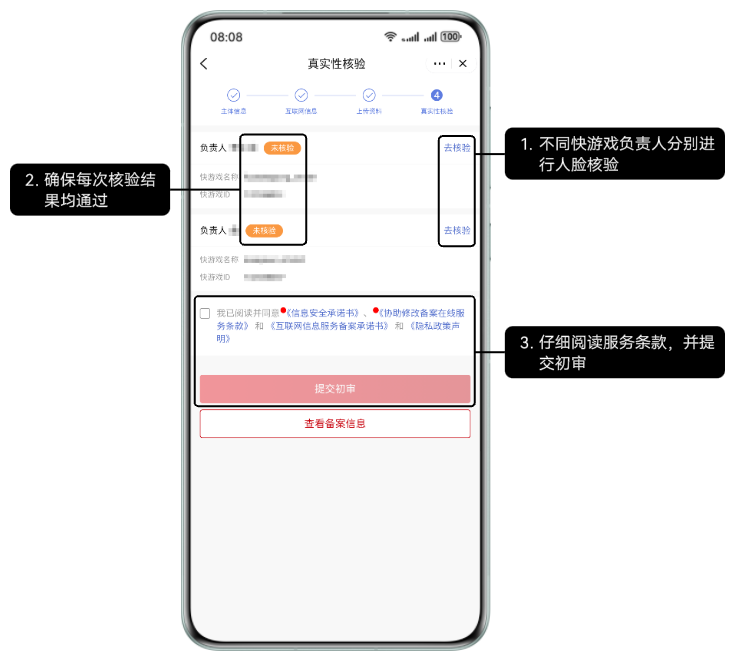
5. 华为工作人员将在3~5个工作日内进行审核，将以短信或邮件形式通知审核结果，请耐心等待，且保持手机通畅。若需要修改核准（备案）信息，将以邮件形式通知。
6. 在华为平台通过人工初审后，需前往工信部网站核验短信验证码，详情请参见[工信部核验核验（备案）短信](/docs/dev/game-dev/quickgame-filing-sms-verify-0000001818117885)。

## 变更主体

1. 在华为云App的“ICP备案”界面变更主体信息。

   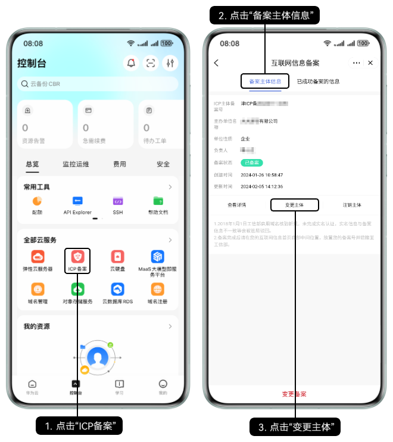
2. 根据实际情况修改主体信息。

   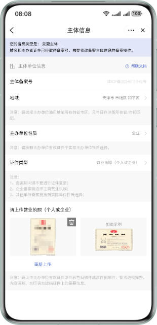
3. 根据提示补充提前准备好的附件材料后提交初审。

   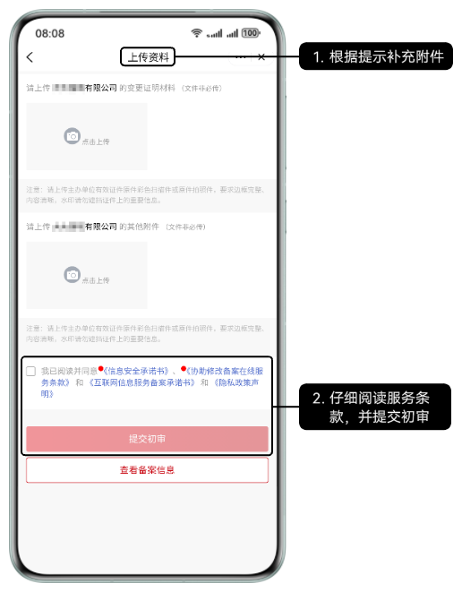
4. 华为工作人员将在3~5个工作日内进行审核，将以短信或邮件形式通知审核结果，请耐心等待，且保持手机通畅。若需要修改核准（备案）信息，将以邮件形式通知。
5. 在华为平台通过人工初审后，需前往工信部网站核验短信验证码，详情请参见[工信部核验核验（备案）短信](/docs/dev/game-dev/quickgame-filing-sms-verify-0000001818117885)。

## 变更互联网信息

1. 在华为云App的“ICP备案”界面变更快游戏信息。

   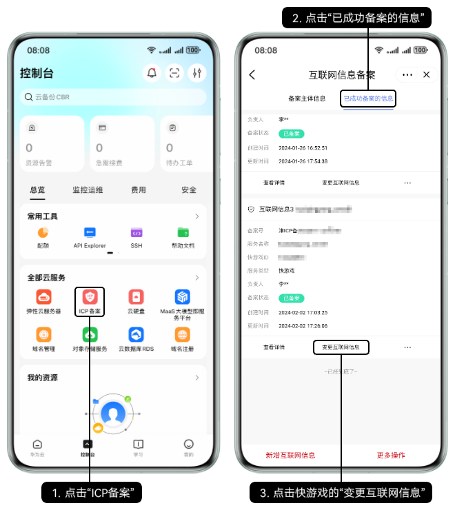
2. 根据实际情况修改快游戏信息。

   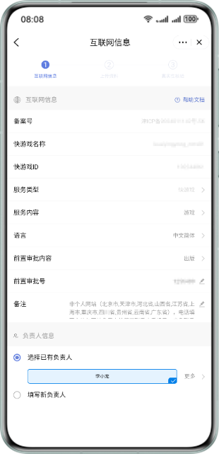
3. 根据提示补充提前准备好的附件材料。

   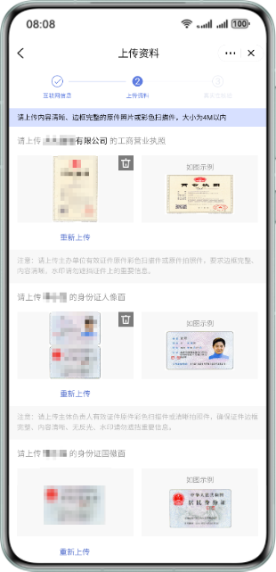
4. 互联网信息负责人人脸核验通过后提交初审。

   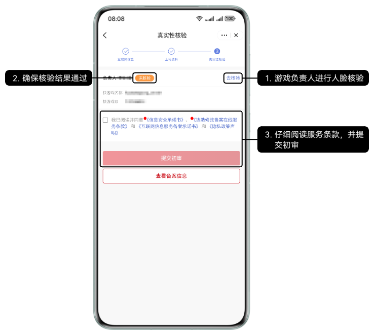
5. 华为工作人员将在3~5个工作日内进行审核，将以短信或邮件形式通知审核结果，请耐心等待，且保持手机通畅。若需要修改核准（备案）信息，将以邮件形式通知。
6. 在华为平台通过人工初审后，需前往工信部网站核验短信验证码，详情请参见[工信部核验核验（备案）短信](/docs/dev/game-dev/quickgame-filing-sms-verify-0000001818117885)。
